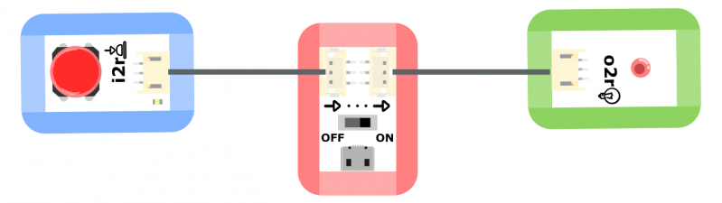
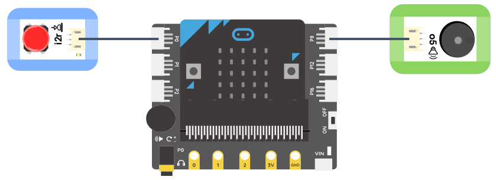
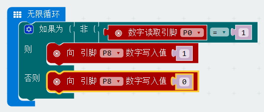

# 按钮模块

## 实物图片

## 基本信息

中文名称：按钮模块

英文名称：Push Button

序号：i2b; i2r; i2y

SKU：BOS0002-B; BOS0002-R; BOS0002-Y

## 功能简介

按钮模块是最简单的按键模块，包括红色按钮模块、蓝色按钮模块和黄色按钮模块，按钮可以广泛应用于门铃、台灯、空调遥控器、按摩浴缸、电梯、消防报警等场景。

## 使用说明

按钮模块能够识别按键动作并输出数字信号。其机制如下：

> * 按下按键，模块输出高电平，即“开”或“1”；松开按键，模块输出低电平，即“关”或“0”。

以按钮控制LED灯为例，按下按钮，输出高电平，小灯被点亮；松开按钮，输出低电平，小灯熄灭。

## 原理介绍

按钮开关一般采用积水式结构，由按钮帽、复位弹簧、静触头、动触头和外壳等组成，通常做成复合式，有一对常闭触头和常开触头。在按钮未按下时，动触头与上面的静触头是接通的，这对触头称为常闭触头。此时，动触头与下面的静触头是断开的，这对触头称为常开触头；按下按钮，常闭触头断开，常开触头闭合；松开按钮，在复位弹簧的作用下恢复原来的工作状态。 来源：[https://baike.baidu.com/item/按钮开关/8063907?fr=aladdin\#2](https://baike.baidu.com/item/按钮开关/8063907?fr=aladdin#2)

## 应用样例

### \(1\) 按钮台灯（非编程）

**样例说明：**使用按钮控制LED灯的点亮和熄灭。当按钮按下时，LED模块被点亮；当按钮松开时，LED模块熄灭。

**元件清单：**按钮模块；LED模块；电源主板-三路。

**连线图：**

### \(2\) 按钮台灯（编程）

**样例说明：**使用按钮控制LED灯的点亮和熄灭。当按钮按下时，LED模块被点亮；当按钮松开时，LED模块被熄灭。

**元件清单：**按钮模块；LED模块；Micro:bit；Micro:bit BOSON扩展板。

**连线图：**将按钮模块连接至Micro:bit扩展板引脚P0，LED模块连接至Micro:bit扩展板引脚P8。

**执行流程：**① 如果引脚P0输出高电平（“1”），即按钮被按下，则LED模块亮起；② 如果引脚P0输出低电平（“0”），即按钮松开，则LED模块熄灭。

**程序示意图（中文版）：**

**程序示意图（英文版）：**

### \(3\) 防盗展台（非编程）

**样例说明：**防盗展台的功能是当展品离开展台，展台自动报警。将展品放在按钮上，相当于按下按钮。当展品被拿开时，按钮弹起，蜂鸣器发出警报。正常情况下，按钮按下输出高电位，高电位会使蜂鸣器发出声音，这与之前的设想恰好相反。因此，需要借助一个逻辑“非”模块，将按钮输出的高电位转为低电位，不让蜂鸣器在按钮按下的情况下发出声音。

**元件清单：**按钮模块；逻辑“非”模块；蜂鸣器模块；电源主板-单路。

**连线图：**

### \(4\) 防盗展台（编程）

**样例说明：**防盗展台的功能是当展品离开展台，展台自动报警。将展品放在按钮上，相当于按下按钮。当展品被拿开时，按钮弹起，蜂鸣器发出警报。

**元件清单：**按钮模块；蜂鸣器模块；Micro:bit；Micro:bit BOSON扩展板。

**连线图：**将按钮模块连接至Micro:bit扩展板引脚P0，蜂鸣器模块连接至Micro:bit扩展板引脚P8。

**执行流程：**① 如果引脚P0输出高电平（“1”），即按钮被按下，展品没有离开展台，则蜂鸣器不报警；② 如果引脚P0输出低电平（“0”），即按钮弹起，展品离开展台，则蜂鸣器报警。

**程序示意图（中文版）：**

**程序示意图（英文版）：**

### \(5\) 密码锁

**样例说明：**设置三个按钮，只有按照正确的顺序按下三个按钮，才能解锁；同时小灯模块也会亮起来，蜂鸣器发出警报，即告诉别人，密码锁已被打开。

**元件清单：**蓝色按钮模块；红色按钮模块；黄色按钮模块；LED模块；蜂鸣器模块；持续模块（0-6秒）；持续模块（0-60秒）；逻辑“与”模块；分支模块；电源主板-三路。

**连线图：**

### \(6\) 抢答器

**样例说明：**做一个抢答器，让按下按钮的人，亮起对应的灯，同时阻止另一个灯不能再亮起。

**元件清单：**蓝色按钮模块；红色按钮模块；蓝色LED模块；红色LED模块；逻辑“与”模块；逻辑“非”模块；分支模块；电源主板-三路。

**连线图：**

### \(7\) 找朋友机

**样例说明：**做一个有趣的找朋友机，轻轻按下一个或几个按钮，看看哪些小朋友志趣相投。

**元件清单：**红色按钮模块；蓝色按钮模块；逻辑“或”模块；逻辑“与”模块；红色LED模块；蓝色LED模块；电源主板-三路。

**连线图：**

## 参数规格

引脚说明：

重量： （g）

尺寸：26mm\*22mm

工作电压：3.0-5.5V

工作电流：\(Max\)10mA@5V

