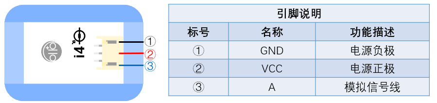

# i4環境光感測器

## 实物图片

## 基本信息

中文名称：环境光传感器

英文名称：Light Sensor

序号：i4

SKU：BOS0004

## 功能简介

环境光传感器能够检测光线强度并把光线强弱信号转换成可用的输出信号，其输出量为模拟量，可以用来制作感光的互动装置，普遍应用于智能手机、笔记本、平板电脑、GPS等移动手持设备中。

## 使用说明

环境光传感器上面的感光元件可以感知光线强度。使用时，将光线传感器置于光照条件下，

> * 当光线增强时，输出信号随之增强；当光线减弱时，输出信号随之减弱。

按照下图所示连接电路，通电后即可实现让蜂鸣器模块的声音随环境光传感器的输出信号大小而改变。

## 原理介绍

环境光传感器主要由光敏元件组成，此处的环境光传感器是一款基于PT550环保型光敏二极管的光线传感器。它可以感知周围光线情况，并根据光线强弱输出相应电压，其中光照强度和输出电压成正比。

## 应用样例

### \(1\) 报晓公鸡

**样例说明：**将模块按下图连接后，当环境光传感器接收到光线信号后会输出模拟信号，且光线越强输出的电压越高，这样便可以控制蜂鸣器模块发出声音。

**元件清单：**环境光传感器；电源主板-三路；蜂鸣器模块。

**连线图：**

### \(2\) 探究光照强度对植物生长的影响

**样例说明：**将两盆相同植物放在不同光照下，使用环境光传感器检测不同环境中的光照强度，并通过显示器模块读取光强数值（注意将显示器模块调到环境光传感器所对应的模块编号“i4”），从而探究不同光照强度下植物的生长状况，尝试找出最适宜某种植物生长的光照强度。

**元件清单：**环境光传感器；电源主板-三路；显示屏模块。

**连线图：**

### \(3\) 智能路灯

**样例说明：**将模块按下图连接后可以实现如下功能：只有在晚上的时候，听到有人来了，路灯才会亮起。这一设计大大节约了电力资源。

**元件清单：**环境光传感器；声音传感器；逻辑“与”模块；逻辑“或”模块；电源主板-三路；LED模块。

**连线图：**

### \(4\) 复古烛台

**样例说明：**用光代替火，光敏传感器感受到光后使小灯泡点亮，小灯泡一旦被“点火”成功，就保持着不灭的状态。

**元件清单：**环境光传感器；逻辑“或”模块；电源主板-三路；分支模块；LED模块。

**连线图：**

### \(5\) 光强检测仪

**样例说明：**环境光传感器测量光强，Micro:bit读取测量值并将光的强度值显示在LED点阵上。

**元件清单：**环境光传感器；Micro:bit；Micro:bit BOSON扩展板。

**连线图：**

**设计意图：**环境光传感器会把检测到的光强直接转换为模拟值输出，输出范围为0~1023，因此在制作光强检测仪时，只需把环境光传感器的输出模拟值直接读取出来并显示在Micro:bit的LED点阵上即可。

**程序示意图（中文版）：**

**程序示意图（英文版）：**

## 参数规格

引脚说明：

重量： （g）

尺寸：26mm\*22mm

工作电压：3.0-5.0V

