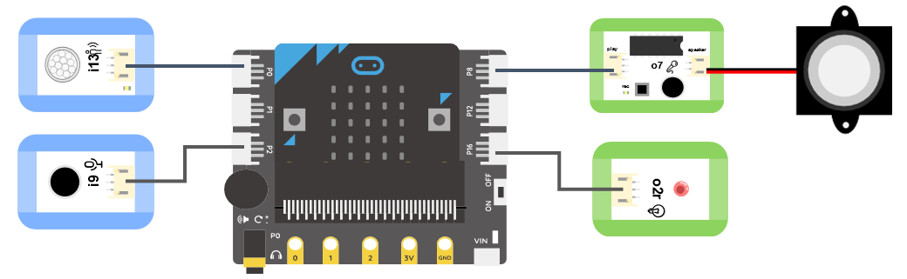
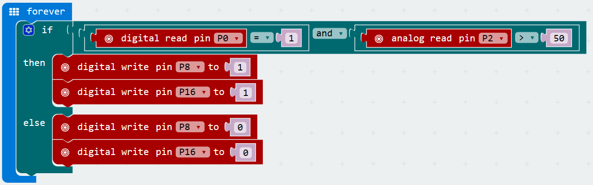

# o7錄音模組

## 实物图片

## 基本信息

中文名称：录音模块

英文名称：Voice Recorder Module

序号：o7

SKU 号：BOS0022

## 模块简介

录音是将声音信号记录在媒质上的过程，将媒质上记录的信号重放出来的过程称为放音。录音模块通过拾音头可以录制声音，通过扬声器模块还可以播放出这段录制好的声音。录音模块在录音笔、录音机、手机、电脑、调音台等场景中都有应用。

## 使用说明

按下录音模块上的录音按钮就可以开始录制声音，BOSON的录音模块最长支持录制时长10s的声音。通过按钮模块可以控制扬声器模块播放出预先录制好的声音，实现录音-放音的过程。按照下图所示连接电路，通电后按住录音模块上的录音按钮即可录制最长为10s的声音，再通过按钮模块就可以控制扬声器模块播放这段录制好的声音。

## 原理介绍

录音模块集录音和放音功能于一体，板载录音按钮和拾音头，最长可以录制10s声音。录音模块的工作原理是将声音转化为数字信号存储下来，在放音时将读取存储的数字信号传输给扬声器模块播放。

## 应用样例

### **\(1\) 留言机**

**样例说明：** 自制留言机，完成编程以后，按住录音模块上的录音按钮即可录制最长为10s的声音，再通过按钮模块就可以控制扬声器模块播放这段录制好的声音。

**元件清单：** 按钮模块；录音模块；扬声器模块；micro:bit；micro:bit BOSON扩展板。

**连线图：** 将按钮模块连接至micro:bit扩展板引脚P0，录音模块和扬声器模块连接至micro:bit扩展板引脚P8。

**执行流程：**

① 按住录音模块上的录音按钮录制最长为10s的声音。

② 如果引脚P0输出高电平（“1”），即按钮被按下，则播放录制好的声音。

③ 如果引脚P0输出低电平（“0”），即按钮松开，则不播放录制好的声音。

**程序示意图（中文版）：**

**程序示意图（英文版）：**

### **\(2\) 倒车雷达**

**样例说明：** 倒车时，当超声波距离传感器检测到后方有障碍物时，扬声器播报声音“请注意后方障碍物”，提醒司机后方有障碍物，保证倒车安全。

**元件清单：** 超声波距离传感器；录音模块；扬声器模块；电源主板-三路。

**连线图：**

### **\(3\) 教师节的礼物**

**样例说明：** 提前录制10秒钟的教师节祝福语，当老师走进教室时，运动传感器与声音传感器感受到老师，LED灯亮起，扬声器播放祝福语。

**元件清单：** 运动传感器；声音传感器；LED模块；录音模块；扬声器模块；micro:bit；micro:bit BOSON扩展板。

**连线图：** 将运动传感器连接至micro:bit扩展板引脚P0，声音传感器连接至micro:bit扩展板引脚P2，录音模块和扬声器模块连接至micro:bit扩展板引脚P8，LED模块连接至micro:bit扩展板引脚P16。

**执行流程：**

① 按住录音模块上的录音按钮录制最长为10s的教师节祝福语。

② 当运动传感器检测到教师，且声音传感器感受到声音强度大于50时，LED灯亮起，同时扬声器播放祝福语。

**程序示意图（中文版）：**

**程序示意图（英文版）：**

## 规格参数

引脚说明： 

尺寸: 38mm\*32mm

工作电压:3.0-5.0V

