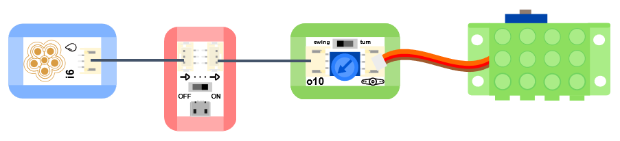

# 水分感測器

## 实物图片

## 基本信息

中文名称：水分传感器

英文名称：Steam Sensor

序号：i6

SKU：BOS0006

## 功能简介

水分传感器是一款能够将感受到的水量转换成可用输出信号的传感器，它与空气湿度传感器的区别在于前者主要用于检测水滴，而后者主要用来检测空气中的水蒸气含量。水分传感器可以用来制作检测环境的互动装置，如简易雨测仪或蒸汽液位开关等。

## 使用说明

水分传感器与Arduino、xbee传感器扩展板V5搭配使用，可以用来检测有没有下雨。水分传感器上的“五朵金花”可以感知水量的多少。

> * 当花瓣状检测面上的水分较多时，输出信号增大；当花瓣状检测面上的水分较少时，输出信号减小。

按照下图所示连接电路，通电后即可通过水分传感器的输出信号控制蜂鸣器模块，当检测到下雨时，蜂鸣器开始鸣叫；否则蜂鸣器停止鸣叫。

**\*注意：**该产品并不完全防水，请勿将3P线接口浸入水中。\*

## 原理介绍

水分传感器采用水分导电原理。

## 应用样例

### \(1\) 下雨报警器

**样例说明：**将水分传感器放在室外，当有雨水滴到花瓣状检测面上时，蜂鸣器发出警报，提醒人们下雨了。

**元件清单：**水分传感器；电源主板-单路；蜂鸣器模块。

**连线图：**

### \(2\) 雨天自动关窗

**样例说明：**将水分传感器放置在室外，当它感受到下雨以后，带动舵机运动，实现自动关窗。

**元件清单：**水分传感器；电源主板-单路；舵机控制模块。

**连线图：**

### \(3\) 简易防汛预警仪

**样例说明：**制作一个简易版的防汛预警仪，当水分传感器检测到没有下雨时什么也不做；当水分传感器检测到小雨时点亮绿色LED灯并报警5秒；当水分传感器检测到中雨时出示蓝色预警并拉响警报持续10秒；当水分传感器检测到有大雨时出示红色预警并拉响警报持续一分钟。

**元件清单：**水分传感器；蜂鸣器模块；蓝色LED模块；绿色LED模块；红色LED模块；Micro:bit；Micro:bit BOSON扩展板。

**连线图：**

**设计意图：**根据水分传感器输出模拟值的大小判断雨情，进而给出不同的汛情预警信号。

**执行流程：**

① 小雨报警：当水分传感器输出模拟值在10~300之间时，点亮绿色LED并让蜂鸣器报警5秒钟；

② 中雨蓝色预警：当水分传感器输出模拟值在300~700之间时，点亮蓝色LED并让蜂鸣器报警10秒；

③ 大雨红色预警：当水分传感器输出模拟值大于700时，点亮红色LED并让蜂鸣器报警1分钟；

④ 关闭蜂鸣器和三个LED灯。

**程序示意图（中文版）：**

**程序示意图（英文版）：**

## 参数规格

引脚说明：

重量： （g）

尺寸：26mm\*22mm

工作电压：3.0-5.0V

