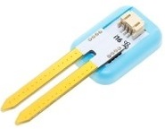

# 土壤湿度传感器

## 实物图片

## 基本信息

中文名称：土壤湿度传感器

英文名称：Soil Moisture Sensor

序号：i16

SKU：BOS0038

## 功能简介

土壤湿度传感器可以检测土壤湿度，广泛应用于节水农业灌溉、温室大棚、花卉蔬菜、草地牧场、土壤速测、植物培养、科学试验等领域。

**知识扩充：**土壤湿度指的是土壤的含水量，能直接影响到作物的水分供应状况。土壤湿度过低将形成土壤干旱，降低光合作用效率，影响作物的产量和品质。严重缺水甚至会导致作物凋萎和死亡。土壤湿度过高会恶化土壤通气性，影响土壤微生物的活动，使作物根系的呼吸、生长等生命活动受到阻碍，从而影响作物地上部分的正常生长，造成徒长、倒伏、病害滋生等。土壤水分的多少还影响田间耕作措施和播种质量，并影响土壤温度的高低。

## 使用说明

土壤湿度传感器可以搭配Micro:bit、Arduino使用，实现非常有趣的互动作品。土壤湿度传感器在使用时需要将金属部分充分插入土壤中，并等待数秒直至数据稳定，通过显示屏模块或Micro:bit可以读取土壤湿度数值，也可以通过土壤湿度传感器制作自动装置，控制其他输出模块。按照下图所示连接电路，通电后即可通过显示屏模块实时监测土壤湿度。

土壤湿度数值参考：

**注意：**

（1）不同土壤介质的测量值会存在差异。土壤中的水分存在分布不均匀的情况，数据仅能代表局部湿度。

（2）传感器顶部的塑料部分不防水，请勿将传感器整个埋入土中。

## 原理介绍

土壤中的水分含量能改变土壤的电阻率，通常来说土壤中的含水量越高，导电能力就越强。土壤湿度传感器的金属片在插入土壤中时，能充分接触到土壤，检测到电阻率的改变，并转化成电信号。

## 应用样例

### \(1\) 探究土壤湿度对种子发芽率的影响

**样例说明：**将相同数量的同一作物的种子分别种在两个盆中，通过显示器读取两盆的土壤湿度，从而控制两盆土壤湿度值始终不同，探究两种情况下种子的发芽情况。

**元件清单：**土壤湿度传感器；电源主板-单路；显示屏模块。

**连线图：**

### \(2\) 自动浇花装置

**样例说明：**利用土壤湿度传感器实时监测花盆中土壤的含水量，当土壤缺水时，舵机带动软管口降低，达到自动浇水的目的。

**元件清单：**土壤湿度传感器；阈值模块；电源主板-单路；舵机控制模块。

**连线图：**

### \(3\) 种子发芽箱

**样例说明：**检测土壤湿度、箱内温度、箱内光照强度等指标，打造适宜某种植物种子发芽的培育箱。

**元件清单：**土壤湿度传感器；温度传感器；环境光传感器；蜂鸣器模块；LED模块；Micro:bit；Micro:bit BOSON扩展板。

**连线图：**

**设计意图：**使用土壤湿度传感器、温度传感器、环境光传感器分别检测种子发芽箱中的土壤湿度、温度和光照强度。若其中某一环境因素不在设定区间范围内，则表示发芽箱内的当前环境不适宜种子生长，此时让LED灯和蜂鸣器发出警报。

**\*注意：**本程序中所设定的区间需要根据具体环境因素和种子生活习性进行调整。\*

**执行流程：**

① 初始化变量：将变量“环境指标”置为0；

② 检测土壤湿度：若土壤湿度小于200或大于800，则将“环境指标”置为1；

③ 检测温度：调用函数获取温度值，若温度小于10或大于40，则将“环境指标”置为1；

④ 检测光照：若光的强度小于100或大于900，则将“环境指标”置为1；

⑤ 判断环境是否适宜种子生长：若“环境指标”为1表明当前环境不适宜种子发芽，点亮LED灯并让蜂鸣器发生警报声持续5秒；否则什么也不做。

**程序示意图（中文版）：**

**程序示意图（英文版）：**

## 参数规格

引脚说明：

重量： （g）

尺寸：26mm\*22mm

工作电压：3.0-5.5V

工作电流：40mA@5V

