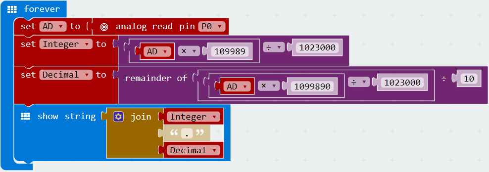

# i11温度感測器

## 实物图片

## 基本信息

中文名称：温度传感器

英文名称：Temperature Sensor

序号：i11

SKU：BOS0011

## 功能简介

温度传感器是指能感受温度并转换成可用输出信号的传感器。温度传感器用途十分广阔，可用作工农业生产中的温度测量与控制、温度补偿、风速测定、液位指示、切换式电源、热水器、电冰箱、厨房设备、空调、汽车等领域。

**知识扩充：**测量温度常用的传感器包括热电偶、铂电阻、热敏电阻和半导体测温芯片，其中热电偶常用于高温测量，铂电阻用于中温测量（摄氏800度左右），而热敏电阻和半导体温度传感器适合于100-200度以下的温度测量，其中半导体温度传感器的应用简单，有较高的灵敏度。

## 使用说明

这款温度传感器可以将感受到的温度转换成相应的模拟信号输出，

> * 当温度增加时，输出信号随之增强；当温度降低时，输出信号随之减弱。

按照下图所示连接电路，通电后即可通过温度传感器控制LED灯的亮度：温度升高，LED灯变亮；温度降低，LED灯变弱。

## 原理介绍

温度传感器利用NTC的阻值随温度变化的特性，将非电学的物理量转换为电学量，从而进行温度的精确测量与自动控制。 来源：[https://baike.baidu.com/item/温度传感器/1202879?fr=aladdin\#2](https://baike.baidu.com/item/温度传感器/1202879?fr=aladdin#2)

## 应用样例

### \(1\) 温控风扇

**样例说明：**当温度较高时，自动开启风扇，温度较低时，自动关闭。

**元件清单：**温度传感器；电源主板-单路；风扇模块。

**连线图：**

### \(2\) 探究外界环境温度对植物生长状况的影响

**样例说明：**将两盆生长状况接近的同一植物放在温度不同的环境中，每隔一段时间观察记录两种环境下植物的生长状况。

**元件清单：**温度传感器；电源主板-单路；显示屏模块。

**连线图：**

### \(3\) 空气温度检测仪

**样例说明：**温度传感器测量实时温度值，Micro:bit读取测量结果并将温度显示在LED点阵上。

**元件清单：**温度传感器；Micro:bit；Micro:bit BOSON扩展板。

**连线图：**

**设计意图：**温度传感器的转换系数为33.33℃/V，即温度（单位：℃）=输出电压（单位：V）×33.33。在套用公式前，首先要把温度传感器输出的模拟值（范围：0~1023）转换为电压值（范围：0~3.3V）。例如，若温度传感器输出模拟值500，则对应电压约为1.6V，结合温度传感器的转换系数可算出实时温度约为53.3℃。

然而，MakeCode是不支持小数运算的，所以我们需要把公式进一步转换为整数之间的运算，即**温度=模拟读数×109989÷1023000**。由于MakeCode也不支持直接显示小数，我们可以将由小数表示的温度值拆分为“整数位+小数点+小数位”三部分组成的字符串，再以字符串形式在Micro:bit上显示出温度值。那么，如何在MakeCode中分别获取一个小数的整数位和小数位呢？以求13÷4的结果为例（结果保留一位小数），整数位可以直接通过13和4相除的商获得（即3），而小数位其实就是130和4相除的余数（即2），所以13÷4最终的结果为3.2。

综上，求**温度值的整数位**可以转换为求模拟读数×109989÷1023000的商，求**温度值的小数位**可以转换为求模拟读数×1099890÷1023000÷10的余数。

**执行流程：**

① 读取模拟读数：读取温度传感器输出的模拟值并赋值给变量“模拟读数”；

② 计算温度值的整数位：整数位=模拟读数×109989÷1023000的商；

③ 计算温度值的小数位：小数位=模拟读数×1099890÷1023000÷10的余数；

④ 输出实时温度：使用“整数位+小数点+小数位”的形式输出温度字符串。

**程序示意图（中文版）：**

**程序示意图（英文版）：**

## 参数规格

引脚说明：

重量： （g）

尺寸：26mm\*22mm

工作电压：3.0-5.0V

