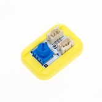
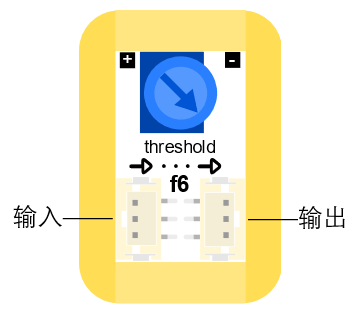

# 阈值模块

## 实物图片

## 基本信息

中文名称：阈值模块

英文名称：Threshold Module

序号：f6

SKU 号：BOS0032

## 模块简介

阈值是临界值的意思。对于阈值模块，当输入电压超过设置的临界值时，输出状态就会发生改变。阈值模块能够将一路输入信号和设置值进行比较，然后根据比较结果输出信号。阈值模块通常可以作为临界值开关，当输入超过临界值时使状态发生改变，如：在使用环境光传感器控制小灯时，若小灯不亮，可以逆时针调节阈值模块上的蓝色旋钮降低对于光强的要求。

## 使用说明

阈值模块既可以放在输入端，也可以放在输出端，但该模块不能直接作为输入或输出模块使用，需要将输入模块连接在阈值模块的输入口，输出模块连接在阈值模块的输出口，通过改变输入口的信号来控制输出口。阈值模块的输入口和输出口如下图所示。

阈值模块能够输入数字信号或模拟信号，但该模块只能输出数字信号。阈值模块的输入输出机制如下：

当输入信号小于设置阈值时，模块输出“关”或“0”；

当输入信号大于设置阈值时，模块输出“开”或“1”。

按照下图所示连接电路，通电后即可通过调节阈值模块的设定值来控制LED灯的点亮和熄灭。

## 原理介绍

阈值模块是通过电位器设置一个临界值，然后将输入信号和此临界值进行比较，根据比较结果的不同输出不同的信号。

## 应用样例

### **\(1\) 自动浇花装置**

**样例说明：** 利用土壤湿度传感器实时监测花盆中土壤的含水量，当土壤缺水时，舵机带动软管口降低，达到自动浇水的目的。

**元件清单：** 土壤湿度传感器；阈值模块；舵机控制模块；9g金属舵机模块；电源主板-单路。

**连线图：**

### **\(2\) 粮仓温湿度检测**

**样例说明：** 粮仓粮食安全储藏的主要参数是粮仓的温度和湿度，这两者之间又是互相关联的。粮食在正常储藏过程中，含水量一般在12%以下是安全状态，不会产生温度突变，一旦粮仓进水、结露等使粮食的含水量达到20%以上时，就会使粮食受潮，胚芽萌发，新陈代谢加快而产生呼吸热，使局部粮食温度突然升高，当温度高于22°C时，必然引起粮食“发烧”和霉变，并可能形成连锁反应，从而造成不可挽回的损失。因此有必要检测粮食温度。当温度传感器感受到粮食内温度时，当温度高于22°C时，自动开启风扇、点亮小灯并报警。而当湿度传感器感受到粮食内湿度高于20%时，自动点亮小灯并报警。

**元件清单：** 防水温度传感器；空气湿度传感器；逻辑“或”模块；阈值模块；分支模块；蜂鸣器模块；LED模块；风扇模块；电源主板-三路。

**连线图：**

## 规格参数

引脚说明： 

尺寸: 26mm\*22mm

工作电压:3.0-5.5V

工作电流：\(Max\)12.5mA@5V

