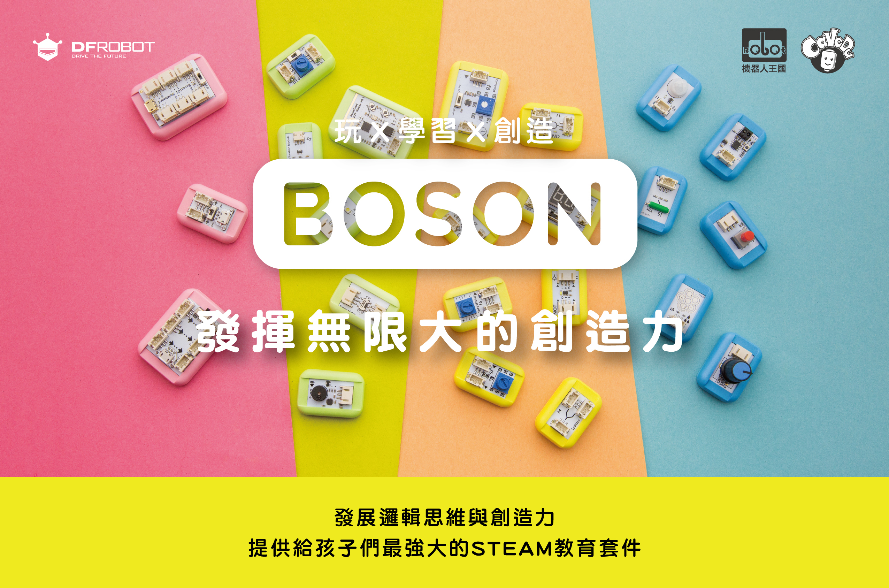

# 認識BOSON

依照套件內容分成\[[發明家套件 Inventor Kit](https://cavedu.gitbook.io/cavedu/boson/boson_intro#shu-wei-luo-ji-tui-jian-fa-ming-jia-tao-jian-inventor-kit) \]、\[[科學家套件 Science Kit](https://cavedu.gitbook.io/cavedu/boson/boson_intro#ke-xue-shi-yan-tui-jian-ke-xue-jia-tao-jian-science-kit) \]以及 \[[程式套件Boson Kit for micro:bit](https://cavedu.gitbook.io/cavedu/boson/boson_intro#cheng-shi-she-ji-tui-jian-cheng-shi-tao-jian-boson-kit-for-microbit)\]。發明家與科學家套件無需寫程式，開盒即可開始使用！程式套件則需搭配BBC micro:bit開發板與擴充板來連接BOSON元件，提供更多專題變化，根據模組類型可以分為輸入、輸出與功能等三種模組，請根據畫面左側選單找到您喜歡的模組吧！另外，我們也使用了LinkIt 7697來連接BOSON電子積木，可使用的感測器分類在下列的項目。

## 【數位邏輯推薦】發明家套件 Inventor Kit

* 實際控制創作\(無需使用電腦\)，立即了解邏 輯流程。
* 將AND、OR、NOT等邏輯運算子實體化。
* 創作素材不設限。

### 感測器清單：

#### [輸入模組](https://cavedu.gitbook.io/boson/boson_intro/input_modules)

* [旋鈕模組](https://cavedu.gitbook.io/boson/boson_intro/input_modules/rotation_sensor) x 1
* [按鈕模組（藍色）](https://cavedu.gitbook.io/boson/boson_intro/input_modules/push_button) x 1
* [自鎖開關 ](https://cavedu.gitbook.io/boson/boson_intro/input_modules/self_locking_switch)x 1
* [光感測器](https://cavedu.gitbook.io/boson/boson_intro/input_modules/light_sensor)x 1
* [傾斜感測器](https://cavedu.gitbook.io/boson/boson_intro/input_modules/tilt_switch)x 1
* [聲音感測器](https://cavedu.gitbook.io/boson/boson_intro/input_modules/sound_sensor)x 1

#### [輸出模組](https://cavedu.gitbook.io/boson/boson_intro/output_modules)

* LED燈模組 x 1
* LED燈條 x 1
* [蜂鳴器模組](https://cavedu.gitbook.io/boson/boson_intro/output_modules/buzzer_module)x 1
* [錄音機模組/喇叭](https://cavedu.gitbook.io/boson/boson_intro/output_modules/voice_recorder_module) x 1
* [馬達模組](https://cavedu.gitbook.io/boson/boson_intro/output_modules/motor_controller_module) x 1
* [伺服機模組](https://cavedu.gitbook.io/boson/boson_intro/output_modules/servo_module_with_servo) x1

#### [功能模組](https://cavedu.gitbook.io/boson/boson_intro/funtion_modules)

* [運算邏輯模組 AND](https://cavedu.gitbook.io/boson/boson_intro/funtion_modules/logic_module_and)x 3
* [運算邏輯模組 OR](https://cavedu.gitbook.io/boson/boson_intro/funtion_modules/logic_module_or)x 3
* [運算邏輯模組 NOT](https://cavedu.gitbook.io/boson/boson_intro/funtion_modules/logic_module_not) x 3
* [分配模組](https://cavedu.gitbook.io/boson/boson_intro/funtion_modules/splitter_module)x 3
* [閾模組](https://cavedu.gitbook.io/boson/boson_intro/funtion_modules/threshold_module)x 2
* [計數模組](https://cavedu.gitbook.io/boson/boson_intro/funtion_modules/reversible_counter_module) x 2
* [計時模組\(0-60秒\)](https://cavedu.gitbook.io/boson/boson_intro/funtion_modules/duration_module) x 2

購買連結：[https://www.robotkingdom.com.tw/product/boson-inventor-kit/](https://www.robotkingdom.com.tw/product/boson-inventor-kit/)

## 【科學實驗推薦】科學家套件 Science Kit

* 擁有10種以上不同功能的感測器。
* 不受限於只能在學校實驗室進行實驗。
* 體驗科學實驗與進行科展創作的新武器。

### 感測器清單：

#### 輸入模組

* 光感測器 x1
* 濕度感測器x1
* 土壤濕度感測器 x1
* 溫度感測器x1
* 防水溫度感測器x1
* 酸鹼值感應器x1
* 導電感測開關x1
* 心律監測感測器x1

#### 輸出模組

* OLED顯示模組

購買連結：[https://www.robotkingdom.com.tw/product/boson-science-kit/](https://www.robotkingdom.com.tw/product/boson-science-kit/)

## 【程式設計推薦】程式套件Boson Kit for micro:bit

* 程式入門上手推薦，虛實整合完美搭配。
* 實際體驗更多物聯網主題。
* 能夠更加自由創作。

#### 輸入模組

* LED 模組（紅色）x 1
* 旋鈕模組 x 1
* 聲音感測器 x 1
* 動作感測器 x 1

#### 輸出模組

* 按鈕模組（紅色）x 1
* 風扇模組x 1
* 伺服機模組x 1
* 七彩燈條 x 1

#### 擴充板

* Micro:bit for BOSON擴充板 x 1

購買連結：[https://www.robotkingdom.com.tw/product/boson-starter-kit-for-microbit/](https://www.robotkingdom.com.tw/product/boson-starter-kit-for-microbit/)

## 跟LinkIt 7697一起使用的感測器

### 輸入模組

* [i2r按鈕模組](input_modules/push_button.md)
* [i3自鎖開關](input_modules/self_locking_switch.md)
* [i5傾斜感測器](input_modules/tilt_switch.md)
* [i12導電感測開關](input_modules/conductivity_sensor_switch.md)
* [i13動作感測器](input_modules/motion_sensor.md)

### **輸出模組**

* [o2LED燈模組](output_modules/led_module.md)
* [o5蜂鳴器模組](output_modules/buzzer_module.md)
* [o6風扇模組](output_modules/fan_module.md)
* [o7錄音機模組/喇叭](output_modules/voice_recorder_module.md)
* [o9馬達模組](output_modules/motor_controller_module.md)
* [o10伺服機模組](output_modules/servo_module_with_servo.md)

## 跟micro:bit一起使用的感測器

### 輸入模組

* [i1旋鈕模組](input_modules/rotation_sensor.md)
* [i2r按鈕模組](input_modules/push_button.md)
* [i3自鎖開關](input_modules/self_locking_switch.md)
* [i4光感測器](input_modules/light_sensor.md)
* [i5傾斜感測器](input_modules/tilt_switch.md)
* [i6水分感測器](input_modules/steam_sensor.md)
* [i7火焰感測器](input_modules/flame_sensor.md)
* [i8觸碰感測器](input_modules/touch_sensor.md)
* [i9聲音感測器](input_modules/sound_sensor.md)
* [i10紅外線接近度感測器](input_modules/ir_proximity_sensor.md)
* [i11溫度感測器](input_modules/temperature_sensor.md)
* [i12導電感測開關](input_modules/conductivity_sensor_switch.md)
* [i13動作感測器](input_modules/motion_sensor.md)
* [i16土壤濕度感測器](input_modules/soil_moisture_sensor.md)
* [i17酸鹼值感測器](input_modules/ph_sensor.md)
* [i18濕度感測器](input_modules/humidity_sensor.md)
* [i19防水溫度感測器](input_modules/water_proof_temperature_sensor.md)
* [i20心律監測感測器](input_modules/heartrate_monitor_sensor.md)
* [i22超音波感測器](input_modules/ultrasonic_sensor.md)

### **輸出模組**

* [o2LED燈模組](output_modules/led_module.md)
* [o5蜂鳴器模組](output_modules/buzzer_module.md)
* [o6風扇模組](output_modules/fan_module.md)
* [o7錄音機模組/喇叭](output_modules/voice_recorder_module.md)
* [o9馬達模組](output_modules/motor_controller_module.md)
* [o10伺服機模組](output_modules/servo_module_with_servo.md)
* [七彩燈條](output_modules/rgb_led_string.md)

