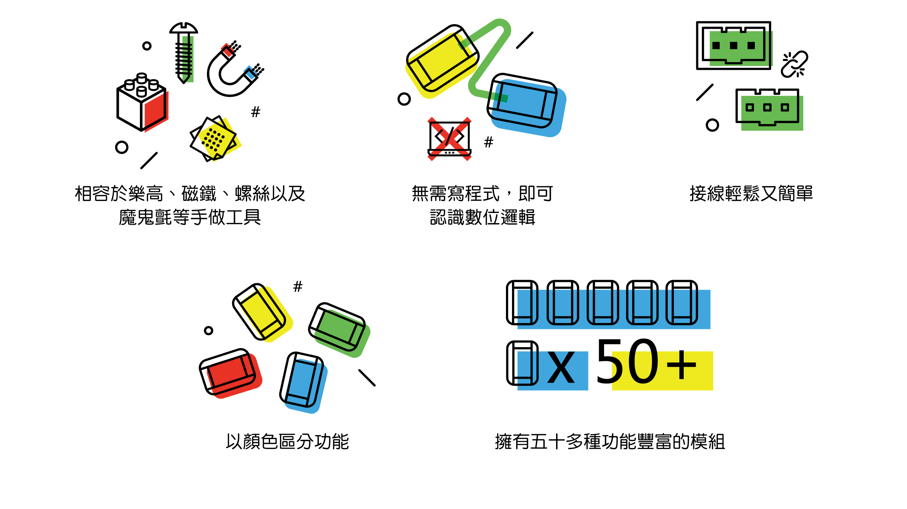

# 認識BOSON

依照套件內容分成\[[發明家套件 Inventor Kit](https://cavedu.gitbook.io/cavedu/boson/boson\_intro#shu-wei-luo-ji-tui-jian-fa-ming-jia-tao-jian-inventor-kit) ]、\[[科學家套件 Science Kit](https://cavedu.gitbook.io/cavedu/boson/boson\_intro#ke-xue-shi-yan-tui-jian-ke-xue-jia-tao-jian-science-kit) ]以及 \[[程式套件Boson Kit for micro:bit](https://cavedu.gitbook.io/cavedu/boson/boson\_intro#cheng-shi-she-ji-tui-jian-cheng-shi-tao-jian-boson-kit-for-microbit)]。發明家與科學家套件無需寫程式，開盒即可開始使用！程式套件則需搭配BBC micro:bit開發板與擴充板來連接BOSON元件，提供更多專題變化，根據模組類型可以分為輸入、輸出與功能等三種模組，請根據畫面左側選單找到您喜歡的模組吧！另外，我們也使用了LinkIt 7697來連接BOSON電子積木，可使用的感測器分類在下列的項目。

## 【數位邏輯推薦】發明家套件 Inventor Kit

* 實際控制創作(無需使用電腦)，立即了解邏 輯流程。
* 將AND、OR、NOT等邏輯運算子實體化。
* 創作素材不設限。

### 感測器清單：

#### [輸入模組](https://cavedu.gitbook.io/cavedu/boson/boson\_intro/input\_modules)

* [旋鈕模組](https://cavedu.gitbook.io/cavedu/boson/boson\_intro/input\_modules/rotation\_sensor) x 1
* [按鈕模組](https://cavedu.gitbook.io/cavedu/boson/boson\_intro/input\_modules/push\_button) x 1
* [自鎖開關 ](https://cavedu.gitbook.io/boson/self\_locking\_switch)x 1
* [光感測器](https://cavedu.gitbook.io/cavedu/boson/boson\_intro/input\_modules/light\_sensor)x 1
* [傾斜感測器](input\_modules/tilt\_switch.md)x 1
* [聲音感測器](input\_modules/sound\_sensor.md)x 1

#### [輸出模組](https://cavedu.gitbook.io/cavedu/boson/boson\_intro/output\_modules)

* [七彩燈條](https://cavedu.gitbook.io/cavedu/boson/boson\_intro/output\_modules/rgb\_led\_string) x 1
* [LED燈模組](https://cavedu.gitbook.io/cavedu/boson/boson\_intro/output\_modules/led\_module) x 1
* [蜂鳴器模組](https://cavedu.gitbook.io/cavedu/boson/boson\_intro/output\_modules/buzzer\_module) x 1
* [錄音機模組/喇叭](https://cavedu.gitbook.io/cavedu/boson/boson\_intro/output\_modules/voice\_recorder\_module) x 1
* [馬達模組](https://cavedu.gitbook.io/cavedu/boson/boson\_intro/output\_modules/motor\_controller\_module) x 1
* [伺服機模組](https://cavedu.gitbook.io/cavedu/boson/boson\_intro/output\_modules/servo\_module\_with\_servo) x1

#### [功能模組](https://cavedu.gitbook.io/cavedu/boson/boson\_intro/funtion\_modules)

* [運算邏輯模組 AND](https://cavedu.gitbook.io/cavedu/boson/boson\_intro/funtion\_modules/logic\_module\_and) x 3
* [運算邏輯模組 OR](https://cavedu.gitbook.io/cavedu/boson/boson\_intro/funtion\_modules/logic\_module\_or) x 3
* [運算邏輯模組 NOT](https://cavedu.gitbook.io/cavedu/boson/boson\_intro/funtion\_modules/logic\_module\_not) x 3
* [分配模組](https://cavedu.gitbook.io/cavedu/boson/boson\_intro/funtion\_modules/splitter\_module) x 3
* [閾模組](https://cavedu.gitbook.io/cavedu/boson/boson\_intro/funtion\_modules/threshold\_module) x 2
* [計數模組](https://cavedu.gitbook.io/cavedu/boson/boson\_intro/funtion\_modules/reversible\_counter\_module) x 2
* [計時模組(0-60秒)](https://cavedu.gitbook.io/cavedu/boson/boson\_intro/funtion\_modules/duration\_module) x 2

購買連結：[https://www.robotkingdom.com.tw/product/boson-inventor-kit/](https://www.robotkingdom.com.tw/product/boson-inventor-kit/)

## 【科學實驗推薦】科學家套件 Science Kit

* 擁有10種以上不同功能的感測器。
* 不受限於只能在學校實驗室進行實驗。
* 體驗科學實驗與進行科展創作的新武器。

### 感測器清單：

#### 輸入模組

* 光感測器 x1
* 濕度感測器x1
* 土壤濕度感測器 x1
* 溫度感測器x1
* 防水溫度感測器x1
* 酸鹼值感應器x1
* 導電感測開關x1
* 心律監測感測器x1

#### 輸出模組

* OLED顯示模組

購買連結：[https://www.robotkingdom.com.tw/product/boson-science-kit/](https://www.robotkingdom.com.tw/product/boson-science-kit/)

## 【程式設計推薦】程式套件Boson Kit for micro:bit

* 程式入門上手推薦，虛實整合完美搭配。
* 實際體驗更多物聯網主題。
* 能夠更加自由創作。

#### 輸入模組

* LED 模組（紅色）x 1
* 旋鈕模組 x 1
* 聲音感測器 x 1
* 動作感測器 x 1

#### 輸出模組

* 按鈕模組（紅色）x 1
* 風扇模組x 1
* 伺服機模組x 1
* 七彩燈條 x 1

#### 擴充板

* Micro:bit for BOSON擴充板 x 1

購買連結：[https://www.robotkingdom.com.tw/product/boson-starter-kit-for-microbit/](https://www.robotkingdom.com.tw/product/boson-starter-kit-for-microbit/)

## 跟LinkIt 7697一起使用的感測器

### 輸入模組

* [i2r按鈕模組](input\_modules/push\_button.md)
* [i3自鎖開關](input\_modules/self\_locking\_switch.md)
* [i5傾斜感測器](input\_modules/tilt\_switch.md)
* [i12導電感測開關](input\_modules/conductivity\_sensor\_switch.md)
* [i13動作感測器](input\_modules/motion\_sensor.md)

### **輸出模組**

* [o2LED燈模組](output\_modules/led\_module.md)
* [o5蜂鳴器模組](output\_modules/buzzer\_module.md)
* [o6風扇模組](output\_modules/fan\_module.md)
* [o7錄音機模組/喇叭](output\_modules/voice\_recorder\_module.md)
* [o9馬達模組](output\_modules/motor\_controller\_module.md)
* [o10伺服機模組](output\_modules/servo\_module\_with\_servo.md)

## 跟micro:bit一起使用的感測器

### 輸入模組

* [i1旋鈕模組](input\_modules/rotation\_sensor.md)
* [i2r按鈕模組](input\_modules/push\_button.md)
* [i3自鎖開關](input\_modules/self\_locking\_switch.md)
* [i4光感測器](input\_modules/light\_sensor.md)
* [i5傾斜感測器](input\_modules/tilt\_switch.md)
* [i6水分感測器](input\_modules/steam\_sensor.md)
* [i7火焰感測器](input\_modules/flame\_sensor.md)
* [i8觸碰感測器](input\_modules/touch\_sensor.md)
* [i9聲音感測器](input\_modules/sound\_sensor.md)
* [i10紅外線接近度感測器](input\_modules/ir\_proximity\_sensor.md)
* [i11溫度感測器](input\_modules/temperature\_sensor.md)
* [i12導電感測開關](input\_modules/conductivity\_sensor\_switch.md)
* [i13動作感測器](input\_modules/motion\_sensor.md)
* [i16土壤濕度感測器](input\_modules/soil\_moisture\_sensor.md)
* [i17酸鹼值感測器](input\_modules/ph\_sensor.md)
* [i18濕度感測器](input\_modules/humidity\_sensor.md)
* [i19防水溫度感測器](input\_modules/water\_proof\_temperature\_sensor.md)
* [i20心律監測感測器](input\_modules/heartrate\_monitor\_sensor.md)
* [i22超音波感測器](input\_modules/ultrasonic\_sensor.md)

### **輸出模組**

* [o2LED燈模組](output\_modules/led\_module.md)
* [o5蜂鳴器模組](output\_modules/buzzer\_module.md)
* [o6風扇模組](output\_modules/fan\_module.md)
* [o7錄音機模組/喇叭](output\_modules/voice\_recorder\_module.md)
* [o9馬達模組](output\_modules/motor\_controller\_module.md)
* [o10伺服機模組](output\_modules/servo\_module\_with\_servo.md)
* [七彩燈條](output\_modules/rgb\_led\_string.md)
