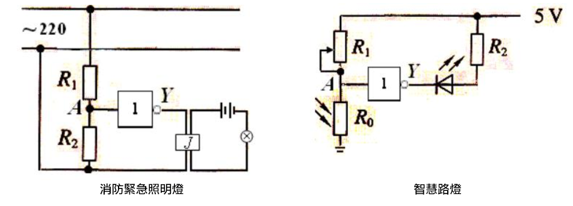

# f3運算邏輯模組NOT

## 實體照片

## 基本信息

中文名稱：運算邏輯模組 NOT

英文名稱：Logic Module - NOT

序號：f3

SKU 號：BOS0029

## 功能簡介

運算邏輯模組 NOT是功能模組中的一種，可以用來進行簡單的邏輯運算，還可以和其他邏輯模組組合使用，達到更為複雜的功能，如數據的運算和存儲。運算邏輯模組 NOT可廣泛應用於日常生活中的消防緊急照明燈、智慧路燈、火警警報裝置等電路。

## 使用說明

運算邏輯模組 NOT既可以放在輸入端，也可以放在輸出端，但該模組不能直接作為輸入或輸出模組使用，需要將輸入模組連接在運算邏輯模組 NOT的輸入口，輸出模組連接在運算邏輯模組 NOT的輸出口，通過改變輸入口的信號來控制輸出口。運算邏輯模組 NOT的輸入口和輸出口如下圖所示。

運算邏輯模組 NOT既可以輸入數位信號，也可以輸入類比信號，但該模組只能輸出數位信號。運算邏輯模組 NOT能夠對輸入信號進行處理並輸出相應結果，其輸入輸出機制如下：

當輸入訊號為「0」時，模組輸出「1」；

當輸入訊號為「1」時，模組輸出「0」。

下圖列出了運算邏輯模組 NOT的真值表。

按照下圖所示連接電路，通電後紅色LED燈亮起，按下紅色按鈕時紅色LED燈熄滅，鬆開紅色按鈕後紅色LED燈再次亮起。

## 原理介紹

反閘是積體電路上的基本組件。簡單的邏輯閘可由電晶體組成，並由高低電位控制。高、低電位可以分別代表邏輯上的“真”和“假”、二進位當中的1和0、“開”和“關”，從而達到邏輯運算。

## 應用範例

### **\(1\) 防盜展示臺**

**範例說明：** 防盜展示臺的功能是當展品離開展示臺，展示臺自動警報。將展品放在按鈕上，相當於按下按鈕。當展品被拿開時，按鈕彈起，蜂鳴器發出警報。正常情況下，按鈕按下輸出高電位，高電位會使蜂鳴器發出聲音，這與之前的設想恰好相反。因此，需要借助一個運算邏輯模組 NOT，將按鈕輸出的高電位轉為低電位，不讓蜂鳴器在按鈕按下的情況下發出聲音。

**元件清單：** 按鈕模組；運算邏輯模組 OR；蜂鳴器模組；主控板：1組輸入/輸出端。

**連線圖：**

### **\(2\) 智慧路燈**

**範例說明：** 將模組按下圖連接後可以達到如下功能：只有在晚上的時候，聽到有人來了，路燈才會亮起。這一設計大大節約了電力資源。

**元件清單：** 光感測器；聲音感測器；運算邏輯模組 NOT；運算邏輯模組 AND；LED燈模組；主控板：1組輸入/輸出端。

**連線圖：**

### **\(3\) 搶答器**

**範例說明：** 做一個搶答器，讓按下按鈕的人，亮起對應的燈，同時阻止另一個燈不能再亮起。

**元件清單：** 藍色按鈕模組；紅色按鈕模組；藍色LED燈模組；紅色LED燈模組；運算邏輯模組 AND；運算邏輯模組 NOT；分配模組；主控板：3組輸入/輸出端。

**連線圖：**

## 商品規格

腳位說明：

尺寸: 26mm\*22mm

工作電壓:3.0-5.5V

工作電流：\(Max\)32mA@5V

