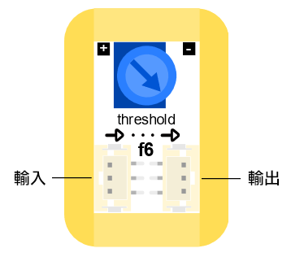
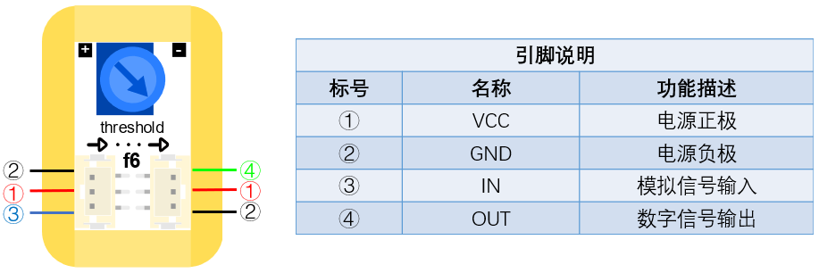

# f6閾模組

## 實體照片

## 基本信息

中文名稱：閾模組

英文名稱：Threshold Module

序號：f6

SKU 號：BOS0032

## 功能簡介

閾值是臨界值的意思。對於閾模組，當輸入電壓超過設置的臨界值時，輸出狀態就會發生改變。閾模組能夠將一路輸入信號和設置值進行比較，然後根據比較結果輸出信號。閾模組通常可以作為臨界值開關，當輸入超過臨界值時使狀態發生改變，如：在使用光感測器控制小燈時，若小燈不亮，可以逆時針調節閾模組上的藍色旋鈕降低對於光強的要求。

## 使用說明

閾模組既可以放在輸入端，也可以放在輸出端，但該模組不能直接作為輸入或輸出模組使用，需要將輸入模組連接在閾模組的輸入口，輸出模組連接在閾模組的輸出口，通過改變輸入口的信號來控制輸出口。閾模組的輸入口和輸出口如下圖所示。

閾模組能夠輸入數位信號或類比信號，但該模組只能輸出數位信號。閾模組的輸入輸出機制如下：

當輸入信號小於設置閾值時，模組輸出「0」；

當輸入信號大於設置閾值時，模組輸出「1」。

按照下圖所示連接電路，通電後即可通過調節閾模組的設定值來控制LED燈的點亮和熄滅。

## 原理介紹

閾模組是通過電位器設置一個臨界值，然後將輸入信號和此臨界值進行比較，根據比較結果的不同輸出不同的信號。

## 應用範例

### **\(1\) 自動澆花裝置**

**範例說明：** 利用土壤濕度感測器即時監測花盆中土壤的含水量，當土壤缺水時，伺服機帶動軟管口降低，達到自動澆水的目的。

**元件清單：** 土壤濕度感測器；閾模組；伺服機模組；9g金屬伺服機模組；主控板：1組輸入/輸出端。

**連線圖：**

### **\(2\) 糧倉溫濕度檢測**

**範例說明：** 糧倉糧食安全儲藏的主要參數是糧倉的溫度和濕度，這兩者之間又是互相關聯的。糧食在正常儲藏過程中，含水量一般在12%以下是安全狀態，不會產生溫度突變，一旦糧倉進水、結露等使糧食的含水量達到20%以上時，就會使糧食受潮，胚芽萌發，新陳代謝加快而產生呼吸熱，使局部糧食溫度突然升高，當溫度高於22°C時，必然引起糧食“發燒”和發霉變質，並可能形成連鎖反應，從而造成不可挽回的損失。因此有必要檢測糧食溫度。當溫度感測器感受到糧食內溫度時，當溫度高於22°C時，自動開啟風扇、點亮小燈並發出警報。而當濕度感測器感受到糧食內濕度高於20%時，自動點亮小燈並發出警報。

**元件清單：** 防水溫度感測器；濕度感測器；運算邏輯模組 OR；閾模組；分配模組；蜂鳴器模組；LED燈模組；風扇模組；主控板：3組輸入/輸出端。

**連線圖：**

## 商品規格

腳位說明：

尺寸: 26mm\*22mm

工作電壓:3.0-5.5V

工作電流：\(Max\)12.5mA@5V

