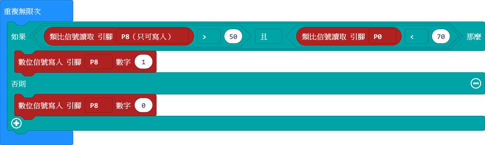
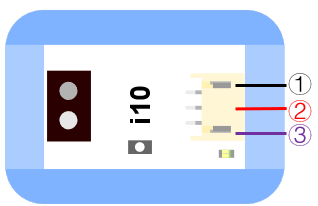

# i10紅外線接近度感測器

## 實體照片

## 基本信息

中文名稱：紅外線接近度感測器

英文名稱：Infrared Proximity Sensor

序號：i10

SKU：BOS0010

## 功能簡介

紅外線接近度感測器可以感知地面或桌面不同的顏色而產生相應的信號，可達成與顏色有相關的互動作品，也可以用於巡線小車的巡線感測器或者足球機器人的場地灰度識別。

## 使用說明

紅外線接近度感測器可以與Arduino專用感測器擴充板結合使用，與其他感測器不同的是，紅外線接近度感測器既可以輸出類比值，也可以輸出數位值，通過短按按鍵可以達成類比值與數位值之間的切換。

**（1）類比值輸出**

紅外線接近度感測器可以識別不同的顏色並返回不同的電壓值，用三用電表可以觀察到電壓值會發生線性變化，同時LED燈的明暗程度也隨著電壓值的變化而變化。

**（2）數位值輸出**

通過顏色偵測，紅外線接近度感測器可以感知任意兩種顏色然後輸出相應的電壓值，步驟如下：

①偵測所要檢測的兩種顏色：長按按鍵直到LED燈閃爍，等按鍵釋放，則開始第一種顏色電壓值偵測。短按一下，結束第一種顏色的偵測，LED燈熄滅；再短按一下，開始第二種顏色電壓值偵測，此時LED燈快速閃爍；再短按一下，結束偵測回到正常輸出模式。

②測試兩種顏色之下返回的電壓值：當檢測到深顏色時，輸出電壓值約等於0，同時LED燈熄滅；當檢測到淺顏色時，輸出電壓值接近5V，同時LED燈亮。

多重的顏色偵測方式可達成一次偵測多次使用，亦可根據需要隨時偵測。偵測到的顏色具有斷電保持特性，即斷電之後，紅外線接近度感測器會自動保存輸出模式和偵測到的顏色的值，在下次通電的時候保持原來的狀態。

**注意：**

（1）檢測面的材質不同會引起其返回值的差異。

（2）外界光線的強弱對紅外線接近度感測器影響非常大，會直接影響其檢測效果，在對具體項目檢測時注意包裝感測器，避免外界光的干擾。

（3）測量的準確性和感測器到檢測面的距離是有直接關係的。在機器人運動時機體的震盪同樣會影響其測量精確度。

## 原理介紹

灰度感測器內置光敏探頭，根據不同顏色的檢測面對光的反射程度不同、以及光敏電阻對不同檢測面返回的光的阻值也不同的原理進行顏色深淺檢測。 來源：[http://baike.eepw.com.cn/baike/show/word/灰度传感器](http://baike.eepw.com.cn/baike/show/word/灰度传感器)

## 應用範例

### \(1\) 灰度指示儀

**範例說明：**不同的顏色可以發出不同的電壓，通過紅外線接近度感測器可以檢測不同顏色之下小燈的亮度。

**元件清單：**紅外線接近度感測器；主控板：1組輸入/輸出端；LED燈模組。

**連線圖：**

### \(2\) 貨物分類系統

**範例說明：**使用紅外線接近度感測器識別傳送帶上的貨物顏色，當識別出指定顏色的貨物時透過發出聲音提示工人分類貨物。

**元件清單：**紅外線接近度感測器；蜂鳴器模組；Micro:bit；Micro:bit BOSON擴充板。

**連線圖：**

**設計意圖：**使用紅外線接近度感測器識別傳送帶上的貨物顏色，當測得的電壓值位於相應顏色電壓值的範圍內，即已識別出指定顏色的貨物時，透過蜂鳴器鳴叫提示工人分類貨物。

**執行流程：**

① 識別到指定顏色的貨物：紅外線接近度感測器輸出類比值位於指定顏色電壓值範圍內，蜂鳴器開始鳴叫；

② 未識別到指定顏色的貨物：蜂鳴器停止鳴叫。

**程式示意圖（中文版）：**

**Example program\(English\)：**

## 商品規格

腳位說明：

| **編號** | **名稱** | **功能說明** |
| :---: | :---: | :---: |
| 1 | GND | 電源接地 |
| 2 | VCC | 電源正極 |
| 3 | A-D | 類比/數位訊號 |

重量： （g）

尺寸：26mm\*22mm

工作電壓：3.0-5.0V

