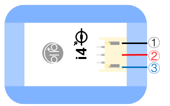

# i4光感測器

## 實體照片

## 基本信息

中文名稱：光感測器

英文名稱：Light Sensor

序號：i4

SKU：BOS0004

## 功能簡介

光感測器能夠檢測光線強度並把光線強弱信號轉換成可用的輸出信號，其輸出值為類比信號，可以用來製作感光的互動裝置，普遍應用於智慧手機、筆記本、平板電腦、GPS等移動手持設備中。

## 使用說明

光感測器上面的感光元件可以感知光線強度。使用時，將光線感測器置於光照條件下，

> * 當光線增強時，輸出信號隨之增強；當光線減弱時，輸出信號隨之減弱。

按照下圖所示連接電路，通電後即可達成讓蜂鳴器模組的聲音隨光感測器的輸出信號大小而改變。

## 原理介紹

光感測器主要由光敏元件組成，此處的光感測器是一款基於PT550環保型光敏二極體的光線感測器。它可以感知周圍光線情況，並根據光線強弱輸出相應電壓，其中光照強度和輸出電壓成正比。

## 應用範例

### \(1\) 報曉公雞

**範例說明：**將模組按下圖連接後，當光感測器接收到光線信號後會輸出類比信號，且光線越強輸出的電壓越高，這樣便可以控制蜂鳴器模組發出聲音。

**元件清單：**光感測器；主控板：3組輸入/輸出端；蜂鳴器模組。

**連線圖：**

### \(2\) 探究光照強度對植物生長的影響

**範例說明：**將兩盆相同植物放在不同光照下，使用光感測器檢測不同環境中的光照強度，並通過顯示器模組讀取光強數值（注意將顯示器模組調到光感測器所對應的模組編號“i4”），從而探究不同光照強度下植物的生長狀況，嘗試找出最適宜某種植物生長的光照強度。

**元件清單：**光感測器；主控板：3組輸入/輸出端；OLED顯示模組。

**連線圖：**

### \(3\) 智慧路燈

**範例說明：**將模組按下圖連接後可以實現如下功能：只有在晚上的時候，聽到有人來了，路燈才會亮起。這一設計大大節約了電力資源。

**元件清單：**光感測器；聲音感測器；運算邏輯模組 AND；運算邏輯模組 OR；主控板：3組輸入/輸出端；LED燈模組。

**連線圖：**

### \(4\) 復古燭臺

**範例說明：**用光代替火，光敏感測器感受到光後使小燈泡點亮，小燈泡一旦被“點亮”成功，就保持著不滅的狀態。

**元件清單：**光感測器；運算邏輯模組 OR；主控板：3組輸入/輸出端；分配模組；LED燈模組。

**連線圖：**

### \(5\) 光強度檢測儀

**範例說明：**光感測器測量光強度，Micro:bit讀取測量值並將光的強度值顯示在LED燈點陣上。

**元件清單：**光感測器；Micro:bit；Micro:bit BOSON擴充板。

**連線圖：**

**設計意圖：**光感測器會把檢測到的光強度直接轉換為類比值輸出，輸出範圍為0~1023，因此在製作光強度檢測儀時，只需把光感測器的輸出類比值直接讀取出來並顯示在Micro:bit的LED燈點陣上即可。

**程式示意圖（中文版）：** 

 **Example program\(English\)：**

## 商品規格

腳位說明：

| **編號** | **名稱** | **功能說明** |
| :---: | :---: | :---: |
| 1 | GND | 電源接地 |
| 2 | VCC | 電源正極 |
| 3 | A | 類比訊號 |

重量： （g）

尺寸：26mm\*22mm

工作電壓：3.0-5.0V

