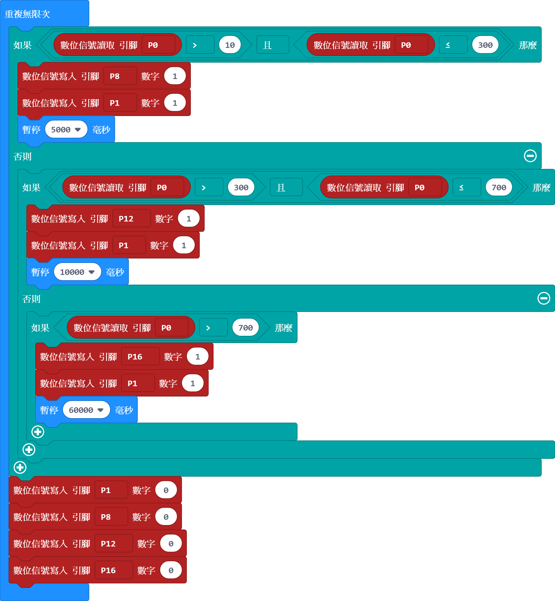
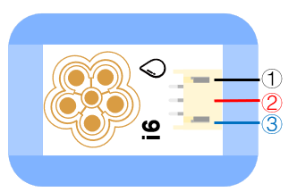

# i6水分感測器

## 實體照片

## 基本信息

中文名稱：水分感測器

英文名稱：Steam Sensor

序號：i6

SKU：BOS0006

## 功能簡介

水分感測器是一款能夠將感受到的水量轉換成可用輸出訊號的感測器，它與空氣濕度感測器的區別在於前者主要用於檢測水滴，而後者主要用來檢測空氣中的水蒸氣含量。水分感測器可以用來製作檢測環境的互動裝置，如簡易雨測儀或蒸汽液位元開關等。

## 使用說明

水分感測器與Arduino、xbee感測器擴充板V5搭配使用，可以用來檢測有沒有下雨。水分感測器上的“五朵金花”可以感知水量的多少。

> * 當花瓣狀檢測面上的水分較多時，輸出訊號增大；當花瓣狀檢測面上的水分較少時，輸出訊號減小。

按照下圖所示連接電路，通電後即可通過水分感測器的輸出信號控制蜂鳴器模組，當檢測到下雨時，蜂鳴器開始鳴叫；否則蜂鳴器停止鳴叫。

**\*注意：**該產品並不完全防水，請勿將3P線介面浸入水中。\*

## 原理介紹

水分感測器採用水分導電原理。

## 應用範例

### \(1\) 下雨報警器

**範例說明：**將水分感測器放在室外，當有雨水滴到花瓣狀檢測面上時，蜂鳴器發出警報，提醒人們下雨了。

**元件清單：**水分感測器；主控板：1組輸入/輸出端；蜂鳴器模組。

**連線圖：**

### \(2\) 雨天自動關窗

**範例說明：**將水分感測器放置在室外，當它感受到下雨以後，帶動伺服機運作，達到自動關窗。

**元件清單：**水分感測器；主控板：1組輸入/輸出端；伺服機模組。

**連線圖：**

### \(3\) 簡易防汛預警儀

**範例說明：**製作一個簡易版的防汛預警儀，當水分感測器檢測到沒有下雨時什麼也不做；當水分感測器檢測到小雨時點亮綠色LED燈並報警5秒；當水分感測器檢測到中雨時出示藍色預警並拉響警報持續10秒；當水分感測器檢測到有大雨時出示紅色預警並拉響警報持續一分鐘。

**元件清單：**水分感測器；蜂鳴器模組；藍色LED燈模組；綠色LED燈模組；紅色LED燈模組；Micro:bit；Micro:bit BOSON擴充板。

**連線圖：**

**設計意圖：**根據水分感測器輸出類比值的大小判斷雨況，進而給出不同的汛情預警信號。

**執行流程：**

① 小雨報警：當水分感測器輸出類比值在10~300之間時，點亮綠色LED並讓蜂鳴器報警5秒鐘；

② 中雨藍色預警：當水分感測器輸出類比值在300~700之間時，點亮藍色LED燈並讓蜂鳴器報警10秒；

③ 大雨紅色預警：當水分感測器輸出類比值大於700時，點亮紅色LED燈並讓蜂鳴器報警1分鐘；

④ 關閉蜂鳴器和三個LED燈。

**程式示意圖（中文版）：**

**Example program\(English\)：**

## 商品規格

腳位說明：

| **編號** | **名稱** | **功能說明** |
| :---: | :---: | :---: |
| 1 | GND | 電源接地 |
| 2 | VCC | 電源正極 |
| 3 | A | 類比訊號 |

重量： （g）

尺寸：26mm\*22mm

工作電壓：3.0-5.0V

