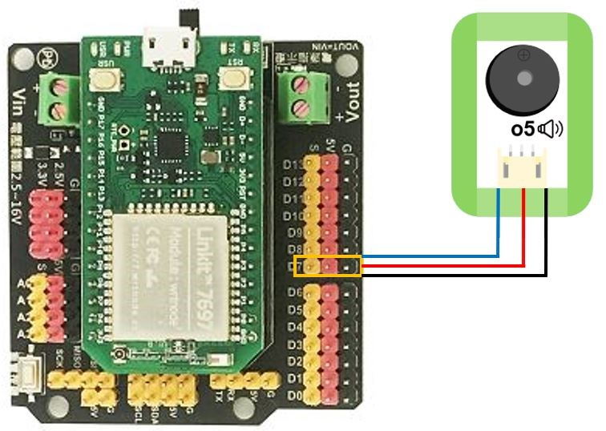
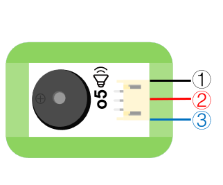

# o5蜂鳴器模組

## 實體照片


## 基本信息

中文名稱：蜂鳴器模組

英文名稱：Buzzer Module

序號：o5

SKU 號：BOS0020

## 功能簡介

蜂鳴器模組屬於簡易的發聲裝置，可以在類比感測器的控制下發出不同的聲音。蜂鳴器模組可廣泛應用於電腦、印表機、影印機、警報器、電子玩具、汽車電子設備、電話機、計時器等電子產品中作發聲器件。


## 使用說明

當使用數位信號控制蜂鳴器模組時， 輸入高電位，蜂鳴器開始鳴叫；輸入低電位，蜂鳴器停止鳴叫。

當使用類比信號控制蜂鳴器模組時， 輸入信號越大，蜂鳴器鳴叫的聲音越大；輸入信號越小，蜂鳴器鳴叫的聲音越小。

按照下圖所示連接電路，即可通過按鈕模組控制蜂鳴器模組的鳴叫。


## 原理介紹

蜂鳴器模組由振動裝置和諧振裝置組成，當輸入高電位時，蜂鳴器模組開始鳴叫；當輸入低電位時，蜂鳴器停止鳴叫。蜂鳴器模組也可以通過類比信號來控制，輸入信號越大，蜂鳴器鳴叫的聲音越響亮。

## 實作範例教學-基本篇

### **智慧防火裝置**

**範例說明：** 當火焰感測器感知到火焰後，便會傳遞出電信號，這樣便可以控制蜂鳴器模組發出警報。

**元件清單：** 火焰感測器；蜂鳴器模組；主控板：3組輸入/輸出端。

**連線圖：**


### **暴躁的小豬**

**範例說明：** 製作一個小豬，將觸碰感測器放在小豬的耳朵上，當觸摸小豬的耳朵時，小豬發出叫聲。

**元件清單：** 觸碰感測器；蜂鳴器模組；主控板：1組輸入/輸出端。

**連線圖：**


### **密碼鎖**

**範例說明：** 設置三個按鈕，只有按照正確的順序按下三個按鈕，才能解鎖；同時小燈模組也會亮起來，蜂鳴器發出警報，即告訴別人，密碼鎖已被打開。

**元件清單：** 藍色按鈕模組；紅色按鈕模組；黃色按鈕模組；LED燈模組；蜂鳴器模組；計時模組（0-6秒）；計時模組（0-60秒）；運算邏輯模組 AND；分配模組；主控板：3組輸入/輸出端。

**連線圖：**


## 實作範例教學-Micro:bit篇

### **報曉公雞**

**範例說明：** micro:bit自帶環境光感測器，可以用來檢測周圍的環境光。環境光越強，蜂鳴器叫聲越大；環境光越弱，蜂鳴器叫聲越小。

**元件清單：** 蜂鳴器模組；micro:bit；micro:bit BOSON擴充板。

**連線圖：** 將蜂鳴器模組連接至micro:bit擴充板P8腳位。


**執行流程：**

① 利用micro:bit自帶的環境光感測器檢測環境光強度。

② 將光強模擬值賦給P8腳位，實現蜂鳴器叫聲隨光強的變化而變化。

**程式示意圖（中文版）：**


**Example program\(English\)：**


### **下雨警報器**

**範例說明：** 下雨警報器可以檢測有無下雨：蜂鳴器下雨時鳴叫，天氣晴朗時不鳴叫。

**元件清單：** 蜂鳴器模組；水分感測器；micro:bit；micro:bit BOSON擴充板。

**連線圖：** 將水分感測器連接至micro:bit擴充板P0腳位，蜂鳴器模組連接至micro:bit擴充板P8腳位。


**執行流程：**

① 如果P0腳位輸出高電位（“1”），即水分感測器檢測到雨水，則蜂鳴器響起。

② 如果P0腳位輸出低電位（“0”），即水分感測器未檢測到雨水，則蜂鳴器不發出聲音。

**程式示意圖（中文版）：**


**Example program\(English\)：**


### **防盜展示臺**

**範例說明：** 防盜展示臺的功能是當展品離開展示臺，展示臺自動發出聲音。將展品放在按鈕上，相當於按下按鈕。當展品被拿開時，按鈕彈起，蜂鳴器發出聲音。

**元件清單：** 按鈕模組；蜂鳴器模組；micro:bit；micro:bit BOSON擴充板。

**連線圖：** 將按鈕模組連接至micro:bit擴充板P0腳位，蜂鳴器模組連接至micro:bit擴充板P8腳位。


**執行流程：**

① 如果P0腳位輸出高電位（“1”），即按鈕被按下，展品沒有離開展示臺，則蜂鳴器不發出聲音。

② 如果P0腳位輸出低電位（“0”），即按鈕彈起，展品離開展示臺，則蜂鳴器發出聲音。

**程式示意圖（中文版）：**


**Example program\(English\)：**


## 實作範例教學-LinkIt 7697篇

**範例說明：**使用「LinkIt 7697 擴充板」控制「蜂鳴器模組」，每一秒控制蜂鳴器模組發出逼的聲音和靜音（需搭配 LinkIt 7697 NANO 擴充板）。

**元件清單：**蜂鳴器模組；LinkIt 7697；LinkIt 7697 NANO 擴充板。

**連線圖：**蜂鳴器模組是數位訊號輸出，可以接「D0 ~ D13」的LinkIt 7697 NANO擴充板訊號端上（本範例連接到「D7」）。



**程式說明：**每一秒控制無源蜂鳴器模組發出逼的聲音和靜音 。


產生出的Arduino程式如下：

```text
void setup()
{

  pinMode(7, OUTPUT);
}


void loop()
{
  digitalWrite(7, HIGH);
  delay(1000);
  digitalWrite(7, LOW);
  delay(1000);
}
```

## 商品規格

腳位說明：



| **編號** | **名稱** | **功能說明** |
| :--- | :--- | :--- |
| 1 | GND | 電源接地 |
| 2 | VCC | 電源正極 |
| 3 | A | 類比訊號 |

尺寸：26mm\*22 mm

工作電壓：5.0V

工作電流：\(Max\)30mA@5V

