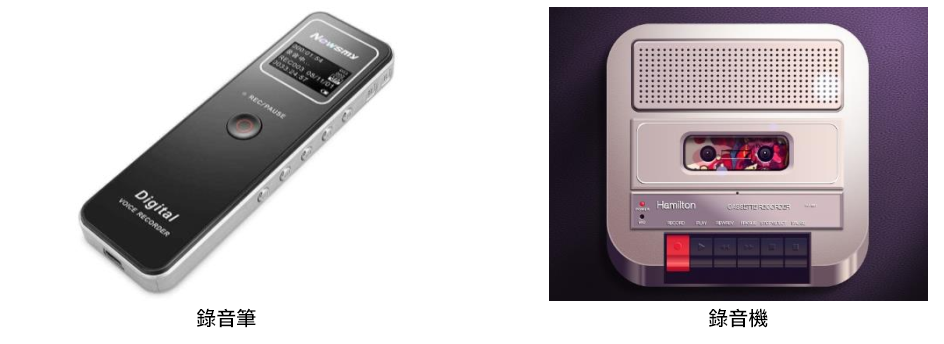
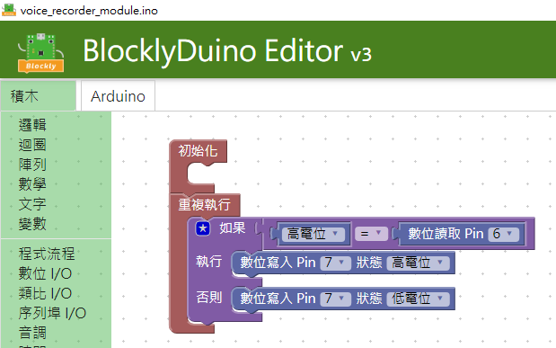
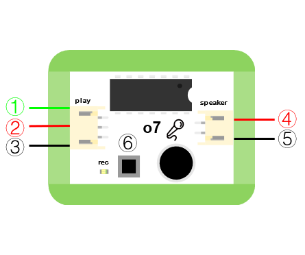

# o7錄音機模組/喇叭

## 實體照片


## 基本信息

中文名稱：錄音機模組/喇叭

英文名稱：Voice Recorder Module

序號：o7

SKU 號：BOS0022

## 功能簡介

錄音是將聲音信號記錄在介質上的過程，將介質上記錄的信號重放出來的過程稱為放音。錄音機模組/喇叭通過收音器可以錄製聲音，通過喇叭還可以播放出這段錄製好的聲音。錄音機模組/喇叭在錄音筆、答錄機、手機、電腦、調音台等設備中都有應用。



## 使用說明

按下錄音機模組/喇叭上的錄音按鈕就可以開始錄製聲音，BOSON的錄音機模組/喇叭最長支援錄製時長10s的聲音。通過按鈕模組可以控制喇叭播放出預先錄製好的聲音，達成錄音-放音的過程。按照下圖所示連接電路，通電後按住錄音機模組/喇叭上的錄音按鈕即可錄製最長為10s的聲音，再通過按鈕模組就可以控制喇叭播放這段錄製好的聲音。


## 原理介紹

錄音機模組/喇叭集錄音和放音功能於一體，模組上有錄音按鈕和收音器，最長可以錄製10s聲音。錄音機模組/喇叭的工作原理是將聲音轉化為數位信號存儲下來，在放音時將讀取存儲的數位信號傳輸給喇叭播放。

## 實作範例教學-基本篇

### **倒車雷達**

**範例說明：** 倒車時，當超音波距離感測器檢測到後方有障礙物時，揚聲器播報聲音“請注意後方障礙物”，提醒司機後方有障礙物，保證倒車安全。

**元件清單：** 超音波距離感測器；錄音機模組/喇叭；主控板：3組輸入/輸出端。

**連線圖：**


### \*\*\*\*

## 實作範例教學-Micro:bit篇

### **留言機**

**範例說明：** 自製留言機，完成程式設計以後，按住錄音機模組/喇叭上的錄音按鈕即可錄製最長為10s的聲音，再通過按鈕模組就可以控制喇叭播放這段錄製好的聲音。

**元件清單：** 按鈕模組；錄音機模組/喇叭；micro:bit；micro:bit BOSON擴充板。

**連線圖：** 將按鈕模組連接至micro:bit擴充板P0腳位，錄音機模組/喇叭連接至micro:bit擴充板P8腳位。


**執行流程：**

① 按住錄音機模組/喇叭上的錄音按鈕錄製最長為10s的聲音。

② 如果P0腳位輸出高電位（“1”），即按鈕被按下，則播放錄製好的聲音。

③ 如果P0腳位輸出低電位（“0”），即按鈕鬆開，則不播放錄製好的聲音。

**程式示意圖（中文版）：**


**Example program\(English\)：**


### **教師節的禮物**

**範例說明：** 提前錄製10秒鐘的教師節祝福語，當老師走進教室時，動作感測器與聲音感測器感受到老師，LED燈亮起，揚聲器播放祝福語。

**元件清單：** 動作感測器；聲音感測器；LED燈模組；錄音機模組/喇叭；micro:bit；micro:bit BOSON擴充板。

**連線圖：** 將動作感測器連接至micro:bit擴充板P0腳位，聲音感測器連接至micro:bit擴充板P2腳位，錄音機模組/喇叭連接至micro:bit擴充板P8腳位，LED燈模組連接至micro:bit擴充板P16腳位。


**執行流程：**

① 按住錄音機模組/喇叭上的錄音按鈕錄製最長為10s的教師節祝福語。

② 當動作感測器檢測到教師，且聲音感測器感受到聲音強度大於50時，LED燈亮起，同時揚聲器播放祝福語。

**程式示意圖（中文版）：**


**Example program\(English\)：**


## 實作範例教學-LinkIt 7697篇

**範例說明：**使用「LinkIt 7697 開發板」控制「錄音機模組」，按住錄音機模組上的錄音按鈕錄製最長為10s的聲音，按下7697上的USR鈕即可撥放剛剛錄製的聲音（需搭配 LinkIt 7697 NANO 擴充板）。

**元件清單：**錄音機模組；LinkIt 7697；LinkIt 7697 NANO 擴充板。

**連線圖：**錄音機模組是數位訊號輸出，可以接「D0～D13」的LinkIt 7697 NANO 擴充板訊號端上（本範例連接到「D7」，並利用7697內建的開關D6來控制喇叭是否撥放錄製的聲音）。


**程式說明：**

① 按住錄音機模組上的錄音按鈕錄製最長為10s的聲音。；② 如果P6腳位輸出高電位（“1”），即按鈕被按下，則播放錄製好的聲音。；③ 如果P6腳位輸出低電位（“0”），即按鈕鬆開，則不播放錄製好的聲音。



產生出的Arduino程式如下：

```text
void setup()
{

  pinMode(6, INPUT);
  pinMode(7, OUTPUT);
}


void loop()
{
  if (HIGH == digitalRead(6)) {
    digitalWrite(7, HIGH);

  } else {
    digitalWrite(7, LOW);

  }
}
```

## 商品規格

腳位說明：



| **編號** | **名稱** | **功能說明** |
| :--- | :--- | :--- |
| 1 | D | 數位訊號 |
| 2 | VCC | 電源正極 |
| 3 | GND | 電源接地 |
| 4 | 喇叭訊號 | 輸出喇叭訊號 |
| 5 | 喇叭訊號 | 輸出喇叭訊號 |

尺寸: 38mm\*32mm

工作電壓:3.0-5.0V

