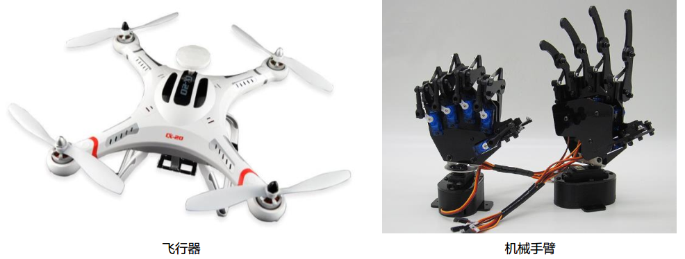
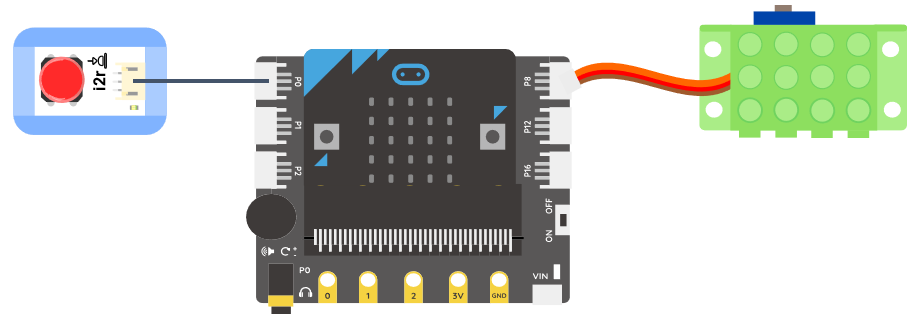
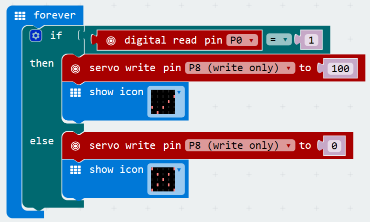
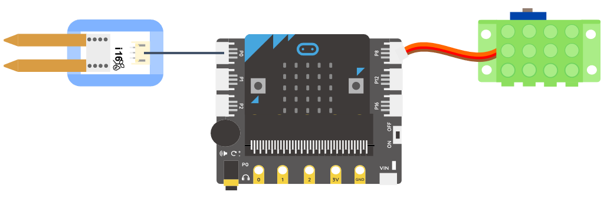
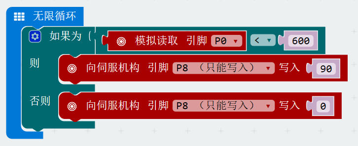
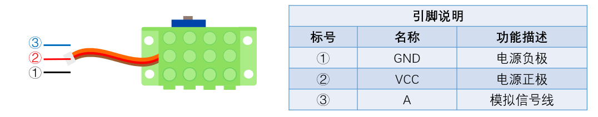

# 9g金属舵机模块

## 实物图片

## 基本信息

中文名称：9g金属舵机模块

英文名称：9g Metal Gear Micro Servo

序号：

SKU 号：SER0045

## 模块简介

舵机模块可以输出设定角度的摆动，适用于那些需要角度不断变化并可以保持的控制系统。目前，舵机模块在高档遥控玩具，如飞行器、机械手臂、潜艇模型、遥控机器人等场景中已经得到了普遍应用。

## 使用说明

舵机模块既可以接收数字信号，也可以接收模拟信号，主要用于输出设定角度的摆动，摆动范围0~180°。

在非编程条件下，舵机模块需要结合舵机控制模块使用。舵机控制模块既可以接收数字信号，也可以接收模拟信号，分别对应swing模式和turn模式：

swing模式：舵机在指定角度和初始角度之间来回摆动；

turn模式：舵机转到指定角度后静止。

这两种模式可以通过舵机控制模块上的拨动开关进行切换。按照下图所示连接电路，通电后即可通过舵机控制模块上的拨动开关控制舵机。

在编程条件下，舵机模块可以直接连接micro:bit扩展板使用。在makecode编程平台指令区有两句专门控制舵机的引脚指令，如下：

**注意：** 在使用过程中，由于舵机模块（伺服机构）耗电量较大，为防止板载元件损坏，需要外接电源（或电脑USB口）独立供电。外接电源接在扩展板的外接电源接口VIN。

## 原理介绍

该舵机模块采用高强度ABS透明外壳配以内部高精度金属齿轮组，加上精准的控制电路、高档轻量化空心杯电机使该微型舵机的输出力矩达到了惊人的1.8kg\*cm。其具体工作原理如下：控制信号由接收机的通道进入信号调制芯片，获得直流偏置电压。它内部有一个基准电路，产生周期为20ms，宽度为1.5ms的基准信号，将获得的直流偏置电压与电位器的电压比较，获得电压差输出。最后，电压差的正负输出到电机驱动芯片决定电机的正反转。当电机转速一定时，通过级联减速齿轮带动电位器旋转，使得电压差为0，电机停止转动。

## 应用样例

### **\(1\) 爬爬虫**

**样例说明：** 通过自锁开关和舵机控制模块控制舵机像虫子一样向前爬动。

**元件清单：** 自锁开关；舵机控制模块；9g金属舵机模块；电源主板-单路。

**连线图：**

### **\(2\) 按钮控制舵机**

**样例说明：** 通过按钮控制舵机的转动角度。

**元件清单：** 按钮模块；9g金属舵机模块；micro:bit；micro:bit BOSON扩展板。

**连线图：** 将按钮模块连接至micro:bit扩展板引脚P0，舵机模块连接至micro:bit扩展板引脚P8。

**执行流程：**

① 当引脚P0输出高电平（“1”），即按钮被按下时，舵机转动100°，并且micro:bit板显示“√”。

② 当引脚P0输出低电平（“0”），即按钮被弹起时，舵机旋转至0°位置，并且micro:bit板显示“×”。

**程序示意图（中文版）：**

**程序示意图（英文版）：**

### **\(3\) 自动浇花装置**

**样例说明：** 利用土壤湿度传感器实时监测花盆中土壤的含水量，当土壤湿度值较小时，舵机带动软管口降低，达到自动浇水的目的。

**元件清单：** 土壤湿度传感器；9g金属舵机模块；软管；micro:bit；micro:bit BOSON扩展板。

**连线图：** 将土壤湿度传感器连接至micro:bit扩展板引脚P0，舵机模块连接至micro:bit扩展板引脚P8。

**执行流程：**

① 土壤湿度传感器检测土壤湿度值。

② 判断湿度值大小，如果湿度值小于600，即土壤较干时，舵机转动90°，带动软管口降低，实现浇水功能；否则，舵机一直保持在0°不动。

**程序示意图（中文版）：**

**程序示意图（英文版）：**

## 规格参数

引脚说明：

尺寸:

工作电压:

