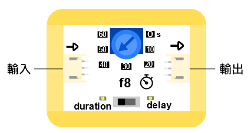
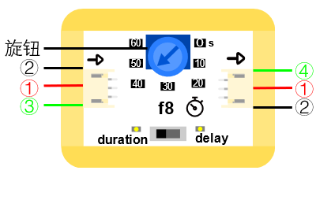

# f8計時模組（0-60秒）

## 實體照片

## 基本信息

中文名稱：計時模組（0-60秒）

英文名稱：Duration Module \(0-60s\)

序號：f8

SKU 號：BOS0033

## 功能簡介

計時模組（0-60秒），是一個可以持續輸出固定設置時間脈衝的模組，計時模組（0-60秒）的常見應用設備是點亮或關閉LED燈並持續一段時間。

## 使用說明

計時模組（0-60秒）不能直接作為輸入或輸出模組使用，需要將輸入模組連接在計時模組（0-60秒）的輸入口，輸出模組連接在計時模組（0-60秒）的輸出口。計時模組（0-60秒）的持續時間由旋鈕調節，模式由開關切換，通過改變輸入口信號來控制輸出口。計時模組（0-60秒）的輸入口和輸出口如下圖所示。

計時模組（0-60秒）的輸入輸出機制如下：

delay檔：當輸入高脈衝後，模組會輸出一個固定設置時間的低電位。

duration檔：當輸入高脈衝後，模組會輸出一個固定設置時間的高電位。

按照下圖所示連接電路並設定好計時模組（0-60秒）的時間值，通電後按下按鈕即可點亮LED燈並持續到設定的時間。

## 原理介紹

計時模組（0-60秒）是一個根據輸入信號來觸發輸出信號的模組。輸出信號的電位由切換開關控制，輸出信號的持續時間由旋鈕控制。

## 應用範例

### **\(1\) 畫廊展示品防盜警報器**

**範例說明：** 當有人觸碰展示品或者展示品傾斜時，自動發出警報。

**元件清單：** 傾斜感測器；觸碰感測器；運算邏輯模組 OR；閥模組；蜂鳴器模組；主控板：1組輸入/輸出端。

**連線圖：**

### **\(2\) 密碼鎖**

**範例說明：** 設置三個按鈕，只有按照正確的順序按下三個按鈕，才能解鎖；同時小燈模組也會亮起來，蜂鳴器發出警報，即告訴別人，密碼鎖已被打開。

**元件清單：** 藍色按鈕模組；紅色按鈕模組；黃色按鈕模組；LED燈模組；蜂鳴器模組；計時模組（0-6秒）；計時模組（0-60秒）；運算邏輯模組 AND；分配模組；主控板：3組輸入/輸出端。

**連線圖：**

## 商品規格

腳位說明：

尺寸：38mm\*32mm

工作電壓：3.0-5.5V

工作電流：\(Max\)32mA@5V

