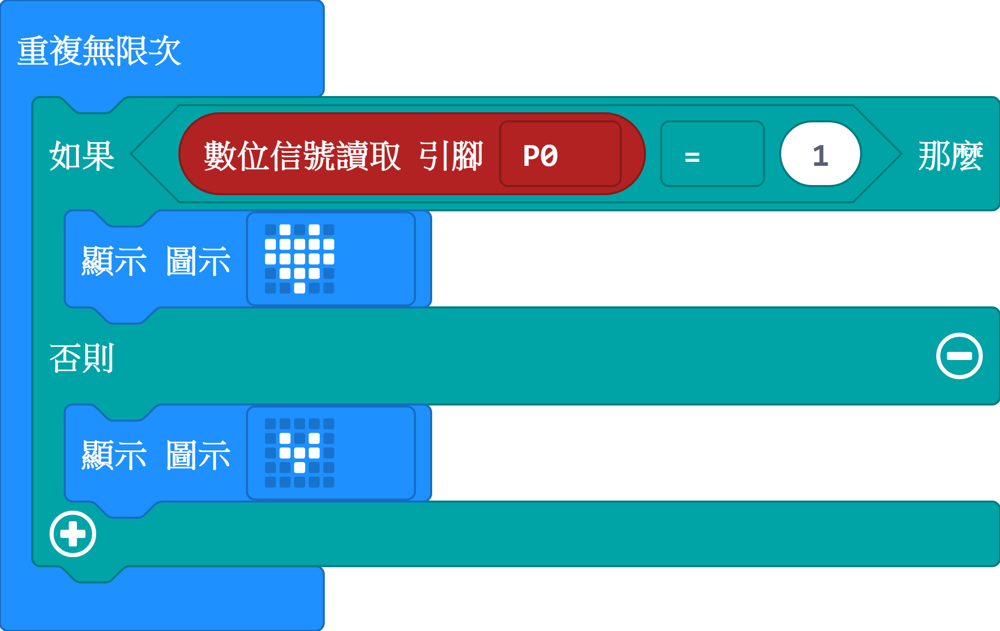
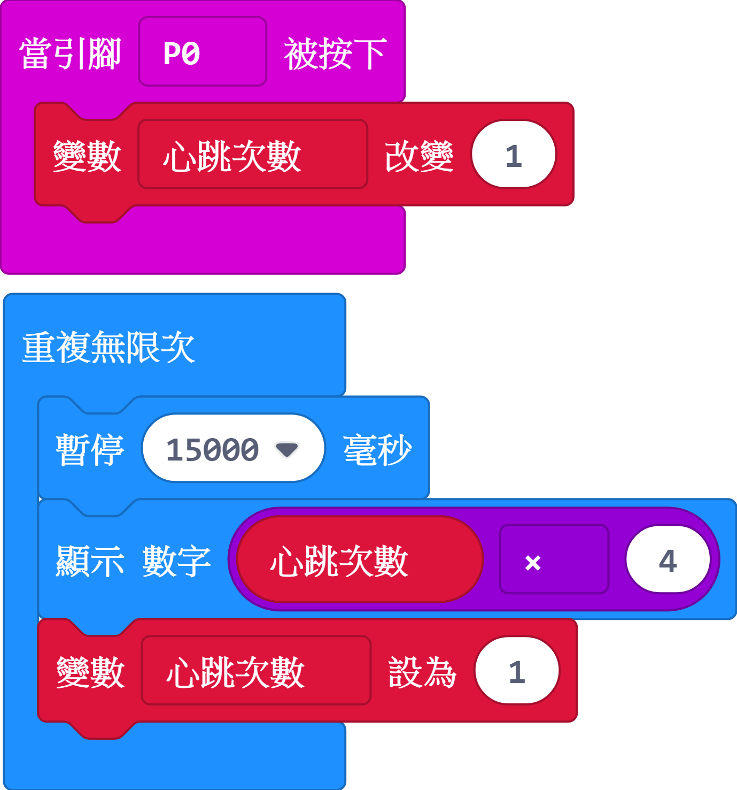
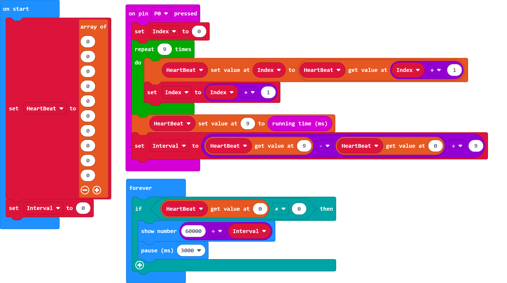

# i20心律監測感測器

## 實體照片

## 基本信息

中文名稱：心律監測感測器

英文名稱：Heart Rate Monitor Sensor

序號：i20

SKU：BOS0043

## 功能簡介

心律監測感測器採用光學技術通過皮下毛細血管內的血氧量變化來檢測人體的心率，心率檢測可廣泛應用於可穿戴設備、健身輔助器材等場景。

## 使用說明

心律監測感測器在使用時需要測量者將任一手指放於下圖所示位置①處進行測量，心律監測感測器的輸出信號是數位信號，即高低電位。

按照下圖所示連接電路，通電後將手指放在心律監測感測器指定位置處即可通過OLED顯示模組查看測量者的心率。

**心律監測感測器在使用時需注意以下四點事項：**

（1）手指皮質厚薄程度會影響測量結果；

（2）測量過程中手指不宜按壓過緊；

（3）測量過程中不宜隨意移動身體；

（4）心律監測感測器並非專業醫療儀器，不能用作醫療診斷或治療。

## 原理介紹

心律監測感測器採用PPG光電容積脈搏波描記法\(PhotoPlethysmoGraphy\)測量心率。這是一種低成本光學技術，通過檢測皮下毛細血管內的血氧量變化量來檢測對應的人體心率。該技術擁有回應性快、性能穩定、適應性強等特點。

## 應用範例

### \(1\) 跳動的心

**範例說明：**當心律監測感測器輸出高電位時，Micro:bit的LED燈點陣顯示“大愛心”；當心律監測感測器輸出低電位時，Micro:bit的LED燈點陣顯示“小愛心”。

**元件清單：**心律監測感測器；Micro:bit；Micro:bit BOSON擴充板。

**連線圖：**

**設計意圖：**當心律監測感測器輸出高電位時，Micro:bit在LED燈點陣上顯示圖示“大愛心”；否則，Micro:bit在LED燈點陣上顯示圖示“小愛心”。將程式上傳到Micro:bit後，當手指沒有放在心律監測感測器的感應位置時，你會發現愛心閃爍的頻率會很快，而當你把手指放在心律監測感測器的感應位置上時，你會發現愛心閃爍的頻率變小了，這是因為心律監測感測器正在根據你的心跳週期有節奏地輸出高低脈衝。

**執行流程：**

① 顯示“大愛心”；若P0腳位輸出高電位（即1），Micro:bit顯示“大愛心”；

② 顯示“小愛心”：若P0腳位輸出低電位（即0），Micro:bit顯示“小愛心”。

**程式示意圖（中文版）：**

**Example program\(English\)：**

### \(2\) 使用OLED顯示模組監測心率

**範例說明：**使用心律監測感測器監測人的心率變化，OLED顯示模組即時顯示心律監測感測器的測量結果。

**元件清單：**心律監測感測器；主控板：3組輸入/輸出端；OLED顯示模組。

**連線圖：**

### \(3\) 使用Micro:bit監測心率

**範例說明：**使用心律監測感測器監測心率變化，Micro:bit在LED燈點陣上顯示心律監測感測器的測量結果。

**元件清單：**心律監測感測器；Micro:bit；Micro:bit BOSON擴充板。

**連線圖：**

**範例程式一：通過累計一定時間的心跳次數測量心率**

**設計意圖：**由於心率表示的是人每分鐘心跳的次數，所以測量心率的一個思路就是使用一個變數累計一分鐘內心律監測感測器監測到了多少次心跳。這裡，設置變數“心跳次數”用來累計心跳發生的次數。每當心律監測感測器檢測到心跳發生時，連接心律監測感測器的P0腳位就會被按下，此時“心跳次數”加1。理論上，讓“心跳次數”這樣累加1分鐘即可測量出心率，但這一方法會導致Micro:bit每次都需間隔一分鐘才能顯示出心率測量結果。為了改善用戶體驗，我們將間隔時間設定為15秒，在顯示心率時，由於“心跳次數”只累計了15秒，所以Micro:bit最終顯示的測量結果還需要用“心跳次數”再乘以4。這樣做雖然會導致每次顯示的心率都是4的倍數，但這一誤差相對來說是可以接受的（如果想讓測量結果更加精確，可以考慮範例程式二和範例程式三）。每次顯示心率測量結果後，還需要把“心跳次數”重新置1，為下一個心率測量週期做準備。

**執行流程：**

② 累計心跳次數：每當P0腳位被按下，“心跳次數”加1；

② 顯示即時心率：每隔15秒在Micro:bit的LED燈點陣上顯示一次心率測量結果；

③ 準備下一個測量週期：“心跳次數”重新置1，為下一個心率測量週期做準備。

**程式示意圖（中文版）：**

**Example program\(English\)：**

**範例程式二：通過計算最近三次心跳發生的時間間隔來測量心率**

**設計意圖：**為了更加準確地測量心率，還有一個思路是先計算出兩次心跳之間的時間間隔，即每次完整心跳需要花費的時間，再通過週期轉換為頻率即可計算出每分鐘心跳的次數。例如，若算得平均間隔為800毫秒，則心跳週期為800毫秒/次，將週期進一步轉為頻率60000÷800=75，即心率為75次/min。最後，讓Micro:bit每隔三秒在LED燈點陣上顯示一次心率測量結果。由於單個心跳週期可能出現較大波動，這裡用兩個心跳週期的平均時間間隔來減小誤差。於是，我們設置了三個變數“心跳時間1”、“心跳時間2”和“心跳時間3”分別用於保存最近三次心跳發生時的系統時間，求出這三次心跳發生的平均時間間隔：平均間隔=\(\(心跳時間3-心跳時間2\)+\(心跳時間2-心跳時間1\)\)/2。這樣我們就算出了平均單次完整心跳需要花費的時間，只需再把心跳週期轉換成頻率即可計算出心率。

**執行流程：**

① 初始化變數：設置變數“心跳時間1”和“心跳時間2”用於保存最近兩次心跳發生時的系統時間；

② 監測心跳：當P0腳位被按下後，用“心跳時間3”記錄下當前心跳發生時的系統時間；

③ 計算平均間隔：算出三次心跳發生的平均時間間隔；

④ 顯示即時心率：將平均間隔轉換為心率並讓Micro:bit每隔三秒顯示一次心率測量結果；

⑤ 準備下一個測量週期：更新“心跳時間1”和“心跳時間2”。

**程式示意圖（中文版）：**

**Example program\(English\)：**

**範例程式三：通過計算最近十次心跳發生的時間間隔來測量心率**

**設計意圖：**使用兩個心跳週期的平均時間間隔計算心率如果還達不到理想的精確性，我們還可以使用一個陣列來記錄一組心跳發生時的系統時間，然後計算出這一組心跳的平均時間間隔。陣列設置得越大，記錄的心跳就越多，計算出的心率也就越準確，但程式的時間複雜度和空間複雜度也會隨之增大。這裡，我們設置了一個長度為10的陣列用於保存最近十次心跳發生的系統時間，求出這十次心跳發生的平均時間間隔：平均間隔=\(第十次心跳發生的時間-第一次心跳發生的時間\)/9。這樣我們就算出了平均單次完整心跳需要花費的時間，只需再把心跳週期轉換成頻率即可計算出心率。最後，讓Micro:bit每隔三秒在LED燈點陣上顯示一次心率測量結果。

**執行流程：**

② 初始化陣列：設置陣列“心跳時間”用於保存最近十次心跳發生時的系統時間；

② 監測心跳並更新陣列：當P0腳位被按下後，陣列“心跳時間”所有項目值向前移一位元（陣列原來的第一個項目值被覆蓋），將當前這次心跳發生時的系統時間保存到陣列“心跳時間”的最後一個項目值中；

③ 計算平均間隔：算出陣列“心跳時間”中保存的最近十次心跳發生的平均時間間隔；

④ 顯示即時心率：將平均間隔轉換為心率並讓Micro:bit每隔三秒顯示一次心率測量結果。

**程式示意圖（中文版）：**

**Example program\(English\)：**

## 商品規格

腳位說明：

| **編號** | **名稱** | **功能說明** |
| :---: | :---: | :---: |
| 1 | GND | 電源接地 |
| 2 | VCC | 電源正極 |
| 3 | D | 數位訊號 |

重量：\(g\)

尺寸：26mm\*22mm

工作電壓：3V-5V

工作電流：&lt;10mA

