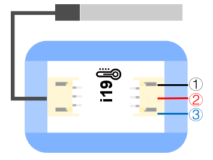

# i19防水溫度感測器

## 實體照片

## 基本信息

中文名稱：防水溫度感測器

英文名稱：Waterproof Temperature Sensor

序號：i19

SKU：BOS0042

## 功能簡介

防水溫度感測器是一款防水的溫度感測器，在測量遠處溫度和環境比較潮濕的情況下，該感測器能發揮極大的作用，適用於電冰箱等冷凍、冷藏環境中的溫度檢測、室內和機電設備溫度檢測、土壤溫度檢測、熱水箱溫度控制等設備中。

## 使用說明

防水溫度感測器可以與Arduino結合使用。使用時，必須連接上拉電阻，與可插拔感測器轉接器配合使用。按照下圖所示連接電路，通電後將防水溫度感測器的探頭放入待測量的物體中，則測量物體的溫度值可以通過OLED顯示模組直接讀取。防水溫度感測器的感溫範圍在-55℃~+125℃之間，溫度顯示範圍為-10°C~+85°C（誤差±0.5°C）。

**\*注意：**雖然該產品能夠在125°C下正常工作，但由於纜線是由聚氯乙烯（PVC）材料製成的，沒有感測器耐熱，因此我們建議不要將其放在溫度高於100°C的地方。\*

## 原理介紹

該感測器的探頭採用熱敏溫度感測器套頭，由導熱性高的密封膠灌封而成，確保了感測器的高靈敏性和極小的溫度延遲，晶片本身每個腳位均用熱縮管隔開，防止短路；使用優質不銹鋼管封裝，實現防水、防潮、防生銹的功能。

## 應用範例

### \(1\) 探究土壤溫度對種子發芽率的影響

**範例說明：**將相同數量、同一作物的種子分別種在兩個盆裁中，通過顯示器讀取兩盆裁的土壤溫度，從而控制兩盆的土壤溫度值不同，探究兩種情況下種子的發芽情況。

**元件清單：**防水溫度感測器；主控板：1組輸入/輸出端；OLED顯示模組。

**連線圖：**

### \(2\) 糧倉溫濕度檢測

**範例說明：**糧倉裡糧食安全儲藏的主要參數是糧倉的溫度和濕度，這兩者之間又是互相關聯的。糧食在正常儲藏過程中，含水量一般在12%以下是安全狀態，不會產生溫度突變，一旦糧倉進水、結露等使糧食的含水量達到20%以上時，就會使糧食受潮，胚芽萌發，新陳代謝加快而產生呼吸熱，使局部糧食溫度突然升高，當溫度高於22°C時，必然引起糧食“發燒”和發霉變質，並可能形成連鎖反應，從而造成不可挽回的損失。因此有必要檢測糧食溫度。當溫度感測器感受到糧食內溫度時，當溫度高於22°C時，自動開啟風扇、點亮小燈並發出警報。而當濕度感測器感受到糧食內濕度高於20%時，自動點亮小燈並發出警報。

**元件清單：**濕度感測器；防水溫度感測器；主控板：3組輸入/輸出端；閥模組；分配模組；運算邏輯模組 OR；風扇模組；蜂鳴器模組；LED燈模組。

**連線圖：**

### \(3\) 液體溫度檢測儀

**範例說明：**防水溫度感測器測量液體溫度值，Micro:bit讀取測量結果並將溫度顯示在LED燈點陣上。

**元件清單：**防水溫度感測器；Micro:bit；Micro:bit BOSON擴充板。

**連線圖：**

**設計意圖：**

**執行流程：**

**程式示意圖（中文版）：**

**Example program\(English\)：**

## 商品規格

腳位說明：

| **編號** | **名稱** | **功能說明** |
| :---: | :---: | :---: |
| 1 | GND | 電源接地 |
| 2 | VCC | 電源正極 |
| 3 | A | 類比訊號 |

重量： （g）

尺寸：26mm\*22mm

工作電壓：3.0-5.0V

