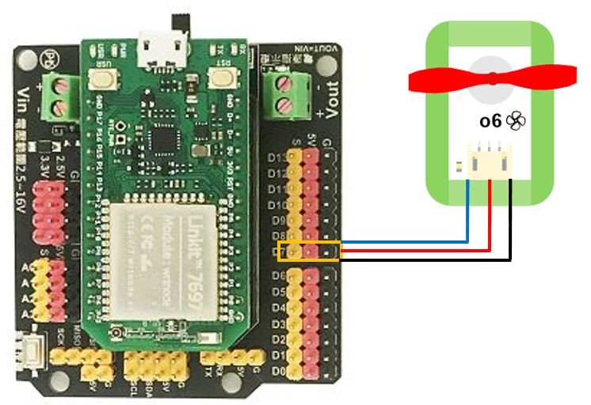
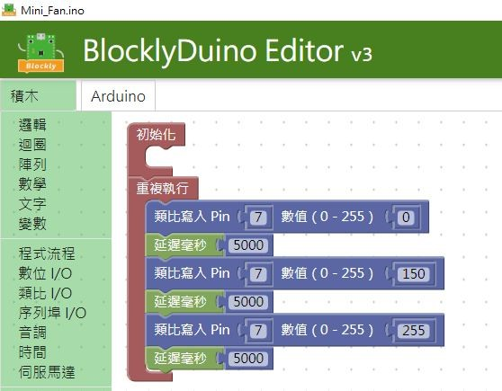
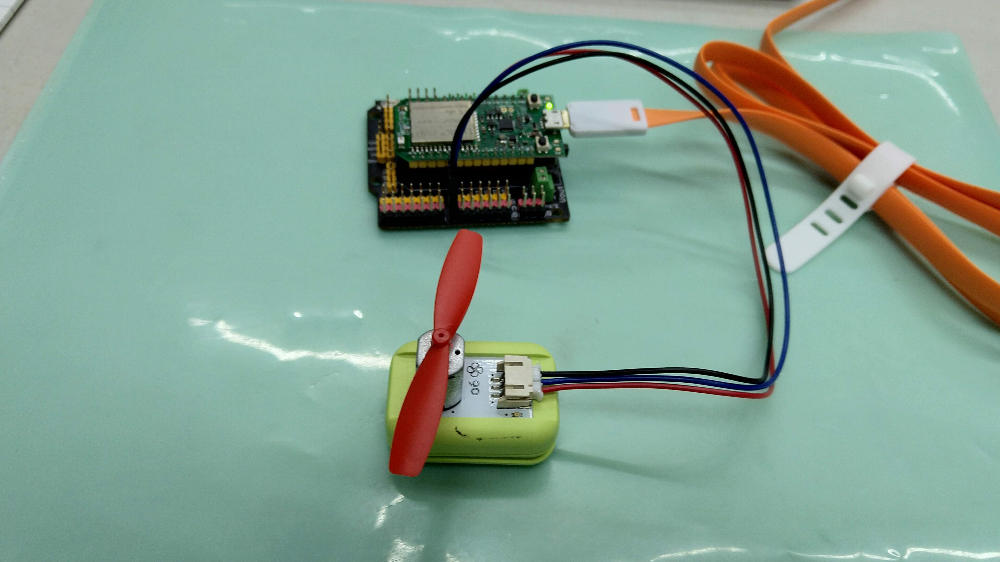
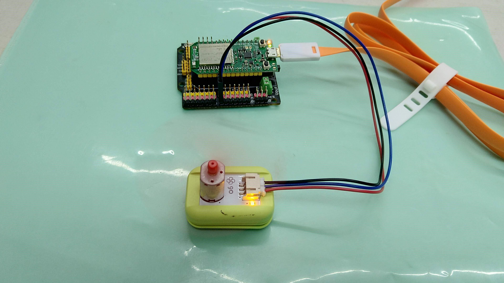

# o6風扇模組

## 實體照片


## 基本信息

中文名稱：風扇模組

英文名稱：Fan Module

序號：o6

SKU 號：BOS0021

## 功能簡介

風扇模組是一款利用直流馬達將電能轉換為機械能，藉此帶動葉片轉動的模組。風扇模組已被廣泛應用於各類電風扇、散熱器、螺旋槳與抽油煙機等設備中。


## 使用說明

風扇模組在通電後即可轉動，還可以搭配旋鈕模組來改變風扇控制腳位的電壓大小使扇葉旋轉的速度提高或降低，從而實現換檔功能。

當使用數位信號控制風扇模組時， 輸入高電位，風扇開始轉動；輸入低電位，風扇停止轉動。

當使用類比信號控制風扇模組時， 輸入信號越大，風扇的轉速越快；輸入信號越小，風扇的轉速越慢。

按照下圖所示連接電路，即可通過按鈕模組控制風扇模組。


## 原理介紹

風扇主要由定子和轉子兩大部分組成，定子主要包括控制電路、軸承、線圈。轉子主要由扇葉、磁鐵和軸三個部分構成。風扇的工作原理簡單的來講就是電流通過控制電路，在定子線圈處和電磁鐵處產生旋轉磁場，推動轉子上的磁鐵朝特定方向旋轉，從而帶動整個扇葉高速旋轉，推動空氣快速從扇葉處通過，以達到特定的風量和風壓。

## 實作範例教學-基本篇

### **\(3\) 溫控風扇**

**範例說明：** 當溫度較高時，自動開啟風扇，溫度較低時，自動關閉。

**元件清單：** 溫度感測器；風扇模組；主控板：1組輸入/輸出端。

**連線圖：**


### **\(4\) 聲控風扇**

**範例說明：** 使用聲音感測器控制風扇模組是否轉動。

**元件清單：** 聲音感測器；風扇模組；主控板：3組輸入/輸出端。

**連線圖：**


## 實作範例教學-Micro:bit篇

### **按鈕風扇**

**範例說明：** 利用micro:bit自帶的A、B按鈕控制風扇的開啟和關閉。當A按鈕被按下時，風扇打開；當B按鈕被按下時，風扇關閉。

**元件清單：** 風扇模組；micro:bit；micro:bit BOSON擴充板。

**連線圖：** 將風扇模組連接至micro:bit擴充板P8腳位。


**執行流程：**

① 當按鈕A被按下時，P8腳位輸出高電位（“1”），風扇轉動。

② 當按鈕B被按下時，P8腳位輸出低電位（“0”），風扇停止。

**程式示意圖（中文版）：**


**Example program\(English\)：**


### **\(2\) 調速風扇**

**範例說明：** 使用旋鈕控制風扇轉速。順時針轉動旋鈕，風扇轉速越來越快；逆時針轉動旋鈕，風扇轉速越來越慢。

**元件清單：** 旋鈕模組；風扇模組；micro:bit；micro:bit BOSON擴充板。

**連線圖：** 將旋鈕模組連接至micro:bit擴充板P0腳位，風扇模組連接至micro:bit擴充板P8腳位。


**執行流程：**

① 讀取P0腳位的類比數值。 ② 將讀取到的數值指定給P8腳位。

**程式示意圖（中文版）：**


**Example program\(English\)：**


## 實作範例教學-LinkIt 7697篇

**範例說明：**使用「LinkIt 7697 開發板」控制「 風扇模組」， 每五秒鐘會切換風扇停止，風扇風速中等，風扇風速強一次（需搭配 LinkIt 7697 NANO 擴充板）。

**元件清單：**風扇模組；LinkIt 7697；LinkIt 7697 NANO 擴充板。

**連線圖：**風扇模組是數位/類比訊號輸出，可以接「D0～D13」的LinkIt 7697 NANO擴充板訊號端上（本範例連接到「D7」）。



**程式說明：**將7號腳位PWM類比寫入訊號，每五秒鐘會切換風扇停止，風扇風速中等，風扇風速強一次。







範例影片：[https://youtu.be/Itl6lUYf9Ws](https://youtu.be/Itl6lUYf9Ws)

產生出的Arduino程式如下：

```text
void setup()
{

  pinMode(7, OUTPUT);
}


void loop()
{
  analogWrite(7, 0);
  delay(5000);
  analogWrite(7, 150);
  delay(5000);
  analogWrite(7, 255);
  delay(5000);
}

```

## 商品規格

腳位說明：


| **編號** | **名稱** | **功能說明** |
| :--- | :--- | :--- |
| 1 | GND | 電源接地 |
| 2 | VCC | 電源正極 |
| 3 | A | 類比訊號 |

尺寸: 26mm\*22mm

工作電壓:3.0-5.0V

