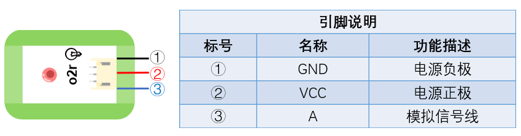

# o2LED燈模組

## 實體照片


## 基本信息

中文名稱：LED燈模組

英文名稱：LED Module

序號：o2r\o2g\o2b

SKU 號：BOS0017-R\BOS0017-G\BOS0017-B

## 功能簡介

LED燈模組是最簡單的發光模組，根據LED燈的顏色可將LED燈模組進一步區分為紅色LED燈模組、綠色LED燈模組和藍色LED燈模組。LED燈模組目前已廣泛應用於LED顯示螢幕、指示燈、交通燈、汽車燈、照明燈、裝飾燈等方面。


## 使用說明

當使用數位信號控制LED燈模組時， 輸入高電位，LED燈被點亮；輸入低電位，LED燈被熄滅。

當使用類比信號控制LED燈模組時， 輸入信號越大，LED燈亮度越大；輸入信號越小，LED燈亮度越小。

按照下圖所示連接電路，即可通過按鈕模組控制LED燈的點亮和熄滅。


## 原理介紹

LED燈模組主要由透明環氧樹脂封裝、LED晶片、楔形支架、陽極桿、有發射碗的陰極桿、針腳（又稱引線架）等部分構成（見下圖）。向LED燈模組輸出高電位表示點亮LED燈，向LED燈模組輸出低電位表示熄滅LED燈。LED燈模組也可以通過類比信號來控制，輸入信號越大，LED燈越亮。


## 實作範例教學-基本篇

### **按鈕檯燈（非程式設計）**

**範例說明：** 使用按鈕控制LED燈的點亮和熄滅。當按鈕按下時，LED燈模組被點亮；當按鈕鬆開時，LED燈模組被熄滅。

**元件清單：** 按鈕模組；LED燈模組；主控板：3組輸入/輸出端。

**連線圖：**


### **感應發光小屋**

**範例說明：** 製作一個感應發光小屋，當有人經過時，動作感測器偵測到人，LED燈亮起。

**元件清單：** 動作感測器；LED燈模組；主控板：3組輸入/輸出端。

**連線圖：**


### **智慧路燈**

**範例說明：** 將模組按下圖連接後可以實現如下功能：只有在晚上的時候，聽到有人來了，路燈才會亮起。這一設計大大節約了電力資源。

**元件清單：** 光感測器；聲音感測器；運算邏輯模組 NOT；運算邏輯模組 AND；LED燈模組；主控板：1組輸入/輸出端。

**連線圖：**


### **復古燭臺**

**範例說明：** 用光代替火，光感測器感受到光後使小燈泡點亮，小燈泡一旦被“點火”成功，就保持著不滅的狀態。

**元件清單：** 光感測器；運算邏輯模組 OR；分支模組；LED燈模組；主控板：1組輸入/輸出端。

**連線圖：**


### **找朋友機**

**範例說明：** 做一個有趣的找朋友機，輕輕按下一個或幾個按鈕，看看哪些小朋友志趣相投。

**元件清單：** 紅色按鈕模組；藍色按鈕模組；運算邏輯模組 OR；運算邏輯模組 AND；紅色LED燈模組；藍色LED燈模組；主控板：3組輸入/輸出端。

**連線圖：**


## 實作範例教學-Micro:bit篇

### **按鈕檯燈（程式設計）**

**範例說明：** 使用按鈕控制LED燈的點亮和熄滅。當按鈕按下時，LED燈模組被點亮；當按鈕鬆開時，LED燈模組被熄滅。

**元件清單：** 按鈕模組；LED燈模組；micro:bit；micro:bit BOSON擴充板。

**連線圖：** 將按鈕模組連接至micro:bit擴充板P0腳位，LED燈模組連接至micro:bit擴充板P8腳位。


**執行流程：**

① 如果P0腳位輸出高電位（“1”），即按鈕被按下，則LED燈模組亮起。

② 如果P0腳位輸出低電位（“0”），即按鈕鬆開，則LED燈模組熄滅。

**程式示意圖（中文版）：**


**Example program\(English\)：**


### **旋鈕檯燈**

**範例說明：** 使用旋鈕控制LED燈模組的亮度。順時針轉動旋鈕，LED燈模組越來越亮，逆時針轉動旋鈕，LED燈模組越來越暗。

**元件清單：** 旋鈕模組；LED燈模組；micro:bit；micro:bit BOSON擴充板。

**連線圖：** 將旋鈕模組連接至micro:bit擴充板P0腳位，LED燈模組連接至micro:bit擴充板P8腳位。


**執行流程：**

① 讀取P0腳位的類比值。 ② 將讀取到的類比值賦給P8腳位。

**程式示意圖（中文版）：**


**Example program\(English\)：**


### \*\*\*\*

## 實作範例教學-LinkIt 7697篇

**範例說明：**使用「LinkIt 7697 NANO Breakout」連接「LED Light 燈模組」, 每一秒控制LED亮和暗。此LED Light 燈模組包含於「Starter Kit for micro:bit」內。

**元件清單：**自鎖開關；LinkIt 7697；LinkIt 7697 NANO 擴充板。

**連線圖：**LED模組是數位/類比訊號輸出，可以接「D0 ~ D13」的LinkIt 7697 NANOBreakout訊號端上。本範例連接到「D7」

**程式說明：**將7號腳位的電位拉高、拉低，每一秒鐘會切換LED的亮暗一次。

產生出的Arduino程式如下：

```text
void setup()
{

  pinMode(7, OUTPUT);
}


void loop()
{
  digitalWrite(7, HIGH);
  delay(1000);
  digitalWrite(7, LOW);
  delay(1000);
}
```

## 商品規格

腳位說明：



| **編號** | **名稱** | **功能說明** |
| :--- | :--- | :--- |
| 1 | GND | 電源接地 |
| 2 | VCC | 電源正極 |
| 3 | A | 類比訊號 |

尺寸: 26mm\*22mm

工作電壓:3.0-5.5V

工作電流：\(Max\)5mA@5V

