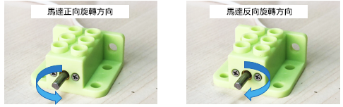
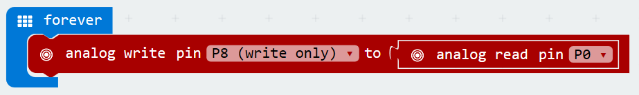
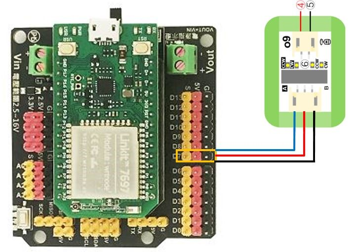
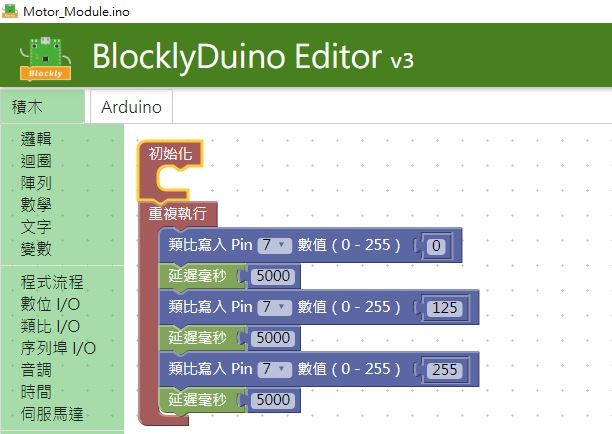
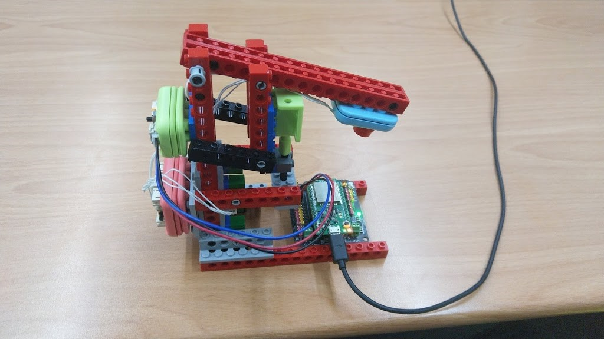
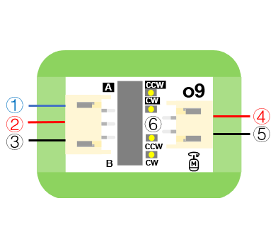

# o9馬達模組

## 實體照片


## 基本信息

中文名稱：馬達模組

英文名稱：Motor Controller Module

序號：o9

SKU 號：BOS0024

## 功能介紹

馬達模組可以控制小車移動、推動輸送帶、帶動滑輪裝置。與風扇模組中的馬達相比，在實現複雜功能時，僅僅依靠馬達的單方向轉動是不夠的，我們需要通過馬達模組來設定馬達的轉速與方向。馬達模組已被廣泛應用於空調、吸塵器、鼓風機、壓縮機、驅動機床、電扇、電冰箱、水泵等方面中。


## 使用說明

馬達模組預設了四種不同的控制模式（如下表所示），可以通過撥動開關進行切換。


馬達的轉動方向如下圖所示：



按照下圖所示連接電路，通電後即可通過馬達模組上的撥動開關控制馬達的轉速和方向。


## 原理介紹

馬達驅動物體運動的過程是一個電能轉化為動能的過程，需要耗費較大的能量，而輸入模組與馬達直接相連無法直接提供足夠的功率。為了保證有足夠能量維持馬達轉動，在使用時我們需要通過馬達模組將信號轉化為馬達的驅動電流。

## 實作範例教學-基本篇

### **調速打蛋器（非程式設計）**

**範例說明：** 製作一個打蛋器，打蛋器的攪拌棒固定在馬達的轉軸上，使用旋鈕模組控制馬達的轉速和轉動方向。

**元件清單：** 旋鈕模組；馬達模組；電源主機板-單路。

**連線圖：**


## 實作範例教學-Micro:bit篇

### **製作風車**

**範例說明：** 用聲音感測器和馬達模組類比風車，當人對著聲音感測器說話或吹氣時，觀察馬達的轉速和轉動方向。

**元件清單：** 聲音感測器；馬達模組；micro:bit；micro:bit BOSON擴充板。

**連線圖：** 將聲音感測器連接至micro:bit擴充板P0腳位，馬達模組連接至micro:bit擴充板P8腳位。


**執行流程：**

① 讀取P0腳位的聲音強度值。

② 將讀取到的強度值賦給P8腳位，通過開關切換4種控制模式，觀察不同模式下馬達的轉速與方向，製作不同轉速與方向的風車。

**程式示意圖（中文版）：**


**Example program\(English\)：**


### **調速打蛋器（程式設計）**

**範例說明：** 製作一個打蛋器，打蛋器的攪拌棒固定在馬達的轉軸上，使用旋鈕模組控制馬達的轉速和轉動方向。

**元件清單：** 旋鈕模組；馬達模組；micro:bit；micro:bit BOSON擴充板。

**連線圖：** 將旋鈕模組連接至micro:bit擴充板P0腳位，馬達模組連接至micro:bit擴充板P8腳位。


**執行流程：**

① 讀取P0腳位的旋鈕類比強度值。

② 將讀取到的類比強度值賦給P8腳位，通過開關切換4種控制模式，觀察不同模式下馬達的轉速與方向，製作不同轉速與方向的打蛋器。

**程式示意圖（中文版）：**


**Example program\(English\)：**



## 實作範例教學-LinkIt 7697篇

**範例說明：**使用「LinkIt 7697 NANO 開發板」控制「馬達模組」， 每五秒鐘會切換馬達停止，馬達轉動速度中等，馬達轉動速度快一次。

**元件清單：**馬達模組；LinkIt 7697；LinkIt 7697 NANO 擴充板。

**連線圖：**馬達控制模組是數位/類比訊號輸出，可以接「D0 ~ D13」的LinkIt 7697 NANO 擴充板訊號端上（本範例連接到「D7」）。



**程式說明：**將7號腳位PWM類比寫入訊號，每五秒鐘會切換馬達停止，馬達轉動速度中等，馬達轉動速度快一次。





範例影片：[https://youtu.be/IxhS6b4INUw](https://youtu.be/IxhS6b4INUw)

產生出的Arduino程式如下：

```text
void setup()
{

  pinMode(7, OUTPUT);
}


void loop()
{
  analogWrite(7, 0);
  delay(5000);
  analogWrite(7, 125);
  delay(5000);
  analogWrite(7, 255);
  delay(5000);
}
```

## 商品規格

腳位說明：



| **編號** | **名稱** | **功能說明** |
| :--- | :--- | :--- |
| 1 | A | 類比訊號 |
| 2 | VCC | 電源正極 |
| 3 | GND | 電源接地 |
| 4 | 馬達電源正極 | 馬達電源正極 |
| 5 | 馬達電源負極 | 馬達電源負極 |
| 6 | 撥動開關 | 馬達模式選擇 |

尺寸: 26mm\*22mm

工作電壓:3.3V-5.0V

工作電流：10mA

