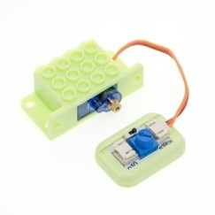
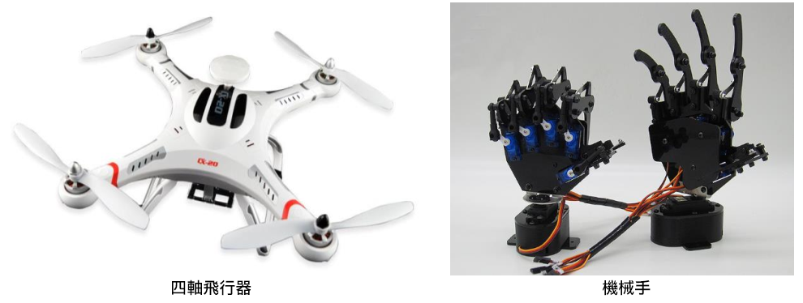
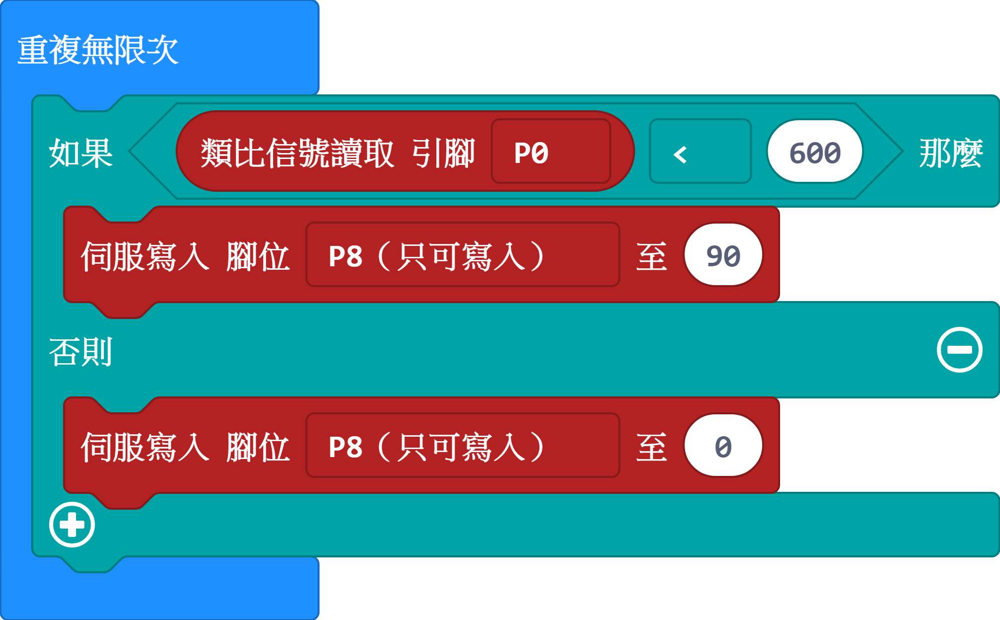
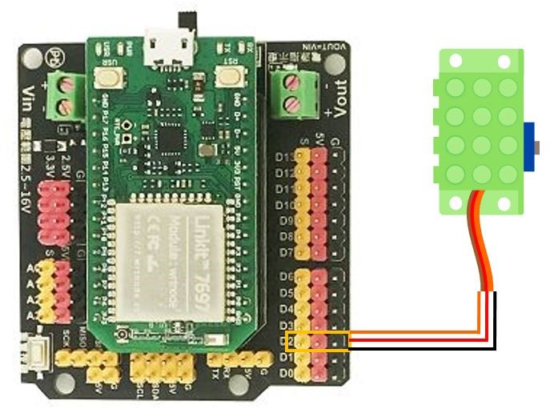
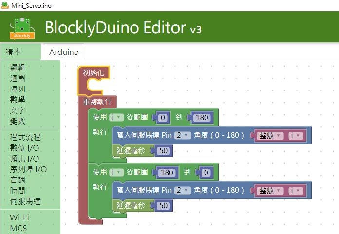
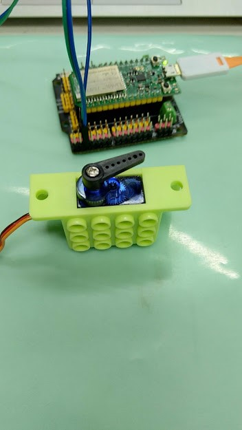
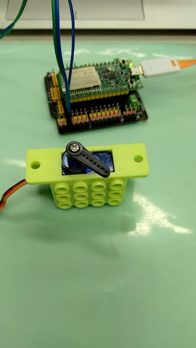
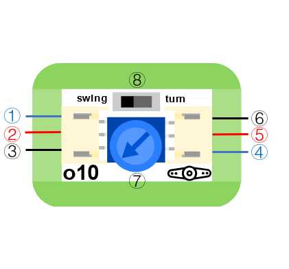

# o10伺服機模組

## 實體照片



## 基本信息

中文名稱：伺服機模組

英文名稱：Servo Module with Servo

序號：o10

SKU 號：BOS0025

## 功能簡介

伺服機模組是一種位置（角度）伺服的驅動器，適用於那些需要角度不斷變化並可以保持的控制系統。目前，伺服機模組在高檔遙控玩具，如飛行器、機械手臂、潛艇模型、遙控機器人等方面中已經得到了普遍應用。



## 使用說明

伺服機模組既可以接收數位信號，也可以接收類比信號，分別對應swing模式和turn模式：

swing模式：伺服機在指定角度和初始角度之間來回擺動；

turn模式：伺服機轉到指定角度後靜止。

這兩種模式可以通過伺服機模組上的撥動開關進行切換。按照下圖所示連接電路，通電後即可通過伺服機模組上的撥動開關控制伺服機。


## 原理介紹

伺服機模組主要是由外殼、電路板、驅動馬達、減速器與位置檢測元件所構成。其工作原理是由接收機發出訊號給伺服機，經由電路板上的IC驅動無核心馬達開始轉動，透過減速齒輪將動力傳至擺臂，同時由位置檢測器送回訊號，判斷是否已經到達定位。位置檢測器其實就是可變電阻，當伺服機轉動時電阻值也會隨之改變，藉由檢測電阻值便可知轉動的角度。

## 實作範例教學-基本篇

### **毛毛蟲**

**範例說明：** 通過自鎖開關和伺服機模組控制伺服機像毛毛蟲一樣向前爬動。

**元件清單：** 自鎖開關；伺服機模組；9g金屬伺服機模組；主控板：1組輸入/輸出端。

**連線圖：**


## 實作範例教學-Micro:bit篇

### **自動澆花裝置**

**範例說明：** 利用土壤濕度感測器即時監測花盆中土壤的含水量，當土壤濕度值較小時，伺服機帶動軟管口降低，達到自動澆水的目的。

**元件清單：** 土壤濕度感測器；9g金屬伺服機模組；軟管；micro:bit；micro:bit BOSON擴充板。

**連線圖：** 將土壤濕度感測器連接至micro:bit擴充板P0腳位，9g金屬伺服機模組連接至micro:bit擴充板P8腳位。


**執行流程：**

① 土壤濕度感測器檢測土壤濕度值。

② 判斷濕度值大小，如果濕度值小於600，即土壤較乾時，伺服機轉動90°，帶動軟管口降低，達到澆水功能；否則，伺服機一直保持在0°不動。

**程式示意圖（中文版）：**



**Example program\(English\)：**


## 實作範例教學-LinkIt 7697篇

**範例說明：**使用「LinkIt 7697 開發板」控制「 伺服機模組」，控制伺服機順時針轉和逆時針轉（需搭配 LinkIt 7697 NANO 擴充板）。

**元件清單：**伺服機模組；LinkIt 7697；LinkIt 7697 NANO 擴充板。

**連線圖：**伺服機是脈衝寬度調變\(Pulse Width Modulation\)訊號輸出， 可以接「D0 ~ D13」的 LinkIt 7697 NANO Breakout訊號端上（ 本範例連接到「D2」）。



**程式說明：**控制伺服機順時針旋轉及逆時旋轉。







範例影片：[https://youtu.be/fXI07tbq-yU](https://youtu.be/fXI07tbq-yU)

產生出的Arduino程式如下：

```text
#include <Servo.h>

int i;

Servo __myservo2;

void setup()
{

  __myservo2.attach(2);
}


void loop()
{
  for (i = 0; i <= 180; i++) {
    __myservo2.write(i);
    delay(50);
  }
  for (i = 180; i >= 0; i--) {
    __myservo2.write(i);
    delay(50);
  }
```

## 商品規格

腳位說明：



| **編號** | **名稱** | **功能說明** |
| :--- | :--- | :--- |
| 1 | A | 類比訊號輸入 |
| 2 | VCC | 電源正極 |
| 3 | GND | 電源接地 |
| 4 | A | 類比訊號輸出 |
| 5 | VCC | 伺服機電源正極 |
| 6 | GND | 伺服機電源負極 |
| 7 | 電位器 | 伺服機擺動頻率控制 |
| 8 | 撥動開關 | 伺服機模式選擇 |

尺寸: 26mm\*22mm

工作電壓:3.3V-5.0V

