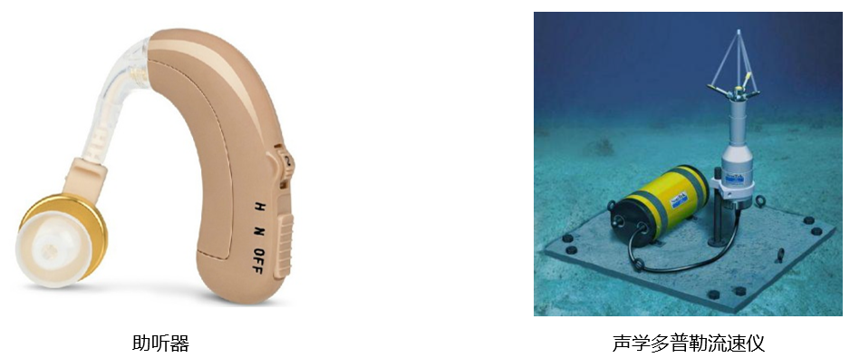
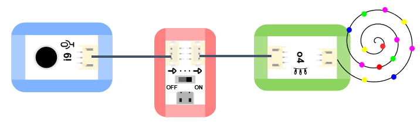
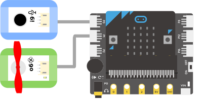

# 声音传感器

## 实物图片

## 基本信息
中文名称：声音传感器

英文名称：Sound Sensor

序号：i9

SKU：BOS0009

## 功能简介
声音传感器相当于一个话筒，它能感受到声音，并将感受到的声音大小转换成相应的模拟信号输出，被广泛应用于手机、录音机、声控照明灯、医疗器械、深海测量、交通干道噪声监测、工业企业噪声检测等场景中。

## 使用说明
声音传感器上有一个黑色拾音头，当你在黑色拾音头前拍掌或大声说话时，声音传感器能感受声音的震动。

> * 声音越大，输出信号越强；声音越小，输出信号越弱。

按照下图所示连接电路，通电后即可通过声音传感器控制LED灯：检测到声音时点亮LED灯，否则熄灭LED灯。

## 原理介绍
声音传感器内置一个对声音敏感的电容式驻极体话筒。声波使话筒内的驻极体薄膜振动，导致电容的变化，而产生与之对应变化的微小电压。这一电压随后被转化成0-5V的电压，经过A/D转换被数据采集器接受。
来源：https://baike.baidu.com/item/声音传感器/5345252?fr=aladdin

## 应用样例
#### (1) 声光互动蛋糕
**样例说明：**制作一个蛋糕，当播放生日歌时，声音传感器检测到声音，蛋糕上的彩色灯带亮起。

**元件清单：**声音传感器；电源主板-单路；彩色灯带。

**连线图：**

#### (2) 智能路灯
**样例说明：**夜晚，当有人经过时，声音传感器检测到声音，LED灯亮起一段时间，直到人走过后熄灭。

**元件清单：**声音传感器；运动传感器；逻辑“非”模块；逻辑“与”模块；电源主板-单路；持续模块（0~6秒）；LED模块。

**连线图：**

#### (3) 声控风扇
**样例说明：**制作1个声控风扇，当声音传感器的输出模拟值>50时打开风扇并持续三秒，否则关闭风扇。

**元件清单：**声音传感器；LED模块；Micro:bit；Micro:bit BOSON扩展板。

**连线图：**

**设计意图：**由于声音传感器的输出信号是模拟值，这里设定一个模拟值50（该模拟值可根据实际情况灵活调整），当声音传感器输出模拟值大于50时开启风扇，否则关闭风扇。

**执行流程：**① 检测到声音：若声音传感器输出模拟值大于50，打开风扇三秒钟；② 未检测到声音：声音传感器输出模拟值小于50，关闭风扇。

**程序示意图（中文版）：**

**程序示意图（英文版）：**

## 参数规格
引脚说明：

重量： （g）

尺寸：26mm*22mm

工作电压：3.0-5.0V