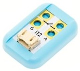
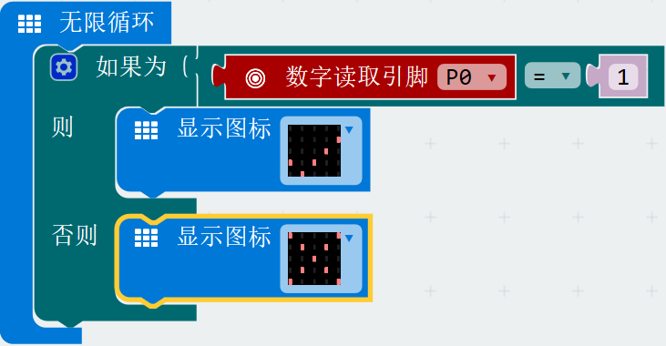
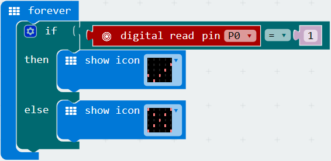

# 电导开关

## 实物图片

## 基本信息
中文名称：电导开关

英文名称：Conductivity Switch

序号：i12

SKU：BOS0012

## 功能简介
电导开关是一个可以用来检测物体是否具有导电性的电子模块，既可以检测硬币、导线、金属等良导体，也可以检测人体、水果、植物等不良导体。可用于制作各类互动交互作品，也可以应用在各类互动游戏中，作为任务执行的关键动作，像密室逃生中的携手同心等等。

## 使用说明
在图示①处，通过触摸电导开关的正负极，可以改变模块的输出状态；也可以通过导线外接一个水果或蔬菜从而产生开关控制信号。

## 原理介绍
电导开关通过检测微弱电流的存在，输出开关信号。

## 应用样例
#### (1) 检测物体的导电性
**样例说明：**通过导线外接物体，通过显示模块查看该物体是否导电。

**元件清单：**电导开关；电源主板-单路；显示屏模块。

**连线图：**

#### (2) 炫彩风铃
**样例说明：**将电导开关置于风铃中，彩色小灯盘绕在风铃上。当风铃下摆相互触碰时，电导开关通电，输出高电平，彩色小灯亮起。

**元件清单：**电导开关；电源主板-单路；彩色灯带。

#### (3) 物体导电性检测仪
**样例说明：**电导开关检测物体的导电性，Micro:bit读取端口高低并将导电性显示在LED点阵上，导电显示“√”，不导电显示“×”。

**元件清单：**电导开关；Micro:bit；Micro:bit BOSON扩展板。

**连线图：**

**设计意图：**将电导开关连接至引脚P0，根据引脚P0输出的数字信号判断物体是否具有导电性。

**执行流程：**

① 具备导电性：当引脚P0输出高电平，表示检测到物体具有导电性，Micro:bit的LED点阵输出“√”；

② 不具备导电性：当引脚P0输出低电平，表示物体不具备导电性，Micro:bit的LED点阵输出“×”。

**程序示意图（中文版）：**

**程序示意图（英文版）：**

## 参数规格
引脚说明：

重量： （g）

尺寸：26mm*22mm

工作电压：3.0-5.0V