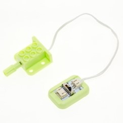

# 电机控制模块
## 实物图片

## 基本信息
中文名称：电机控制模块

英文名称：Motor Controller Module

序号：o9

SKU  号：BOS0024

## 模块简介                                                                  
电机控制模块可以控制小车移动、推动传送带、带动滑轮装置。与风扇模块中的电机相比，在实现复杂功能时，仅仅依靠电机的单方向转动是不够的，我们需要通过电机控制模块来设定电机的转速与方向。电机控制模块已被广泛应用于空调、吸尘器、鼓风机、压缩机、驱动机床、电扇、电冰箱、水泵等场景中。

## 使用说明
电机控制模块预设了四种不同的控制模式（如下表所示），可以通过拨动开关进行切换。

电机的转动方向如下图所示：

按照下图所示连接电路，通电后即可通过电机控制模块上的拨动开关控制电机的转速和方向。

 
## 原理介绍 
电机驱动物体运动的过程是一个电能转化为动能的过程，需要耗费较大的能量，而输入模块与电机直接相连无法直接提供足够的功率。为了保证有足够能量维持电机转动，在使用时我们需要通过电机控制模块将信号转化为电机的驱动电流。

## 应用样例
####**(1) 制作风车**

**样例说明：** 用声音传感器和电机控制模块模拟风车，当人对着声音传感器说话或吹气时，观察电机的转速和转动方向。

**元件清单：** 声音传感器；电机控制模块；N20减速电机模块；micro:bit；micro:bit BOSON扩展板。

**连线图：** 将声音传感器连接至micro:bit扩展板引脚P0，电机控制模块及电机模块连接至micro:bit扩展板引脚P8。

**执行流程：**

①	读取引脚P0的声音强度值。

②	将读取到的强度值赋给引脚P8，通过开关切换4种控制模式，观察不同模式下电机的转速与方向，制作不同转速与方向的风车。

**程序示意图（中文版）：**

**程序示意图（英文版）：**

####**(2) 调速打蛋器（非编程）**

**样例说明：** 制作一个打蛋器，打蛋器的打蛋头固定在电机的转轴上，使用旋钮模块控制电机的转速和转动方向。

**元件清单：** 旋钮模块；电机控制模块；N20减速电机模块；电源主板-单路。

**连线图：** 

####**(3) 调速打蛋器（编程）**

**样例说明：** 制作一个打蛋器，打蛋器的打蛋头固定在电机的转轴上，使用旋钮模块控制电机的转速和转动方向。

**元件清单：** 旋钮模块；电机控制模块；N20减速电机模块；micro:bit；micro:bit BOSON扩展板。

**连线图：** 将旋钮模块连接至micro:bit扩展板引脚P0，电机控制模块及电机模块连接至micro:bit扩展板引脚P8。

**执行流程：**

①	读取引脚P0的声音强度值。

②	将读取到的强度值赋给引脚P8，通过开关切换4种控制模式，观察不同模式下电机的转速与方向，制作不同转速与方向的打蛋器。

**程序示意图（中文版）：**

**程序示意图（英文版）：**

## 规格参数
引脚说明：

尺寸: 26mm*22mm

工作电压:3.3V-5.0V

工作电流：10mA

