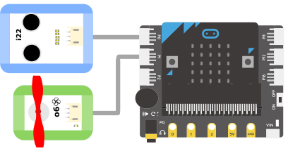

# 超声波距离传感器

## 实物图片

## 基本信息
中文名称：超声波距离传感器

英文名称：Ultrasonic Distance Sensor

序号：i22

SKU：BOS0045

## 功能简介
人耳朵能听到的声波频率为20Hz～20000Hz，当声波的振动频率大于20000Hz或小于20Hz时，人耳无法听到。我们把频率高于20000赫兹的声波称为超声波。超声波在测距、测速、测障、清洗牙齿、医疗透视仪、杀菌消毒、焊接铝金属等场景中均有广泛应用。

## 使用说明
将超声波距离传感器正对待测物体，当超声波距离传感器测得物体距离时，传感器会亮起相应数目的LED灯并将实际测得的距离输出。超声波距离传感器的测量距离为0cm~100cm，测量距离和亮灯数量之间的关系如下图所示：

按照下图所示连接电路，通电后再将超声波距离传感器正对待测物体即可通过显示屏模块查看待测物体与超声波距离传感器之间的距离。

## 原理介绍
超声波距离传感器利用超声波在空气中的传播速度为已知，测量声波在发射后遇到障碍物反射回来的时间，根据发射和接收的时间差计算出发射点到障碍物的实际距离。在测量过程中，该传感器会向某一方向发射超声波，在发射的同时开始计时，超声波在空气中传播，途中碰到障碍物就立即返回来，超声波接收器收到反射波就立即停止计时。超声波在15℃空气中的传播速度为340m/s，根据计时器记录的时间，就可以计算出发射点距障碍物的距离。传感器上的LED灯可以直观的展示距离的远近。

## 应用样例
#### (1) 倒车雷达
**样例说明：**倒车时，当超声波距离传感器检测到后方有障碍物时，扬声器播报声音“请注意后方障碍物”，提醒司机后方有障碍物，保证倒车安全。

**元件清单：**超声波距离传感器；电源主板-三路；录音模块；扬声器模块。

**连线图：**

#### (2) 守卫安全
**样例说明：**设置我们想要的安全距离，当然这个距离要在1米以内。当有危险物体进入我们的安全距离，被超声波距离传感器检测到了，LED灯就会亮起通知我们，提醒我们注意安全。

**元件清单：**超声波距离传感器；电源主板-三路；阈值模块；LED模块。

**连线图：**

#### (3) 带距离感应的智能风扇
**样例说明：**让风扇模块根据人离风扇的距离远近来调节转速：当人距离风扇20cm内，风扇开启1档；当人距离风扇20~40cm，风扇开启2档；当人距离风扇40~60cm，风扇开启3档；当人的距离在60cm以外，风扇停止转动（注意：风扇的三个档位对应转速为1档转速最快，3档转速最慢，2档转速居中）。

**元件清单：**超声波距离传感器；风扇模块；Micro:bit；Micro:bit BOSON扩展板。

**连线图：**

**设计意图：**使用超声波距离传感器感知人离风扇的距离（假设风扇周围没有其他障碍物），根据超声波距离传感器感知的距离值调节风扇的转速。

**执行流程：**

①	读取人与风扇的距离：获取超声波距离传感器测得的距离值；

②	若距离值小于20cm，把风扇转速调为1档（最快）；

③	若距离值在20~40cm之间，把风扇转速调为2档（适中）；

④	若距离值在40~60cm之间，把风扇转速调为3档（最慢）；

⑤	若距离值大于60cm，关闭风扇。

**程序示意图（中文版）：**

**程序示意图（英文版）：**

## 参数规格
引脚说明：

重量：(g)

尺寸：38mm*32mm

工作电压：3V-5V