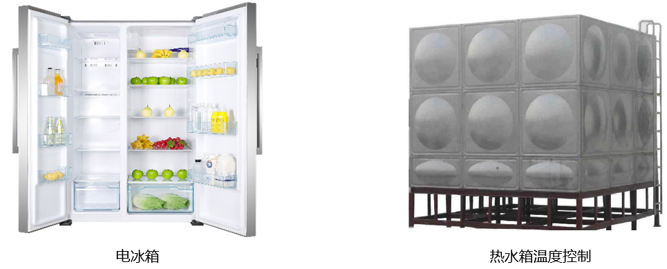

# 防水温度传感器

## 实物图片

## 基本信息
中文名称：防水温度传感器

英文名称：Waterproof Temperature Sensor

序号：i19

SKU：BOS0042

## 功能简介
防水温度传感器是一款防水的温度传感器，在测量远处温度和环境比较潮湿的情况下，该传感器能发挥极大的作用，适用于电冰箱等冷冻、冷藏环境中的温度检测、室内和机电设备温度检测、土壤温度检测、热水箱温度控制等场景中。

## 使用说明
防水温度传感器可以与Arduino结合使用。使用时，必须连接上拉电阻，与可插拔传感器转接器配合使用。按照下图所示连接电路，通电后将防水温度传感器的探头放入待测量的物体中，则测量物体的温度值可以通过显示屏模块直接读取。防水温度传感器的感温范围在-55℃~+125℃之间，温度显示范围为-10°C~+85°C（误差±0.5°C）。

***注意：**虽然该产品能够在125°C下正常工作，但由于缆线是由聚氯乙烯（PVC）材料制成的，没有传感器耐热，因此我们建议不要将其放在温度高于100°C的地方。*

## 原理介绍
该传感器的探头采用DS18B20温度传感器芯片，由导热性高的密封胶灌封而成，保证了传感器的高灵敏性和极小的温度延迟，芯片本身每个引脚均用热缩管隔开，防止短路；使用优质不锈钢管封装，实现防水、防潮、防生锈的功能。

## 应用样例
#### (1) 探究土壤温度对种子发芽率的影响
**样例说明：**将相同数量的同一作物的种子分别种在两个盆中，通过显示器读取两盆的土壤温度，从而控制两盆土壤温度值始终不同，探究两种情况下种子的发芽情况。

**元件清单：**防水温度传感器；电源主板-单路；显示屏模块。

**连线图：**

#### (2) 粮仓温湿度检测
**样例说明：**粮仓粮食安全储藏的主要参数是粮仓的温度和湿度，这两者之间又是互相关联的。粮食在正常储藏过程中，含水量一般在12%以下是安全状态，不会产生温度突变，一旦粮仓进水、结露等使粮食的含水量达到20%以上时，就会使粮食受潮，胚芽萌发，新陈代谢加快而产生呼吸热，使局部粮食温度突然升高，当温度高于22°C时，必然引起粮食“发烧”和霉变，并可能形成连锁反应，从而造成不可挽回的损失。因此有必要检测粮食温度。当温度传感器感受到粮食内温度时，当温度高于22°C时，自动开启风扇、点亮小灯并报警。而当湿度传感器感受到粮食内湿度高于20%时，自动点亮小灯并报警。

**元件清单：**防水温度传感器；空气湿度传感器；电源主板-三路；阈值模块；分支模块；逻辑“或”模块；风扇模块；LED模块；蜂鸣器模块。

**连线图：**

#### (3) 液体温度检测仪 
**样例说明：**防水温度传感器测量液体温度值，Micro:bit读取测量结果并将温度显示在LED点阵上。

**元件清单：**防水温度传感器；Micro:bit；Micro:bit BOSON扩展板。

**连线图：**

**设计意图：**

**执行流程：**

**程序示意图（中文版）：**

**程序示意图（英文版）：**

## 参数规格
引脚说明：

重量： （g）

尺寸：26mm*22mm

工作电压：3.0-5.0V