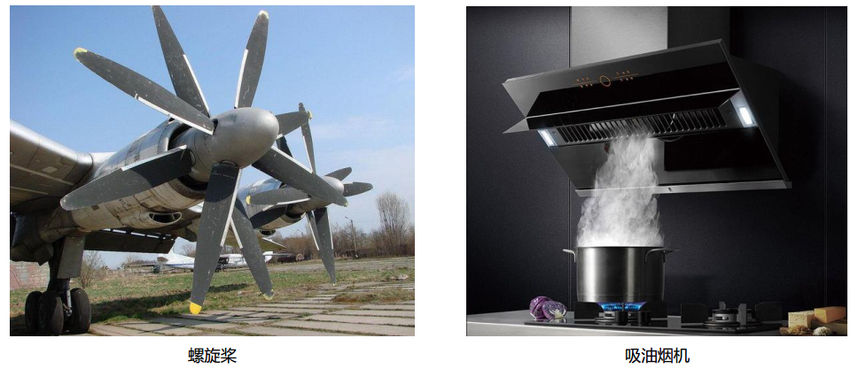

# 风扇模块
## 实物图片

## 基本信息
中文名称：风扇模块

英文名称：Fan Module

序号：o6

SKU  号：BOS0021

## 模块简介                                                                  
风扇模块是一款利用直流电机将电能转化为机械能，驱动扇叶旋转的模块。风扇模块已被广泛应用于电风扇、散热器、螺旋桨、吸油烟机等场景中。

## 使用说明
风扇模块在通电后即可转动，还可以搭配旋钮模块来改变风扇控制脚的电压大小使扇叶旋转的速度提高或降低，从而实现换档功能。

当使用数字信号控制风扇模块时，
输入高电平，风扇开始转动；输入低电平，风扇停止转动。

当使用模拟信号控制风扇模块时，
输入信号越大，风扇的转速越快；输入信号越小，风扇的转速越慢。

按照下图所示连接电路，即可通过按钮模块控制风扇模块。

 
## 原理介绍 
风扇主要由定子和转子两大部分组成，定子主要包括控制电路、轴承、线圈。转子主要由扇叶、磁铁和轴三个部分构成。风扇的工作原理简单的来讲就是电流通过控制电路，在定子线圈处和电磁铁处产生旋转磁场，推动转子上的磁铁朝特定方向旋转，从而带动整个扇叶高速旋转，推动空气快速从扇叶处通过，已到达特定的风量和风压。

## 应用样例
####**(1) 按钮风扇**

**样例说明：** 利用micro:bit自带的A、B按钮控制风扇的开启和关闭。当A按钮被按下时，风扇打开；当B按钮被按下时，风扇关闭。

**元件清单：** 风扇模块；micro:bit；micro:bit BOSON扩展板。

**连线图：** 将风扇模块连接至micro:bit扩展板引脚P8。

**执行流程：**

①	当按钮A被按下时，引脚P8输出高电平（“1”），风扇启动。

②	当按钮B被按下时，引脚P8输出低电平（“0”），风扇关闭。

**程序示意图（中文版）：**

**程序示意图（英文版）：**

####**(2) 调速风扇**

**样例说明：** 使用旋钮控制风扇转速。顺时针转动旋钮，风扇转速越来越快；逆时针转动旋钮，风扇转速越来越慢。

**元件清单：** 旋钮模块；风扇模块；micro:bit；micro:bit BOSON扩展板。

**连线图：** 将旋钮模块连接至micro:bit扩展板引脚P0，风扇模块连接至micro:bit扩展板引脚P8。

**执行流程：**

①	读取引脚P0的模拟值。
②	将读取到的模拟值赋给引脚P8。

**程序示意图（中文版）：**

**程序示意图（英文版）：**

####**(3) 温控风扇**

**样例说明：** 当温度较高时，自动开启风扇，温度较低时，自动关闭。

**元件清单：** 温度传感器；风扇模块；电源主板-单路。

**连线图：** 

####**(4) 声控风扇**

**样例说明：** 使用声音传感器控制风扇模块的启动和关闭。

**元件清单：** 声音传感器；风扇模块；电源主板-三路。

**连线图：** 

## 规格参数
引脚说明：

尺寸: 26mm*22mm

工作电压:3.0-5.0V

