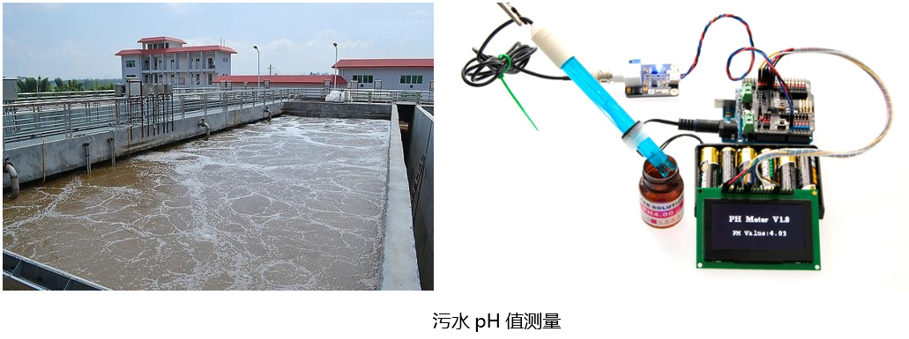
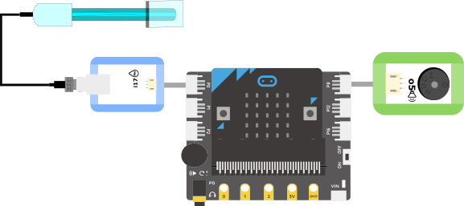
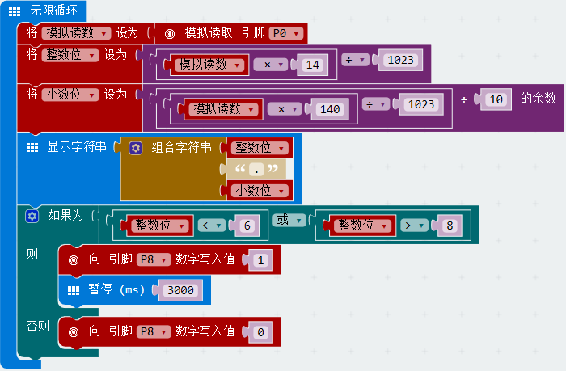

# i17酸鹼值感測器

## 实物图片

## 基本信息

中文名称：pH传感器

英文名称：pH Sensor

序号：i17

SKU：BOS0039

## 功能简介

pH传感器是一款用来检测被测物中氢离子浓度并转换成相应的可用输出信号的传感器，通常由化学部分和信号传输部分构成。通过pH传感器，可以快速准确的获取pH值，得知溶液的酸碱度，便于对pH进行调节，免去了使用pH试纸的繁琐。pH传感器可以用于废水污水场合pH值测量、电镀废水场合pH值测量、高温场合pH值测量、发酵场合pH值测量、高压场合pH值测量等多种场合pH值的测量。

## 使用说明

使用pH传感器时，需要将探头部分浸没溶液，其pH测量范围为0-14pH，测量误差为±0.1pH\(25℃\)。按照下图所示连接电路，通电后即可通过显示屏模块直接读取pH值。

pH值与溶液酸碱性对应表：

**维修保养注意事项：**

（1）电极在初次使用或久置不用重新使用时，把电极球泡及砂芯，浸在3NKCL溶液中活化8小时。

（2）取下电极保护套后要注意，在塑料保护栅内的敏感玻璃泡不与硬物接触，任何破损和擦毛都会使电极失效。

（3）测量完毕，不用时应将电极保护套套上，保护套内应放少量3.3mol/L氯化钾溶液，以保持电极球泡的湿润。

（4）电极的引出端，必须保持清洁和干燥，绝对防止输出两端短路，否则将导致测量结果失准或失效。

（5）电极避免长期浸在蒸馏水中或蛋白质溶液和酸性氯化物溶液中，并防止和有机硅油脂接触。

（6）电极经长期使用后，如发现梯度略有降低，则可把电极下端浸泡在4%HF（氢氟酸）中3-5秒钟，用蒸馏水洗净，然后在氯化钾溶液中浸泡，使之复新。

（7）被测溶液中如含有易污染敏感球泡货堵塞液接界的物质，而使电极钝化，其现象是敏感梯度降低，货读数不准。如此，则应根据污染物质的性质，以适当溶液清洗，使之复新。

（8）选用清洗剂时，如能溶解聚碳酸树脂的清洗液，如四氯化碳，三氯乙烯，四氢呋喃等，则可能把聚碳酸树脂溶解后，涂在敏感玻璃球泡上，而使电极失效，请慎用！

## 原理介绍

pH是指溶液中氢离子的总数和总物质的量的比，表现为酸碱度。pH传感器的电极采用玻璃电极和参比电极组合在一起的塑壳不可填充式复合电极，是pH计测量元件，可用来测量水溶液中的氢离子活度，即pH值。

## 应用样例

### \(1\) 饮品大调查

**样例说明：**通过pH检测器的显示屏观察不同饮品的pH值，得知饮品的酸碱度。

**元件清单：**pH传感器；电源主板-单路；显示屏模块。

**连线图：**

### \(2\) 鱼缸水质监测仪

**样例说明：**若鱼缸中pH值出现波动，肯定是水质变化带动了pH值变化，监测到异常的pH传感器及时返回信号，提醒主人调整水质。

**元件清单：**pH传感器；蜂鸣器模块；Micro:bit；Micro:bit BOSON扩展板。

**连线图：**

**设计意图：**pH值的计算公式为pH=输出电压（单位：V）×14÷3.3。在套用公式前，首先要把pH传感器输出的模拟值（范围：0~1023）转换为模拟电压值（范围：0~3.3V）。例如，若pH传感器输出模拟值500，则对应电压约为1.6V，结合pH值的转换公式可算出pH值约为6.7。

然而，MakeCode是不支持小数运算的，所以我们需要把公式进一步转换为整数之间的运算，即pH值=模拟读数×14÷1023。由于MakeCode也不支持直接显示小数，我们可以将由小数表示的pH值拆分为“整数位+小数点+小数位”三部分组成的字符串，再以字符串形式在Micro:bit上显示出pH值。那么，如何在MakeCode中分别获取一个小数的整数位和小数位呢？以求13÷4的结果为例（结果保留一位小数），整数位可以直接通过13和4相除的商获得（即3），而小数位其实就是130和4相除的余数（即2），所以13÷4最终的结果为3.2。

综上，求pH值的整数位可以转换为求模拟读数×14÷1023的商，求pH值的小数位可以转换为求模拟读数×140÷1023÷10的余数。求出pH值后，还需要对当前鱼缸内的pH值是否出现异常进行判断。

**执行流程：**

① 读取模拟读数：读取pH感器输出的模拟值并赋值给变量“模拟读数”；

② 计算pH值的整数位：整数位=模拟读数×14÷1023的商；

③ 计算pH值的小数位：小数位=模拟读数×140÷1023÷10的余数；

④ 输出实时pH值：使用“整数位+小数点+小数位”的形式输出pH值字符串；

⑤ 若pH值小于6或大于8，则蜂鸣器发出警报并持续三秒，提醒水质pH值异常。

**程序示意图（中文版）：**

**程序示意图（英文版）：**

## 参数规格

引脚说明：

重量： （g）

尺寸：43mm\*32mm

工作电压：3.0-5.0V

工作电流：25mA

