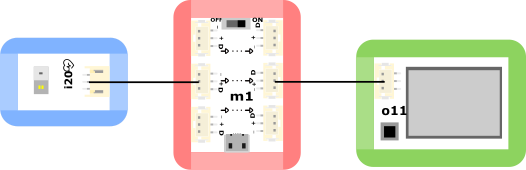

# o11顯示模組

## 实物图片

## 基本信息

中文名称：显示屏模块

英文名称：Display Module

序号：o11

SKU 号：BOS0044

## 模块简介

显示屏模块能够为其他模块信息提供可视化效果，方便查看实验效果。在日常生活中，电视机、电脑、洗衣机、手机、仪表盘等电子设备都会使用显示屏模块。

## 使用说明

显示屏模块共预设了八种不同模块的信息显示（见下表），可以通过按钮切换到相应的模块编号查看。

按照下图所示连接电路，通电后即可通过显示屏模块上的按钮切换到空气湿度传感器模块查看空气湿度。

## 原理介绍

显示屏模块通过采集其他模块的输出信息并加以处理转换成屏幕可以显示的内容，实现信息的可视化。该显示屏模块设计有保护外框，在保护显示屏不易破碎的同时，防止显示屏玻璃边缘划伤手指。

## 应用样例

### **\(1\) 心率监测**

**样例说明：** 使用心率传感器和显示屏模块监测人的心率（注意将显示屏模块调到心率传感器所对应的模块编号“i20”）。

**元件清单：** 心率传感器；显示屏模块；电源主板-三路。

**连线图：**

### **\(2\) 探究光照强度对植物生长的影响**

**样例说明：** 将两盆相同植物放在不同光照下，使用环境光传感器检测不同环境中的光照强度，并通过显示屏模块读取光强数值（注意将显示屏模块调到环境光传感器所对应的模块编号“i4”），从而探究不同光照强度下植物的生长状况，尝试找出最适宜某种植物生长的光照强度。

**元件清单：** 环境光传感器；显示屏模块；电源主板-单路。

**连线图：**

### **\(3\) 检测物体的导电性**

**样例说明：** 通过导线外接物体，通过显示屏模块查看该物体是否导电（注意将显示屏模块调到电导开关所对应的模块编号“i12”）。

**元件清单：** 电导开关；导线；显示屏模块；电源主板-单路。

**连线图：**

### **\(4\) 探究土壤湿度对种子发芽率的影响**

**样例说明：** 将相同数量的同一作物的种子分别种在两个盆中，通过显示屏模块读取两盆的土壤湿度（注意将显示屏模块调到土壤湿度传感器所对应的模块编号“i16”），从而控制两盆土壤湿度值始终不同，探究两种情况下种子的发芽情况。

**元件清单：** 土壤湿度传感器；显示屏模块；电源主板-单路。

**连线图：**

### **\(5\) 饮品大调查**

**样例说明：** 通过pH检测器的显示屏观察不同饮品的pH值（注意将显示屏模块调到pH传感器所对应的模块编号“i17”），得知饮品的酸碱度。

**元件清单：** pH传感器；显示屏模块；电源主板-单路。

**连线图：**

## 规格参数

引脚说明： 

尺寸: 38mm\*32mm

工作电压:3.0-5.5V

工作电流：13mA

