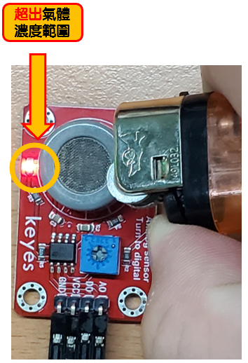

# 【12】氣體感測器Gas Sensor(MQ7)模組

### 氣體模組(MQ7) 

**專案說明**

使用「Raspberry Pi Pico W」連接「氣體模組(MQ7)」, 讀取氣體模組(MQ7)的數值變化。此**氣體模組(MQ7)**包含於「洞洞五教學材料包」內。

**感測器調整說明**

精密電阻旋鈕可以調整氣體濃度測量範圍，如下圖所示。

.png>)

**氣體模組(MQ7)電路圖**

* Raspberry Pi Pico W
* Raspberry Pi Pico W 擴充板
* 氣體模組(MQ7)

**氣體模組(MQ7)**是**類比訊號**輸入， 可以接「A0\~ A2」的Raspberry Pi Pico擴充板訊號端上。 本範例連接到「A0」

.png>)

**BlocklyDuino 程式 (GAS)**

偵測氣體的濃度變化，若**氣體濃度大於500，則顯示「危險!」；反之顯示「安全!」**。

.png>)

**Arduino 程式(GAS.ino)如下**

void setup()

{

Serial.begin(9600);

}

void loop()

{

int GAS = analogRead(A0);

if (GAS > 500) {

Serial.println("危險!");

} else {

Serial.println("安全!");

}

Serial.println((String("數值 :")+String(GAS)));

delay(100);

}

**程式執行結果:**

偵測氣體的濃度變化，若**氣體濃度大於500，則顯示「危險!」；反之顯示「安全!」**。

以下是**安全範例**

|  |  |
| ----------------------------------------------------------------------- | ----------------------------------------------------------------------------------------------------------- |

以下**危險範例**

|  |  |
| ------------------------------------------------------------------- | ----------------------------------------------------------------------- |
