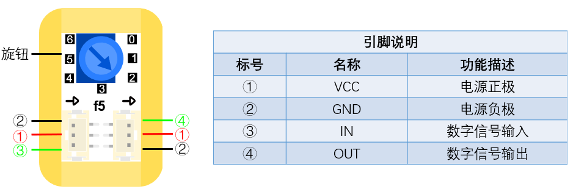

# f5延時模組（0~6秒）

## 实物图片

## 基本信息

中文名称：持续模块（0~6秒）

英文名称：Duration Module \(0-6s\)

序号：f5

SKU 号：BOS0031

## 模块简介

持续模块（0~6秒）是一个可以持续输出固定设置时间的高脉冲的模块，持续模块（0~6秒）的常见应用场景是实现点亮或关闭LED灯并持续一段间。

## 使用说明

持续模块（0~6秒）不能直接作为输入或输出模块使用，需要将输入模块连接在持续模块（0~6秒）的输入口，输出模块连接在持续模块（0~6秒）的输出口。持续模块（0~6秒\)的持续时间通过旋钮来调节，通过输入信号来触发输出信号。持续模块（0~6秒）的输入口和输出口如下图所示。

持续模块（0~6秒）的输入输出机制如下：当输入高脉冲后，模块会输出一个固定设置时间的高电平。

按照下图所示连接电路并设定好持续模块（0~6秒）的时间值，通电后按下按钮即可点亮LED灯并持续设定时长。

## 原理介绍

持续模块（0~6秒）是一个根据输入信号来触发输出信号的模块；输出信号的持续时间由旋钮控制。

## 应用样例

### **\(1\) 画廊展示品防盗报警器**

**样例说明：** 当有人触摸展品或者展品发生倾斜时，自动报警。

**元件清单：** 倾斜传感器；触摸传感器；逻辑“或”模块；阈值模块；蜂鸣器模块；电源主板-单路。

**连线图：**

### **\(2\) 密码锁**

**样例说明：** 设置三个按钮，只有按照正确的顺序按下三个按钮，才能解锁；同时小灯模块也会亮起来，蜂鸣器发出警报，即告诉别人，密码锁已被打开。

**元件清单：** 蓝色按钮模块；红色按钮模块；黄色按钮模块；LED模块；蜂鸣器模块；持续模块（0-6秒）；持续模块（0-60秒）；逻辑“与”模块；分支模块；电源主板-三路。

**连线图：**

## 规格参数

引脚说明： 

尺寸: 26mm\*22mm

工作电压:3.0-5.5V

工作电流：\(Max\)32mA@5V

