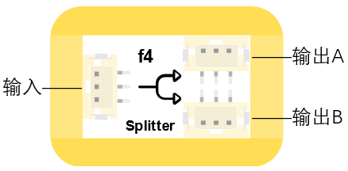

# f4分配模組

## 實體照片

## 基本資訊

中文名稱：分配模組

英文名稱：Splitter Module

序號：f4

SKU 號：BOS0030

## 功能簡介

分配模組是把一路輸入信號擴展為兩路輸出信號的模組，該模組的常用場景是：當要使用一個輸入信號去控制兩台設備而介面不夠用的情況下，可以使用分配模組將一路輸入信號變成兩個相同的輸出信號去控制這兩台設備。

## 使用說明

分配模組既可以放在輸入端，也可以放在輸出端，但該模組不能直接作為輸入或輸出模組使用，需要將輸入模組連接在分配模組的輸入口，兩個輸出模組分別連接在分配模組的兩個輸出口，通過改變輸入口的信號來控制兩個輸出口。分配模組的輸入口和輸出口如下圖所示。

分配模組的輸入輸出機制如下：

當輸入訊號為「0」時，模組輸出「0」；

當輸入訊號為「1」時，模組輸出「1」。

下圖列出了分配模組的真值表。

分配模組除了可以輸入輸出數位信號外，還可以將一路類比輸入信號轉換為兩路相同的類比輸出信號。按照下圖所示連接電路，通電後按下紅色按鈕即可同時點亮兩盞LED燈。

## 原理介紹

分配模組能夠將一路輸入信號擴展為兩路相同的輸出信號。

## 應用範例

### **\(1\) 復古燭臺**

**範例說明：** 用光代替火，光敏感測器感受到光後使小燈泡點亮，小燈泡一旦被“點火”成功，就保持著不滅的狀態。

**元件清單：** 光感測器；運算邏輯模組 OR；分配模組；紅色LED燈模組；主控板：1組輸入/輸出端。

**連線圖：**

### **\(2\) 密碼鎖**

**範例說明：** 設置三個按鈕，只有按照正確的順序按下三個按鈕，才能解鎖；同時小燈模組也會亮起來，蜂鳴器發出警報，即告訴別人，密碼鎖已被打開。

**元件清單：** 藍色按鈕模組；紅色按鈕模組；黃色按鈕模組；LED燈模組；蜂鳴器模組；計時模組（0-6秒）；計時模組（0-60秒）；運算邏輯模組 AND；分配模組；主控板：3組輸入/輸出端。

**連線圖：**

### **\(3\) 搶答器**

**範例說明：** 做一個搶答器，讓按下按鈕的人，亮起對應的燈，同時阻止另一個燈不能再亮起。

**元件清單：** 藍色按鈕模組；紅色按鈕模組；藍色LED燈模組；紅色LED燈模組；運算邏輯模組 AND；運算邏輯模組 NOT；分配模組；主控板：3組輸入/輸出端。

**連線圖：**

## 商品規格

腳位說明： 

| **編號** | **名稱** | **功能說明** |
| :---: | :---: | :---: |
| 1 | GND | 電源接地 |
| 2 | VCC | 電源正極 |
| 3 | IN | 類比輸入 |
| 4 | OUTA | 類比輸出A |
| 5 | OUTB | 類比輸出B |

尺寸: 26mm\*22mm

工作電壓:3.0-5.5V

工作電流：\(Max\)32mA@5V

