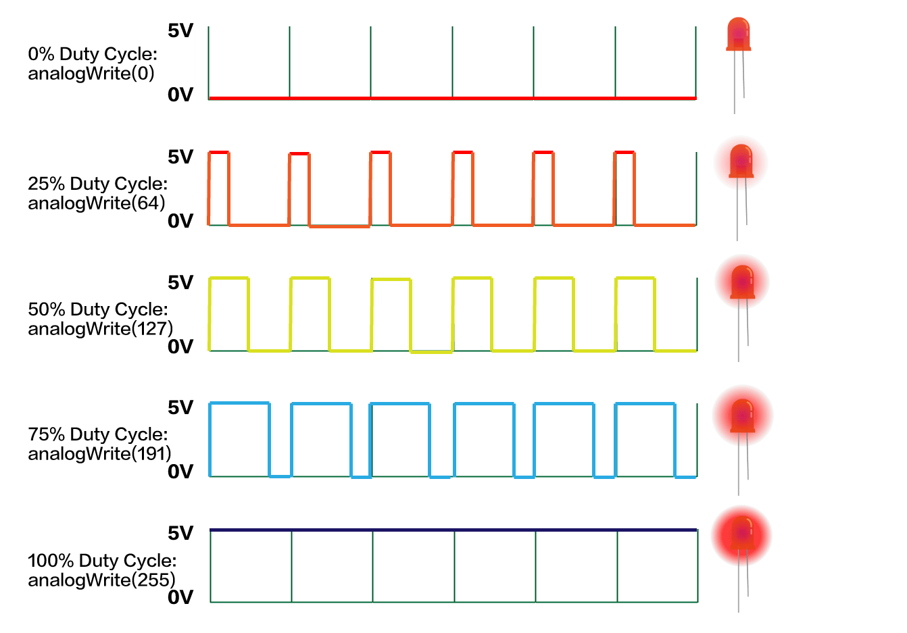
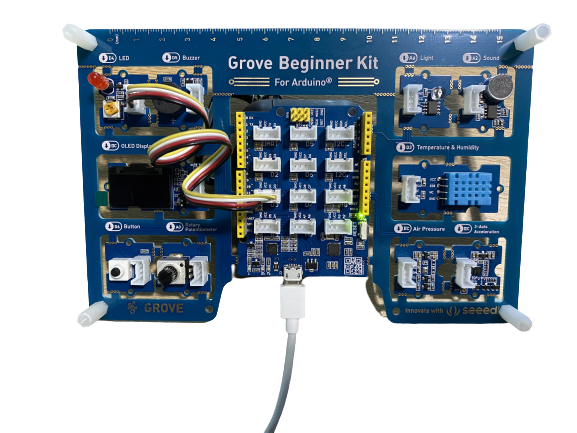

# 書籍更新\_202012更新

## 01.LED 模組

**\*\*\* P19新增LED模組亮度調整內容說明\*\*\***

  
**展示效果和序列埠輸出結果** 新增以下內容:

LED 模組將亮 1 秒，燈滅 1 秒。

下面新增說明及圖片

LED模組亮度調整說明：


LED模組上有可變電阻，可以用螺絲起子轉動它，使LED更亮或更暗。

## 03. 旋轉式電位器

**\*\*\* P27 程式碼部分修改程式碼內容\*\*\***

程式碼後面加上//本行修改部分為須更改之程式碼AND註解

```text
//Rotary controls LED
int rotaryPin = A0; // select the input pin for the rotary
int ledPin = 4; // select the pin for the LED
int rotaryValue = 0; // variable to store the value coming from the rotary
void setup() {
 // declare the ledPin as an OUTPUT:
pinMode(ledPin, OUTPUT);
}
void loop() {
 // read the value from the sensor:
rotaryValue = analogRead(rotaryPin);
 // turn the ledPin on
digitalWrite(ledPin, HIGH);
 // stop the program for <sensorValue> milliseconds://本行修改
delay(rotaryValue);//本行修改
 // turn the ledPin off://本行修改
digitalWrite(ledPin, LOW);
 // stop the program for for <sensorValue> milliseconds:
delay(rotaryValue);
}
```

## 04. 蜂鳴器\(整個章節修改\)

與 LED 模組相同，蜂鳴器也是輸出模組，不同的是它不會發光而是發出聲音。蜂鳴器在很多情況下可以用於指示某種狀況或提醒。

**背景知識**

**什麼是有源蜂鳴器和被動式蜂鳴器？**

蜂鳴器有兩種類型，一種是有源，另一種是無源。有源蜂鳴器和無源蜂鳴器都是用來給電子產品發聲的。

有源蜂鳴器具有內部振盪源，只要接通電源，蜂鳴器就會發出聲音。有源蜂鳴器廣泛應用於電腦，印表機，警報器，電子玩具，汽車電子產品，電話，計時器和其他電子產品的發聲設備。

無源蜂鳴器沒有內部振盪源，需要由方波和不同頻率驅動。它的作用就像電磁揚聲器，不斷變化的輸入信號會產生聲音，而不是自動發出聲音。


在本套件中，Grove-Buzzer是一個無源蜂鳴器，所以需要一個交流信號（AC）來控制它。這就產生了一個問題，如何用Arduino產生方波（交流信號）? 一個簡單的方法就是使用PWM。

**什麼是 PWM ？**

脈衝寬度調變 \(PWM\) 是一種通過數位方式來模擬類比效果的技術。數位腳位可以產生方波，即在開 \(ON\) 和關 \(OFF\) 之間切換的訊號。只要改變 \(ON\) 和 \(OFF\) 這兩種訊號的時間長度比例，此開關模式可以模擬全開 \(5V\) 和關 \(0V\) 之間的連續電壓變化。【接通時間 \(ontime\)】的持續時間稱為脈衝寬度。例如，如果 LED 重複這種開關模式夠快的話，結果就如同控制 LED 亮度從 0 至 5V 之間的連續穩定電壓一樣。引用自：Arduino（[https://www.arduino.cc/en/tutorial/PWM](https://www.arduino.cc/en/tutorial/PWM)）

Seeeduino 上有 6 個數位腳位，上面額外標示了“ ~ ＂符號，表示它們可以發送PWM訊號：3、5、6、9、 10、11，因此它們也稱為PWM腳位。

**使用模組**

1. Seeeduino 開發板

2. 蜂鳴器

3. 訊號線（僅適用於模組已拆開的情況）


**硬體連接**

模組連接

① 預設以電路板上的線路連接到 Seeeduino。

② 透過 USB 傳輸線將 Seeeduino 連接到電腦。

程式碼

①打開 Arduino IDE.

②輸入以下程式碼，按一下【驗證\(✓\)】來檢查有無語法錯誤，如果沒有出現錯誤訊息，就可以按【上傳\(→\)】把程式碼上傳到開發板。

```text
int BuzzerPin = 5;
 void setup() {
 pinMode(BuzzerPin, OUTPUT);
}
void loop() {
 analogWrite(BuzzerPin, 128);
 delay(1000);
 analogWrite(BuzzerPin, 0);
 delay(1000);
}
```

**程式碼分析**

analogWrite\(BuzzerPin, Value\);

將類比值（PWM）寫入蜂鳴器。

**描述：**

將類比值（PWM）寫入腳位。可用於調整 LED 亮度或控制馬達的轉速快慢。在設定 analogWrite\(\) 函式後，該腳位將生成指定工作週期的穩定方波，直到同一腳位再次被不同參數的 analogWrite\(\)函式設定（也可以使用 digitalRead\(\) 或 digitalWrite\(\) 函式）為止。

**語法：**

analogWrite\(pin, value\)

**參數：**

pin（腳位）: 要寫入的 Arduino 腳位（pin）。

允許的資料型態：整數 \(int\)。

數值 : 工作週期：介於 0（始終關閉）和 255（始終開啟）之間。

允許的資料型態：整數 \(int\)。

**展示效果和序列埠輸出結果**

蜂鳴器會響一秒、停止響一秒。

**拆解指南**

如果模組已從主機板上分離，則需要使用訊號線把蜂鳴器連接到 Seeeduino 的數位連接埠 D5。

**使用蜂鳴器發出設定頻率的聲音**

如果要使蜂鳴器發出設定好的頻率的聲音，可以使用以下程式碼，詳細介紹請參考一下連結。

```text
tone(pin, value);
```


[https://cavedu.gitbook.io/cavedu/hangeekduino/samplecode/output\_module/buzzer](https://cavedu.gitbook.io/cavedu/hangeekduino/samplecode/output_module/buzzer)


**PWM用法**

現在我們已經學會了PWM的使用，除了用PWM控制無源蜂鳴器外，我們還可以用PWM於控制馬達的轉速快慢或調整LED亮度等功能。

如下圖所示，使用 analogWrite\(\) 函式來生成不同寬度 PWM 波，其中工作週期 \(Duty Cycle\) 高電位的比例越高，LED燈越亮。



然而，Grove Beginner Kit上的LED燈無法直接使用PWM控制，因為LED連接的是D4，而如上文中所述PWM腳位為3,5,6,9,10,11，pin 4並不是PWM腳位。如果您想用PWM來控制LED，則需要將它拆開下來，使用訊號線連到帶PWM功能的腳位。\(或著如以下範例使用訊號線連接D3腳位，但不能同時使用溫溼度感測器\)

例如，讓我們用訊號線將LED模組與數位連接埠D3連接起來。

> **\*注意:D3也與溫濕度感測器相互連接，因此本範例不能與溫濕度感測器一起使用。**



```text
	int LED = 3; // Cable connection from LED to D3
	int Potentiometer = A0;
	 
	void setup() {
	  pinMode(LED, OUTPUT);
	  pinMode(Potentiometer, INPUT);
	}
	 
	void loop() {
	  int potentioValue, Value;
	  potentioValue = analogRead(Potentiometer);
	  Value = map(potentioValue, 0, 1023, 0, 255); //Mapping potentiometer value to PWM signal value
	  analogWrite(LED, Value);
	}
```

編譯並上傳程式碼，你應該可以使用PWM訊號來調整旋轉式電位器改變LED的亮度。

**程式碼分析**

Value = map\(potentioValue, 0, 1023, 0, 255\);

把旋轉式電位器的類比訊號 \(0 - 1023\) 映射為LED的亮度 \(0 - 255\)。

語法：

map\(value, fromLow, fromHigh, toLow, toHigh\)

描述：

把一個範圍中的某個數字等比例對應到另一個範圍中的數字。也就是說，fromLow 這個值會被對應到 toLow，fromHigh 同樣地會被對應到 toHigh。兩者之間的數字也是如此。

不需要硬把數字限制在某個範圍中，因為就算超出上下限的數字有時也是有意義甚至是有用的。如果真的有必要限制範圍的話，可把 constrain\(\) 函式放在 map\(\) 函式的之前或之後來執行。

請注意，新舊兩個數值範圍的下限不一定要真的小於上限。這樣一來，map\(\) 函式還可以把一個範圍的數字反過來，例如：

y = map\(x, 1, 50, 50, 1\);

這個函式也可以處理負數，如以下範例：

y = map\(x, 1, 50, 50, -100\);

同樣也可以正確執行。

map \(\) 函式只接受整數，因此就算運算結果有小數點，一樣會被改為整數。小數點會直接被捨去，而非四捨五入。

參數：

● value: 要被映射的數字

● fromLow: 原始數值範圍的下限

● fromHigh: 原始數值範圍的上限

● toLow:映射後數值範圍的上限

● toHigh:映射後數值範圍的上限

**展示效果和序列埠輸出結果：**

調整旋轉式電位器的數值會改變LED的亮度。

總而言之，當你要使用PWM功能時，需要選擇那些名字前面有"~"符號的腳位。

## 06. 聲音感測器

**\*\*\* P42 程式碼部分修改註解內容\*\*\***  
程式碼後面加上//本行修改部分為須更改之程式碼AND註解

```text
//Sound Control Light
int soundPin = A2; // Analog sound sensor is to be attached to analog
int ledPin = 4; // Digital LED is to be attached to digital
void setup() {
 pinMode(ledPin, OUTPUT);
 pinMode(soundPin, INPUT);
 Serial.begin(9600);
}
void loop() {
 int soundState = analogRead(soundPin); // Read sound sensor’s value
 Serial.println(soundState);
 // if the sound sensor’s value is greater than 600, the light will be on.
 //Otherwise, the light will be turned off //本行修改
 if (soundState > 600) {
 digitalWrite(ledPin, HIGH);
 delay(100);
 } else {
 digitalWrite(ledPin, LOW);
 }
}
```

## 07. OLED顯示模組

**\*\*\*P45新增將模組拆解下來需要更新之程式碼\*\*\***

發現將OLED顯示模組拆解下來時，燒錄原本的程式碼時會無法使用。所以更新程式碼內容讓OLED顯示模組在拆解下來時也可正常使用。

u8x8.setBusClock\(100000\);

為新增之程式碼，如將模組拆解下來需要設定BusClock才可使用。

```text
#include <Arduino.h>
#include <U8x8lib.h>
U8X8_SSD1306_128X64_ALT0_HW_I2C u8x8(/* reset=*/ U8X8_PIN_NONE);
void setup(void) {
 u8x8.setBusClock(100000); // If you breakout other modules, please enable this line
 u8x8.begin();
 u8x8.setFlipMode(1);
}
void loop(void) {
 u8x8.setFont(u8x8_font_chroma48medium8_r);
 u8x8.setCursor(0, 0);
 u8x8.print("Hello World!");
}
```

