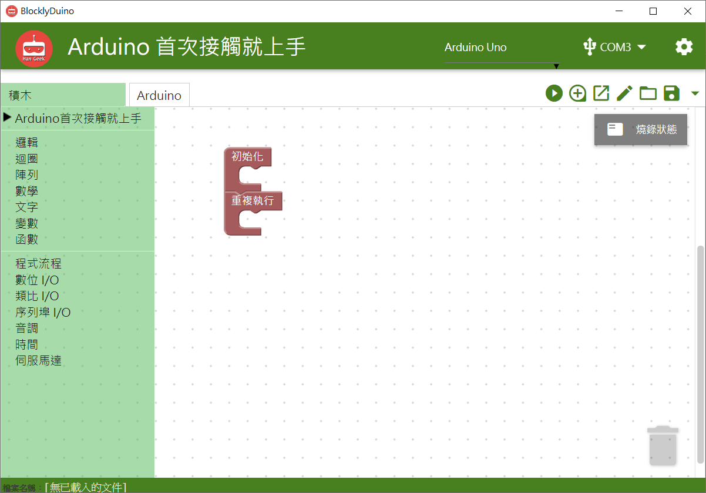
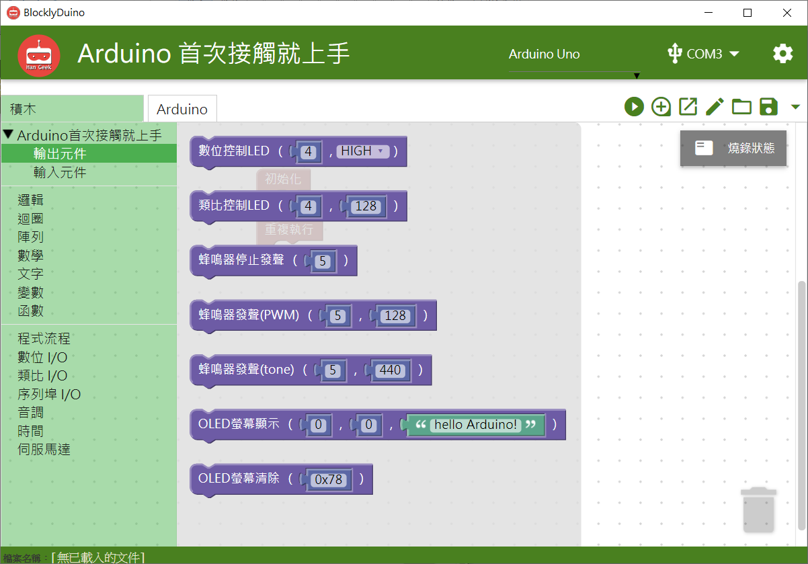
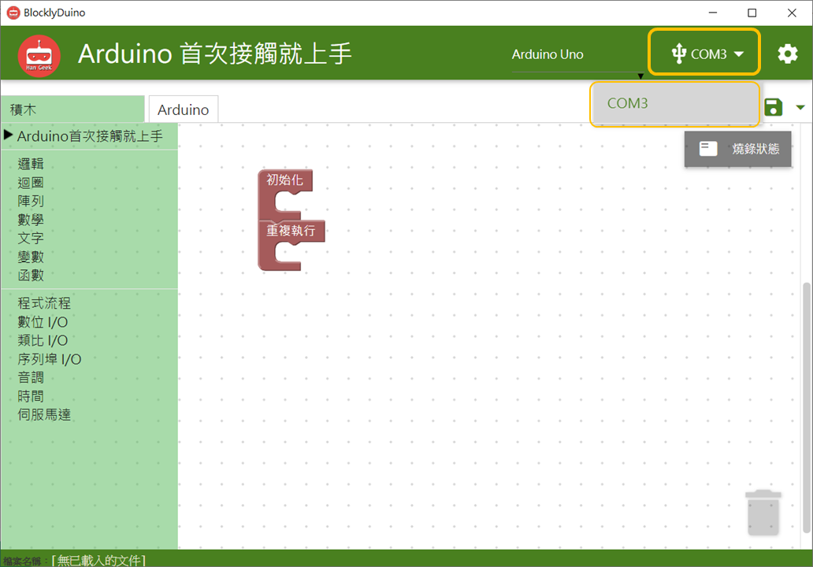
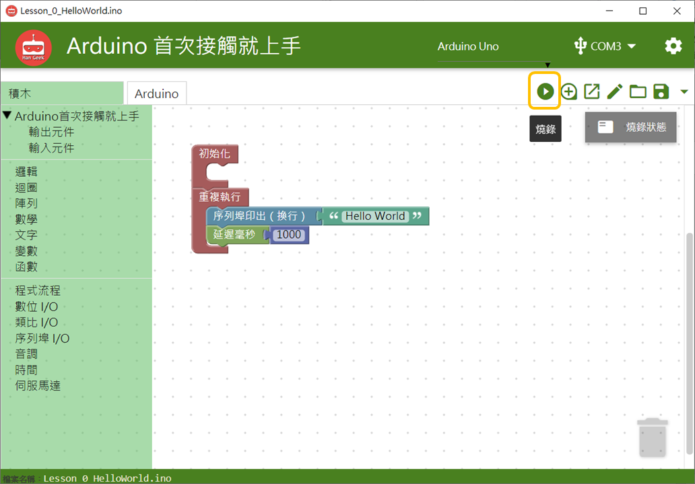
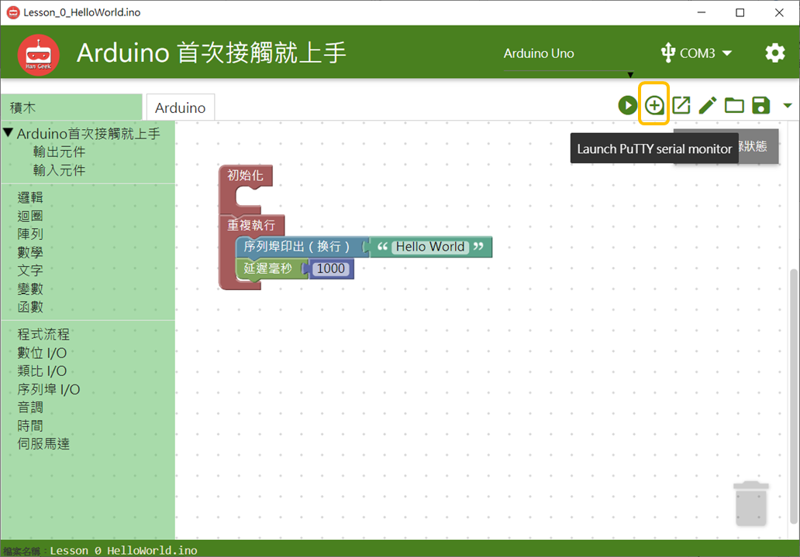

# 圖形化介面Hangeekduino

Hangeekduino是根據BlocklyDuino所新增首次接觸就上手套件相關積木功能出來所設計的圖形化程式開發介面，注意目前此軟體只支援Windows作業系統使用。

### **軟體下載連結:**

\*\*\*\*[https://drive.google.com/drive/folders/1iHQyfQvjbS4lhob-3mF5auntte\_G86\_f](https://drive.google.com/drive/folders/1iHQyfQvjbS4lhob-3mF5auntte_G86_f) 

使用方法就跟BlocklyDuino一樣，從下圖可以看到在積木選單下新增了Arduino首次接觸就上手的區塊。Arduino首次接觸就上手的相關積木都在這邊可以使用。

第一次使用Hangeekduino軟體或Arduino首次接觸就上手的人，需要先安裝CP2102 USB驅動程式才可以正常燒錄程式，根據以下網址選擇您電腦所對應的作業系統下載對應的安裝檔並安裝CP2102 USB驅動程式。



成功安裝完CP2102 USB驅動程式後，將板子上的USB線插入電腦中即可在畫面右上方選擇電腦抓到的COM Port-序列埠\(如下圖橘框處所示\)，這裡我們選擇COM3。

接著我們開始寫我們的第一個程式:在序列埠上每一秒換行並印出Hello World。

選好COM Port之後即可開始燒錄，在工具列最左邊第一個向右箭頭的按鈕即是燒錄鍵\(如下圖橘框處所示\)

燒錄時需要等待一段時間依據不同程式等待時間不同，可以點開燒錄狀態查看是否燒錄完成，如燒錄成功會顯示Arduino.exe exited with 0 and null\(如下圖橘框處所示\)。如顯示其他訊息或Error請檢查CP2102 USB驅動程式是否成功安裝正確版本、USB傳輸線是否正常插上電腦跟Arduino板子上、程式設計是否有誤。

燒錄完成之後，可以選擇功能表左邊第二個選項開啟PuTTY的序列埠監控視窗\(如下圖橘框處所示\)。

開啟序列埠監控視窗之後可以看到每一秒都會換行並印出Hello World，代表程式沒問題，驅動程式安裝正常，程式燒錄成功，就可以開始嘗試我們以下輸入模組、輸出模組的範例。

