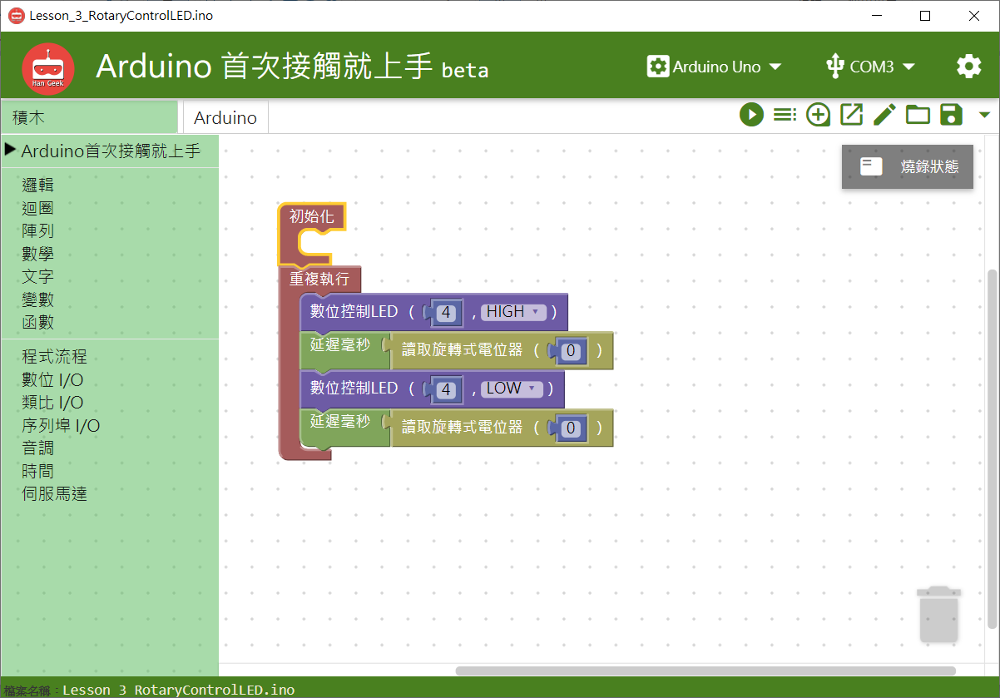

# 旋轉電位計模組


## **指令**


## **對應的**Arduino 語法

```text
analogRead(0);
```

### 範例 BlocklyDuino 積木畫布

根據旋轉電位計模組旋鈕的數值來決定LED燈的延遲時間\(閃爍的頻率\)。



## Arduino 程式

```text
void setup()
{
  pinMode(4, OUTPUT);

}


void loop()
{
  digitalWrite(4, 1);
  digitalWrite(4, 0);
  delay(1000);
analogRead(0);

}
```

