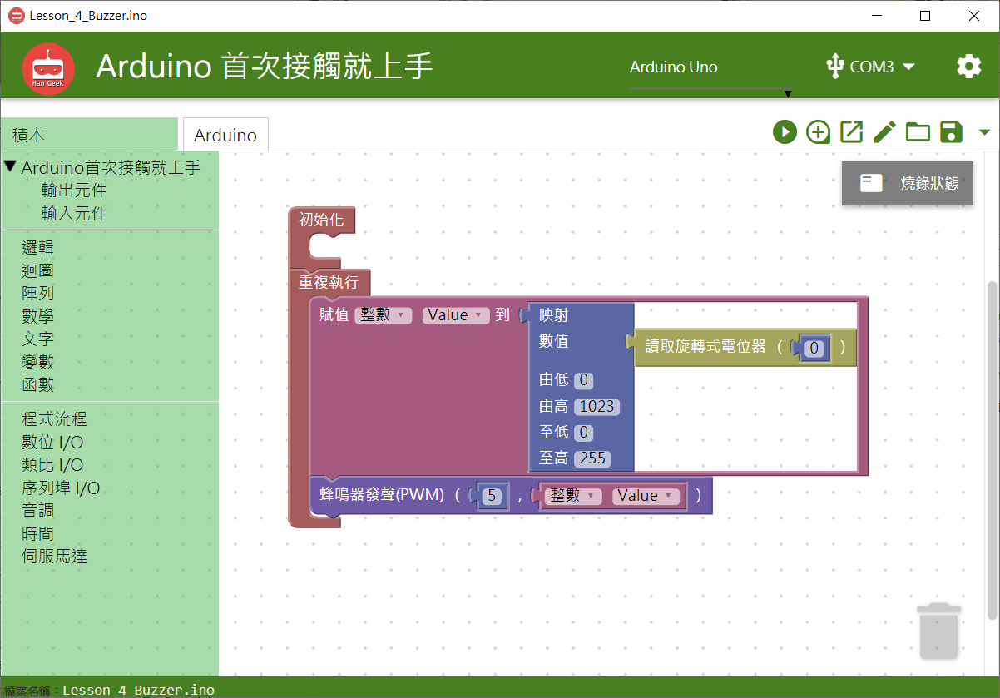

# 蜂鳴器模組


## **指令**


## **對應的**Arduino 語法

```text
  analogWrite(5, 128);
```

### 範例 BlocklyDuino 積木畫布

賦值整數Value到映射旋轉式電位器數值0-1023成0-255，並將5號腳位的蜂鳴器使用PWM發聲給予整數Value。



## Arduino 程式

```text
int Value;

void setup()
{
  pinMode(5, OUTPUT);

}


void loop()
{
  Value = (map(analogRead(0),0,1023,0,255));
  analogWrite(5, Value);
}
```

