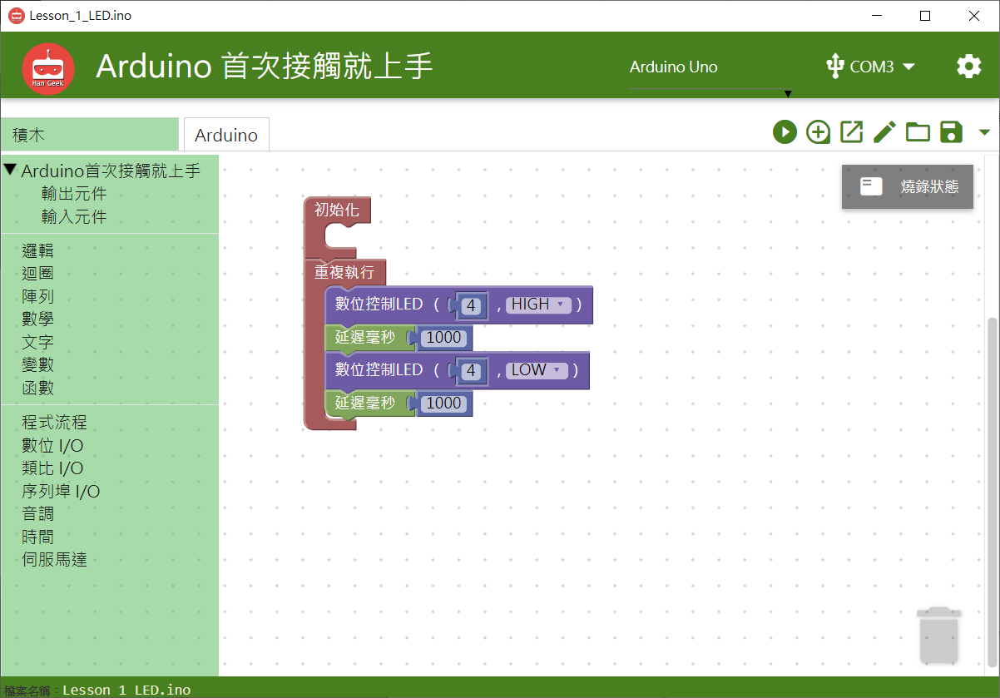

# LED模組


## **指令**


## **對應的**Arduino 語法

```text
  digitalWrite(4, 1);
```

### 範例 BlocklyDuino 積木畫布

將4號腳位的電位拉低、拉高，每一秒鐘會切換LED的亮暗一次。



## Arduino 程式

```text
void setup()
{
  pinMode(4, OUTPUT);

}


void loop()
{
  digitalWrite(4, 1);
  delay(1000);
  digitalWrite(4, 0);
  delay(1000);
}
```

