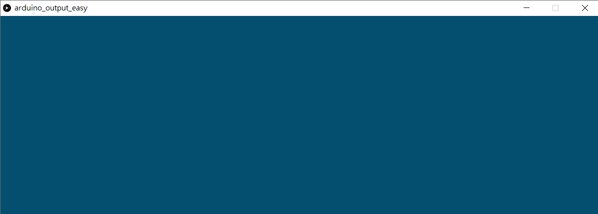
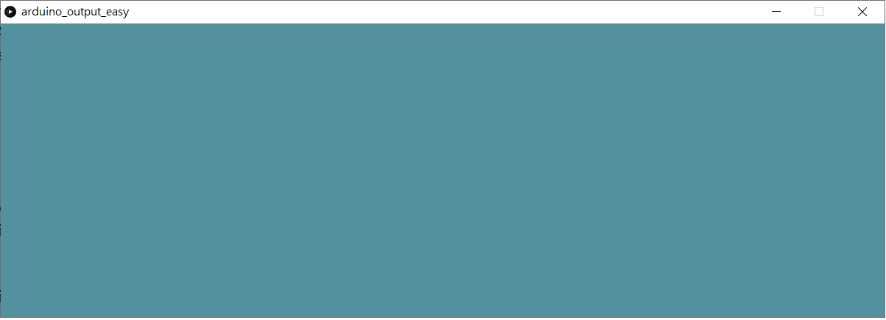
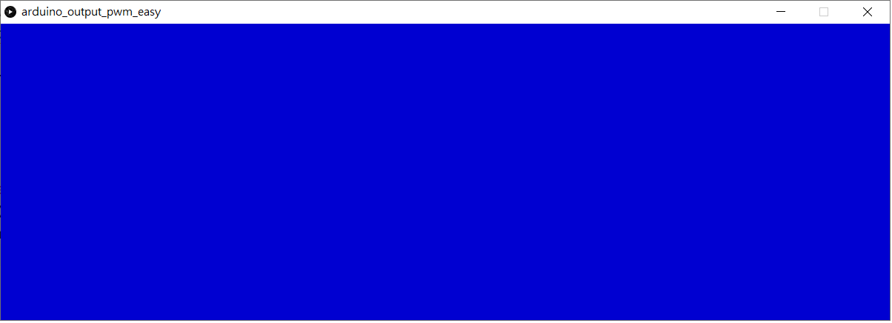

# 範例03\_Processing控制LED

本篇要透過兩個小範例來說明如何透過 Processing 來控制 Arduino 的狀態，分別為數位輸出與類比輸出。前者使用 Processing 的`arduino.digitalWrite()` 語法來控制 LED 的亮、暗兩種狀態。

後者則使用 Processing 的`arduino.analogWrite()` 語法來控制 LED 的亮、暗兩種狀態。請注意後者在 Arduino 上須把 LED 接在支援 PWM 的腳位\(以 Arduino 首次接觸就上手套件的 Arudino Uno 來說，支援 PWM 的腳位為 3 5 6 9 10 與11 等六隻腳位，所以無法使用 D4 LED。

新增一個 Processing 專案，並輸入以下程式碼，確認 Arduino 首次接觸就上手套件已正確燒錄 [StandardFirmata 程式](https://www.arduino.cc/en/reference/firmata)。 輸入完成直接執行以下 pde，會看到以下執行畫面：

## Processing 程式範例 - 點選滑鼠控制 LED 亮滅

檔名 - [arduino\_output\_easy.pde](https://github.com/cavedunissin/boson/tree/master/processing_arduino/example/arduino_output_easy)

執行畫面如下：

**未按下滑鼠鍵，畫面顏色不變，LED 熄滅**  


**按下滑鼠鍵，畫面顏色改變，LED 亮起**  


```text
import processing.serial.*;
import cc.arduino.*;

Arduino arduino;

color off = color(4, 79, 111);
color on = color(84, 145, 158);

void setup() {
  size(1200, 400);

  // Prints out the available serial ports.
  println(Arduino.list());

  arduino = new Arduino(this, Arduino.list()[0], 57600);
  arduino.pinMode(4, Arduino.OUTPUT);
  arduino.digitalWrite(4, Arduino.LOW);
}

void draw() {

  stroke(on);

  if (mouseX > (width/2)) {
    arduino.digitalWrite(4, Arduino.HIGH); //LED亮起
    background(on);
    println("LED on");
  } else {
    arduino.digitalWrite(4, Arduino.LOW); //LED熄滅
    background(off);
    println("LED off");
  }
}
```

## Processing 程式範例 - 根據滑鼠 X 座標控制 LED 漸明漸暗

請在 Arduino 的 D9 腳位上接上 LED，因為預設的 D4 LED 該腳位不支援 PWM。執行畫面如下：

**左右移動滑鼠，可看到畫面的藍色濃度變化，LED也會根據滑鼠由左到右慢慢變亮。反方向移動則漸漸變暗**  


檔名 - [arduino\_output\_pwm\_easy.pde](https://github.com/cavedunissin/boson/tree/master/processing_arduino/example/arduino_output_pwm_easy)

```text
import processing.serial.*;
import cc.arduino.*;

Arduino arduino;

void setup() {
  size(1200, 400);

  // Prints out the available serial ports.
  println(Arduino.list());

  arduino = new Arduino(this, Arduino.list()[0], 57600);
  arduino.pinMode(11, Arduino.OUTPUT);
}

void draw() {
  float pwm = map(mouseX, 0, 1200, 0, 255);
  arduino.analogWrite(11, int(pwm));  //本語法可接受的數值範圍為 0-255，2的8次方
  background(0, 0, pwm);
  println(int(pwm));
  delay(10);
}
```

