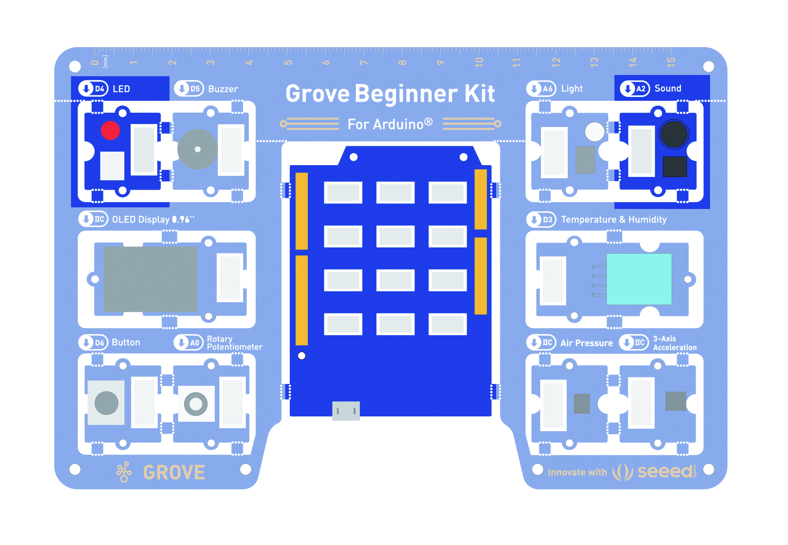
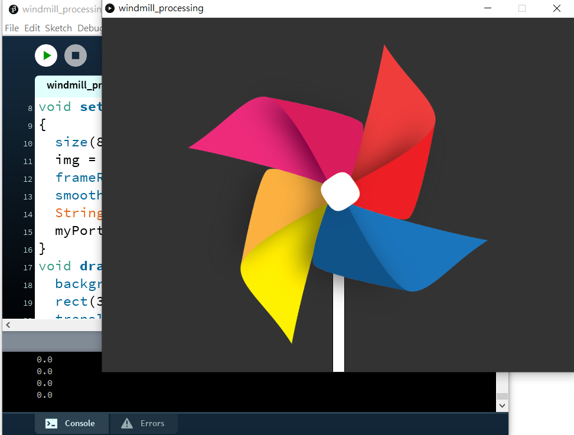

# 範例07\_風車轉轉 - 聲音感測器

## 【教學】Arduino首次接觸就上手\_ep7 Processing 讀取聲音感測器與控制圖片

本篇要示範如何讀取 Arduino 首次接觸就上手套件的類比聲音感測器，並控制 Processing 畫面上的風車圖片轉動速度。本範例一樣讓 Arduino 透過 `Serial.write()` 語法逐個發送資料。這樣的作法雖然較為複雜，但允許使用者加入更多自定義的效果，詳細說明請回顧先前的文章喔！

## Arduino 端程式碼 - 自定義發送資料

請開啟 Arduino IDE \(自行下載或使用 HangeekDuino 下的 Arduino 1.8.5\)，新增一個專案並填入以下內容或直接使用範例。請注意 Arduino首次接觸就上手套件的聲音感測器是接在 A2 腳位。[聲音感測器基本教學請點我](https://cavedu.gitbook.io/cavedu/hangeekduino/samplecode/input_module/soundsensor)。



檔名 - [windmill.ino](https://github.com/cavedunissin/boson/tree/master/processing_arduino/example/windmill)

```text
void setup() {
  Serial.begin(9600);
}

void loop() {
  int sensorVoice=analogRead(A2); //讀取腳位A2(聲音感測器)
  if(sensorVoice>500){            //數值500以下視為白噪音
    Serial.write("blow");
    delay(10);
  }
  delay(10);
}
```

## Processing 程式範例 - 接收 Arduino 發送的聲音測器資料來控制風車圖片轉動

新增一個 Processing 專案，並輸入以下程式碼，請注意要在 .pde 相同路徑下放入 windmill.png 圖檔，否則將無法執行，請務必注意喔。在此會用到 Processing 的 [PImage](https://processing.org/reference/PImage.html) 來處理圖片旋轉。請參考其文件來看看還有哪些有趣的效果。

確認 Arduino 首次接觸就上手套件已正確燒錄以上 .ino 檔。輸入完成直接執行以下 pde，會看到以下執行畫面。用嘴巴對著聲音感測器吹氣或拍手發出較大的聲響，小風車轉動的速度也會隨之變化。這些效果都可以自由在 Processing 中調整。由於環境中一定有背景噪音，所以程式只要一啟動風車就會開始轉動。

**想想看：如何加一個判斷式來"過濾掉"背景噪音呢？** 

**執行畫面**



**主程式 windmill_processing.pde**

檔名 - [windmill_processing.pde](https://github.com/cavedunissin/boson/tree/master/processing_arduino/example/windmill)

```text
import processing.serial.*;
Serial myPort;  
String str; 
String blow="blow";
public float angle=0.0;
public float speed=0.0;
PImage img;

void setup()
{
  size(800,600);
  img = loadImage("./windmill.png");
  frameRate(100);
  smooth();
  String portName = Serial.list()[0];
  myPort = new Serial(this, portName, 9600);  
}

void draw(){
  background(51);
  rect(390,300,20,500);
  translate(400,300);
  rotate(angle);
  angle=0.05+speed+angle;
  println(speed);
  imageMode(CENTER);
  image(img, 0, 0);
  //arc(-100,-100,200,200, 1, PI+QUARTER_PI, CLOSE);
  if(myPort.available()>0){
    str=myPort.readString();
    if(str!=""){
      println(str);
      if(str!=blow){
        speed+=0.3;
      }
    }
  }
  else{
    speed=0;
  }
}
```
