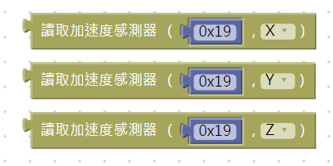
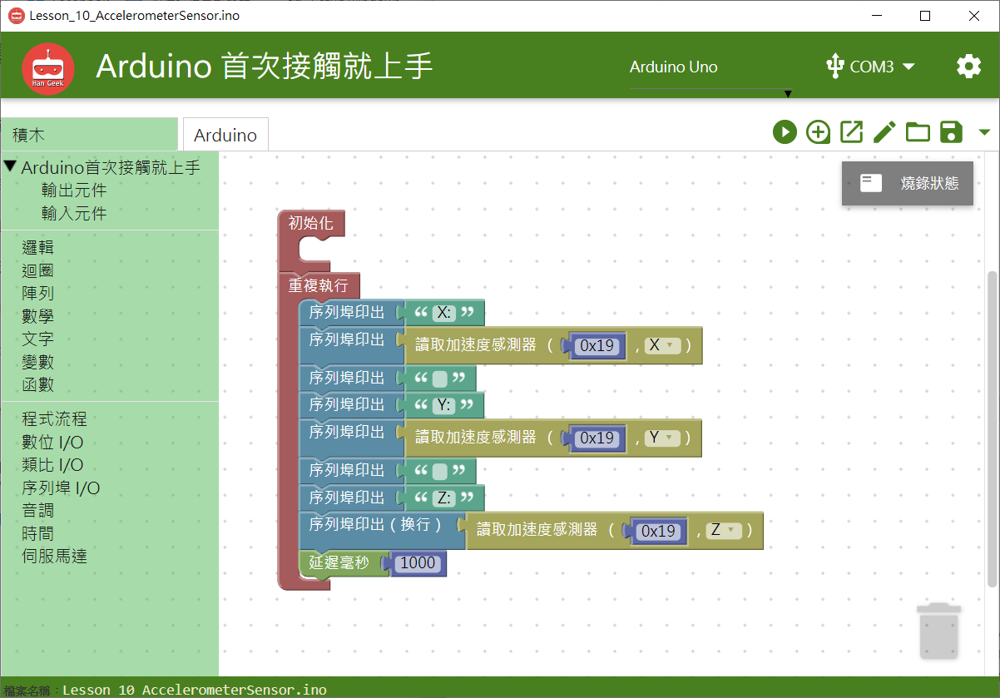
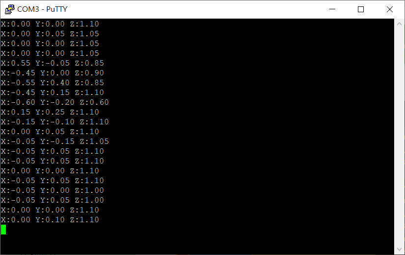

# 三軸加速度模組


## **指令**



## **對應的**Arduino 語法

```text
     LIS.getAccelerationX();
     LIS.getAccelerationY();
     LIS.getAccelerationZ();
```

### 範例 BlocklyDuino 積木畫布

在序列埠印出三軸加速度模組X軸、Y軸、Z軸的數值。





## Arduino 程式

```text
#include "LIS3DHTR.h"
#include <Wire.h>
LIS3DHTR<TwoWire> LIS;
#define WIRE Wire

void setup()
{
  LIS.begin(WIRE, 0x19);
  delay(100);
  LIS.setOutputDataRate(LIS3DHTR_DATARATE_50HZ);

  Serial.begin(9600);

}


void loop()
{
  Serial.print("X:");
  Serial.print((LIS.getAccelerationX()));
  Serial.print(" ");
  Serial.print("Y:");
  Serial.print((LIS.getAccelerationY()));
  Serial.print(" ");
  Serial.print("Z:");
  Serial.println((LIS.getAccelerationZ()));
  delay(1000);
}
```

