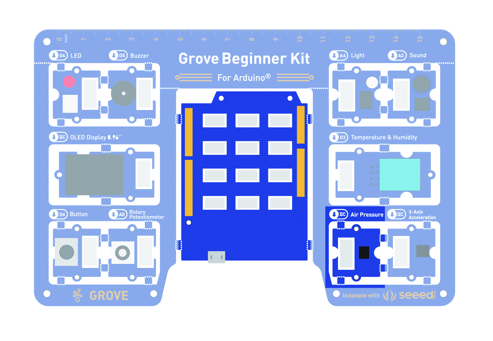

# 氣壓感測模組



## **指令**


## **對應的**Arduino 語法

```
    bmp280.getPressure();
    bmp280.calcAltitude(bmp280.getPressure());
```

### 範例 BlocklyDuino 積木畫布

在序列埠印出氣壓、高度的數值。


## Arduino 程式

```
#include "Seeed_BMP280.h"
#include <Wire.h>;
BMP280 bmp280;

void setup()
{
  bmp280.init();

  Serial.begin(9600);

}


void loop()
{
  Serial.print("Pressure: ");
  Serial.print((bmp280.getPressure()));
  Serial.println("Pa");
  Serial.print("Altitude: ");
  Serial.print((bmp280.calcAltitude(bmp280.getPressure())));
  Serial.println("m");
  Serial.println("");
  delay(1000);
}
```

## 影片教學:


