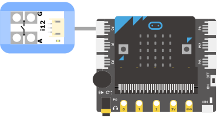

# i12導電感測開關

## 實體照片

## 基本信息

中文名稱：導電感測開關

英文名稱：Conductivity Switch

序號：i12

SKU：BOS0012

## 功能簡介

導電感測開關是一個可以用來檢測物體是否具有導電性的電子模組，既可以檢測硬幣、導線、金屬等良導體，也可以檢測人體、水果、植物等不良導體。可用於製作各類互動交互作品，也可以應用在各類互動遊戲中，作為任務執行的關鍵動作，像密室逃脫中的攜手同心等等。

## 使用說明

在圖示①處，通過觸摸導電感測開關的正負極，可以改變模組的輸出狀態；也可以通過導線外接一個水果或蔬菜從而產生開關控制訊號。

## 原理介紹

導電感測開關通過檢測微弱電流的存在，輸出開關訊號。

## 應用範例

### \(1\) 檢測物體的導電性

**範例說明：**通過導線外接物體，通過顯示模組查看該物體是否導電。

**元件清單：**導電感測開關；主控板：1組輸入/輸出端；OLED顯示模組。

**連線圖：**

### \(2\) 炫彩風鈴

**範例說明：**將導電感測開關置於風鈴中，彩色小燈盤繞在風鈴上。當風鈴下擺相互觸碰時，導電感測開關通電，輸出高電位，彩色小燈亮起。

**元件清單：**導電感測開關；主控板：1組輸入/輸出端；七彩燈條。

### \(3\) 物體導電性檢測儀

**範例說明：**導電感測開關檢測物體的導電性，Micro:bit讀取埠上電壓的高低並將導電性顯示在LED點陣上，導電顯示“√”，不導電顯示“×”。

**元件清單：**導電感測開關；Micro:bit；Micro:bit BOSON擴充板。

**連線圖：**

**設計意圖：**將導電感測開關連接至P0腳位，根據P0腳位輸出的數位訊號判斷物體是否具有導電性。

**執行流程：**

① 具備導電性：當P0腳位輸出高電位，表示檢測到物體具有導電性，Micro:bit的LED點陣輸出“√”；

② 不具備導電性：當P0腳位輸出低電位，表示物體不具備導電性，Micro:bit的LED點陣輸出“×”。

**程式示意圖（中文版）：**

**Example program(English)：**

## 商品規格

腳位說明：

重量： （g）

尺寸：26mm\*22mm

工作電壓：3.0-5.0V

