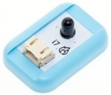

# i7火焰感測器

## 實體照片

## 基本信息

中文名稱：火焰感測器

英文名稱：Flame Sensor

序號：i7

SKU：BOS0007

## 功能簡介

火焰感測器是機器人專門用來搜尋火源的感測器，也可以用來檢測光線的亮度，但本感測器對火焰特別靈敏。火焰感測器主要應用於火災消防系統，尤其是一些易燃易爆場所，用來檢測火焰的產生；此外，該感測器也可以用於發動機、鍋爐、窯爐等的火焰報警系統。

## 使用說明

這款火焰感測器可以用來探測火源或其它波長在760奈米～1100奈米範圍內的光源，探測角度可達60度，能在-25到85攝氏度下工作，性能穩定可靠。

> * 當火焰增強時，輸出信號隨之增強；當火焰減弱時，輸出信號隨之減弱。

按照下圖所示連接電路，通電後即可通過火焰感測器控制蜂鳴器模組：當檢測到火焰時，蜂鳴器開始鳴叫；否則蜂鳴器停止鳴叫。

**\*注意：**儘管這款感測器用於感知火焰的，但它並不防火。因此使用時請與火焰保持距離，以免燒壞感測器。\*

## 原理介紹

火焰的熱輻射具有離散光譜的氣體輻射和連續光譜的固體輻射。不同燃燒物的火焰輻射強度、波長分佈有所差異，但總體來說，其對應火焰溫度的近紅外波長域及紫外光域有很大的輻射強度，火焰感測器就是根據這種特性製作而成。 火焰感測器利用紅外線對火焰非常敏感的特點，使用特製的紅外線接收管檢測火焰，然後把火焰的亮度轉化為高低變化的電位信號，輸入到中央處理器中，中央處理器根據信號的變化做出相應的程式處理。 來源：[https://baike.baidu.com/item/火焰传感器/8405773?fr=aladdin](https://baike.baidu.com/item/火焰传感器/8405773?fr=aladdin)

## 應用範例

### \(1\) 火災報警器

**範例說明：**當發生火災的時候，火焰感測器感知到火焰，蜂鳴器模組發出警報。

**元件清單：**火焰感測器；主控板：3組輸入/輸出端；蜂鳴器模組。

**連線圖：**

### \(2\) 火爐自動報警器

**範例說明：**火爐點火後，火焰感測器開始檢測，若燃氣灶火焰熄滅，火焰感測器傳回信號，蜂鳴器報警。

**元件清單：**火焰感測器；運算邏輯模組 NOT；主控板：1組輸入/輸出端；蜂鳴器模組。

**連線圖：**

### \(3\) 滅火機器人

**範例說明：**當發生火災的時候，火焰感測器檢測到火焰後迅速使用風扇撲滅火焰。

**元件清單：**火焰感測器；風扇模組；蜂鳴器模組；Micro:bit；Micro:bit BOSON擴充板。

**連線圖：**

**設計意圖：**由於火焰感測器的輸出信號是類比值，這裡設置一個臨界值“30”（臨界值需要根據環境等因素經過多次測試後確定），當火焰感測器輸出類比值大於30時表示發生火警，蜂鳴器和風扇開始工作，否則關閉蜂鳴器和風扇。

**執行流程：**

① 已發生火警：若火焰感測器檢測到火焰，蜂鳴器發出警報聲，打開風扇開始滅火並持續5秒；

② 未發生火警：若火焰感測器沒有檢測到火焰，關閉蜂鳴器和風扇。

**程式示意圖（中文版）：**

**Example program(English)：**

## 商品規格

腳位說明：

重量： （g）

尺寸：26mm\*22mm

工作電壓：3.0-5.0V

