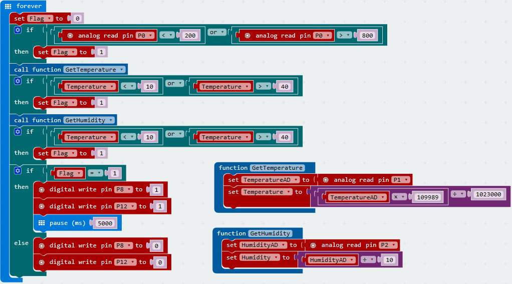
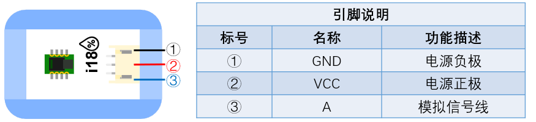

# i18空氣濕度感測器

## 實體照片

## 基本信息

中文名稱：空氣濕度感測器

英文名稱：Humidity Sensor

序號：i18

SKU：BOS0041

## 功能簡介

空氣濕度感測器可以檢測空氣中的水分，並轉換成可用的輸出信號，它與水分感測器的區別在於前者主要用於檢測空氣中的水蒸氣含量，而後者主要用於檢測水滴。空氣濕度感測器可用於氣象觀測、環境控制、露點測量、乾燥處理、暖房、植物栽培、博物館、展覽會（館）、紙張製造、存儲、程序控制、養殖控制、紡織製造等場所中。

## 使用說明

空氣濕度感測器可以感知空氣中水分的多少，按照下圖所示連接電路，通電後即可通過OLED顯示模組直接讀取空氣濕度值。

也可以將空氣濕度感測器與其他輸出模組相連，實現各種功能。

> * 當空氣濕度升高時，輸出信號增強；當空氣濕度降低時，輸出信號減弱。

## 原理介紹

空氣濕度感測器主要用來測量空氣濕度，感應部件採用高分子薄膜濕敏電容，位於杆頭部，這種具有感濕特性的電介質其介電常數會隨相對濕度而變化。 來源：[https://baike.baidu.com/item/空气湿度传感器](https://baike.baidu.com/item/空气湿度传感器)

## 應用範例

### \(1\) 比較晴天與雨天室內空氣濕度差異

**範例說明：**分別在晴天與雨天，測量室內空氣濕度，並通過顯示器模組讀取數值，比較兩種天氣下空氣濕度的差異。

**元件清單：**空氣濕度感測器；主控板：1組輸入/輸出端；OLED顯示模組。

**連線圖：**

### \(2\) 糧倉溫濕度檢測

**範例說明：**糧倉糧食安全儲藏的主要參數是糧倉的溫度和濕度，這兩者之間又是互相關聯的。糧食在正常儲藏過程中，含水量一般在12%以下是安全狀態，不會產生溫度突變，一旦糧倉進水、結露等使糧食的含水量達到20%以上時，就會使糧食受潮，胚芽萌發，新陳代謝加快而產生呼吸熱，使局部糧食溫度突然升高，當溫度高於22°C時，必然引起糧食“發燒”和發霉變質，並可能形成連鎖反應，從而造成不可挽回的損失。因此有必要檢測糧食溫度。當溫度感測器感受到糧食內溫度時，當溫度高於22°C時，自動開啟風扇、點亮小燈並報警。而當濕度感測器感受到糧食內濕度高於20%時，自動點亮小燈並報警。

**元件清單：**空氣濕度感測器；防水溫度感測器；主控板：3組輸入/輸出端；閥模組；分配模組；運算邏輯模組 OR；風扇模組；蜂鳴器模組；LED燈模組。

**連線圖：**

### \(3\) 植物培育箱

**範例說明：**檢測土壤濕度、箱內溫度、空氣濕度等指標，打造適宜某種植物生長的培育箱。

**元件清單：**土壤濕度感測器；溫度感測器；空氣濕度感測器；蜂鳴器模組；LED燈模組；Micro:bit；Micro:bit BOSON擴充板。

**連線圖：**

**設計意圖：**使用土壤濕度感測器、溫度感測器、空氣濕度感測器分別檢測植物培育箱中的土壤濕度、溫度和空氣濕度。若其中某一環境因素不在設定區間範圍內，則表示培育箱內的當前環境不適宜種子生長，此時讓LED燈和蜂鳴器發出警報。

**\*注意：**本程式中所設定的區間需要根據具體環境因素和種子生活習性進行調整。\*

**執行流程：**

① 初始化變數：將變數“環境指標”置為0；

② 檢測土壤濕度：若土壤濕度小於200或大於800，則將“環境指標”置為1；

③ 檢測溫度：調用函數獲取溫度值，若溫度小於10或大於40，則將“環境指標”置為1；

④ 檢測光照：若空氣濕度小於60%，則將“環境指標”置為1；

⑤ 判斷環境是否適宜植物生長：若“環境指標”為1表明當前環境不適宜植物生長，點亮LED燈並讓蜂鳴器發生警報聲持續5秒；否則什麼也不做。

**程式示意圖（中文版）：**

**Example program(English)：**

## 商品規格

腳位說明：

重量： （g）

尺寸：26mm\*22mm

工作電壓：3.0-5.0V

