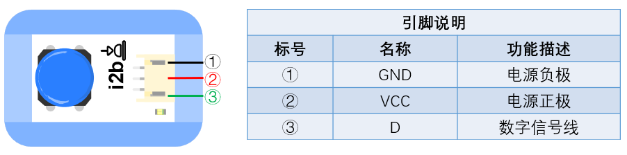

# i2r按鈕模組

##  實體照片

## 基本信息

中文名稱：按鈕模組

英文名稱：Push Button

序號：i2b; i2r; i2y

SKU：BOS0002-B; BOS0002-R; BOS0002-Y

## 功能簡介

按鈕模組是最簡單的按鍵模組，包括紅色按鈕模組、藍色按鈕模組和黃色按鈕模組，按鈕可以廣泛應用於門鈴、檯燈、空調遙控器、按摩浴缸、電梯、消防報警等場景。

## 使用說明

按鈕模組能夠識別按鍵動作並輸出數位信號。其機制如下：

> * 按下按鍵，模組輸出高電位，即“開”或“1”；鬆開按鍵，模組輸出低電位，即“關”或“0”。
>
>   以按鈕控制LED燈為例，按下按鈕，輸出高電位，LED燈被點亮；鬆開按鈕，輸出低電位，LED燈熄滅。

## 原理介紹

按鈕開關一般採用積水式結構，由按鈕帽、重定彈簧、靜觸頭、動觸頭和外殼等組成，通常做成複合式，有一對常閉觸頭和常開觸頭。在按鈕未按下時，動觸頭與上面的靜觸頭是接通的，這對觸頭稱為常閉觸頭。此時，動觸頭與下面的靜觸頭是斷開的，這對觸頭稱為常開觸頭；按下按鈕，常閉觸頭斷開，常開觸頭閉合；鬆開按鈕，在重定彈簧的作用下恢復原來的工作狀態。 來源：[https://baike.baidu.com/item/按钮模块/8063907?fr=aladdin\#2](https://baike.baidu.com/item/按鈕開關/8063907?fr=aladdin#2)

## 應用範例

### \(1\) 按鈕檯燈（非程式設計）

**範例說明：**使用按鈕控制LED燈的點亮和熄滅。當按鈕按下時，LED燈模組被點亮；當按鈕鬆開時，LED燈模組熄滅。

**元件清單：**按鈕模組；LED燈模組；主控板：3組輸入/輸出端。

**連線圖：**

### \(2\) 按鈕檯燈（程式設計）

**範例說明：**使用按鈕控制LED燈的點亮和熄滅。當按鈕按下時，LED燈模組被點亮；當按鈕鬆開時，LED燈模組被熄滅。

**元件清單：**按鈕模組；LED燈模組；Micro:bit；Micro:bit BOSON擴充板。

**連線圖：**將按鈕模組連接至Micro:bit擴充板P0腳位，LED燈模組連接至Micro:bit擴充板P8腳位。

**執行流程：**① 如果P0腳位輸出高電位（“1”），即按鈕被按下，則LED燈模組亮起；② 如果P0腳位輸出低電位（“0”），即按鈕鬆開，則LED燈模組熄滅。

**程式示意圖（中文版）：**

**Example program(English)**

### \(3\) 防盜展示台（非程式設計）

**範例說明：**防盜展示台的功能是當展示物品離開展示台，展示台自動報警。將展示物品放在按鈕上，相當於按下按鈕。當展示物品被拿開時，按鈕彈起，蜂鳴器發出警報。正常情況下，按鈕按下輸出高電位，高電位會使蜂鳴器發出聲音，這與之前的設想恰好相反。因此，需要借助一個運算邏輯模組 NOT，將按鈕輸出的高電位轉為低電位，不讓蜂鳴器在按鈕按下的情況下發出聲音。

**元件清單：**按鈕模組；運算邏輯模組 NOT；蜂鳴器模組；主控板：1組輸入/輸出端。

**連線圖：**

### \(4\) 防盜展示台（程式設計）

**範例說明：**防盜展示台的功能是當展示物品離開展示台，展示台自動報警。將展示物品放在按鈕上，相當於按下按鈕。當展示物品被拿開時，按鈕彈起，蜂鳴器發出警報。

**元件清單：**按鈕模組；蜂鳴器模組；Micro:bit；Micro:bit BOSON擴充板。

**連線圖：**將按鈕模組連接至Micro:bit擴充板P0腳位，蜂鳴器模組連接至Micro:bit擴充板P8腳位。

**執行流程：**① 如果P0腳位輸出高電位（“1”），即按鈕被按下，展示物品沒有離開展示台，則蜂鳴器不報警；② 如果P0腳位輸出低電位（“0”），即按鈕彈起，展示物品離開展示台，則蜂鳴器報警。

**程式示意圖（中文版）：**

**Example program(English)**

### \(5\) 密碼鎖

**範例說明：**設置三個按鈕，只有按照正確的順序按下三個按鈕，才能解鎖；同時LED燈模組也會亮起來，蜂鳴器發出警報，即告訴別人，密碼鎖已被打開。

**元件清單：**藍色按鈕模組；紅色按鈕模組；黃色按鈕模組；LED燈模組；蜂鳴器模組；計時模組（0-6秒）；計時模組（0-60秒）；運算邏輯模組 AND；分配模組；主控板：3組輸入/輸出端。

**連線圖：**

### \(6\) 搶答器

**範例說明：**做一個搶答器，讓按下按鈕的人，亮起對應的燈，同時阻止另一個燈不能再亮起。

**元件清單：**藍色按鈕模組；紅色按鈕模組；藍色LED燈模組；紅色LED燈模組；運算邏輯模組 AND；運算邏輯模組 NOT；分配模組；主控板：3組輸入/輸出端。

**連線圖：**

### \(7\) 找朋友機

**範例說明：**做一個有趣的找朋友機，輕輕按下一個或幾個按鈕，看看哪些小朋友志趣相投。

**元件清單：**紅色按鈕模組；藍色按鈕模組；運算邏輯模組 OR；運算邏輯模組 AND；紅色LED燈模組；藍色LED燈模組；主控板：3組輸入/輸出端。

**連線圖：**

## 商品規格

腳位說明：

重量： （g）

尺寸：26mm\*22mm

工作電壓：3.0-5.5V

工作電流：\(Max\)10mA@5V

