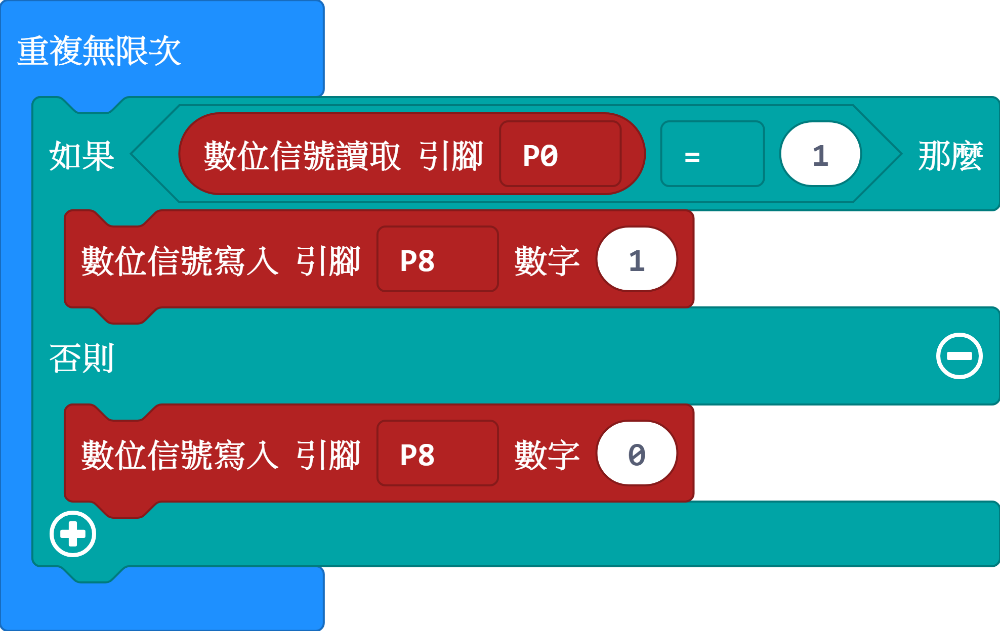
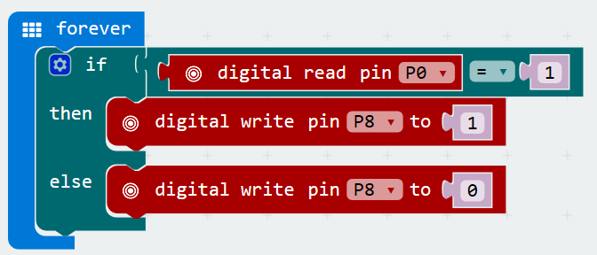
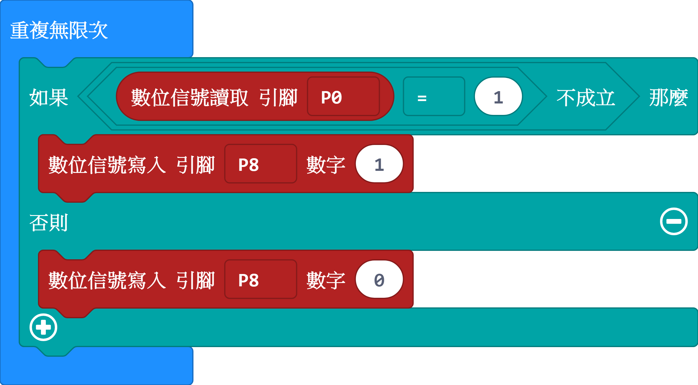
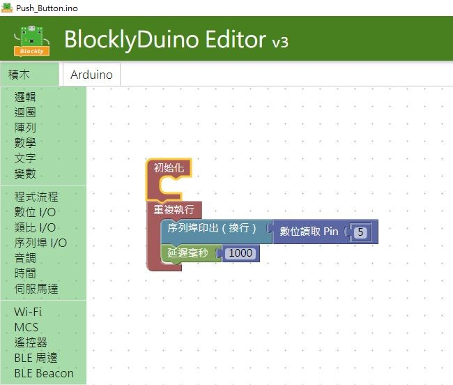
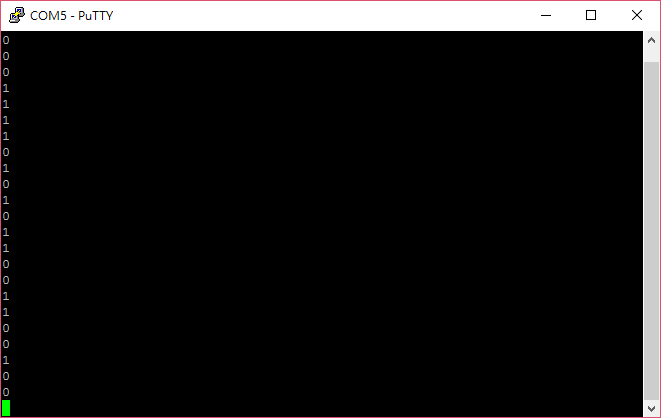
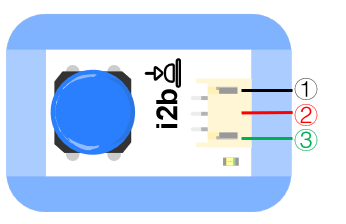

# i2r按鈕模組

##  實體照片

## 基本信息

中文名稱：按鈕模組

英文名稱：Push Button

序號：i2b; i2r; i2y

SKU：BOS0002-B; BOS0002-R; BOS0002-Y

## 功能簡介

按鈕模組是最簡單的按鍵模組，按鍵分別有三種顏色，紅色、藍色和黃色。按鈕可以廣泛應用於門鈴、檯燈、遙控器、按摩浴缸、電梯、消防報警等設備。

## 使用說明

按鈕模組能夠識別按鍵動作並輸出數位訊號。其機制如下：

> * 按下按鍵，模組輸出高電位，即「開」或「1」；鬆開按鍵，模組輸出低電位，即「關」或「0」。
>
>   以按鈕控制LED燈為例，按下按鈕，輸出高電位，LED燈被點亮；鬆開按鈕，輸出低電位，LED燈熄滅。

## 原理介紹

按鈕也稱為按鍵，是一種電閘（switch，或稱開關），用來控制機械或程式的某些功能。一般而言，紅色按鈕是用來使某一功能停止，而綠色按鈕，則通常可開始某一項功能。按鈕的形狀通常是圓形或方形。來源：[按鈕-維基百科](https://zh.wikipedia.org/wiki/%E6%8C%89%E9%92%AE)

## 實作範例教學-基本篇
### 按鈕檯燈

**範例說明：**使用按鈕控制LED燈的點亮和熄滅。當按鈕按下時，LED燈模組被點亮；當按鈕鬆開時，LED燈模組熄滅。

**元件清單：**按鈕模組；LED燈模組；主控板：3組輸入/輸出端。

**連線圖：**

### 防盜展示台

**範例說明：**防盜展示台的功能是當展示物品離開展示台，展示台自動報警。將展示物品放在按鈕上，相當於按下按鈕。當展示物品被拿開時，按鈕彈起，蜂鳴器發出警報。正常情況下，按鈕按下輸出高電位，高電位會使蜂鳴器發出聲音，這與之前的設想恰好相反。因此，需要借助一個運算邏輯模組 NOT，將按鈕輸出的高電位轉為低電位，不讓蜂鳴器在按鈕按下的情況下發出聲音。

**元件清單：**按鈕模組；運算邏輯模組 NOT；蜂鳴器模組；主控板：1組輸入/輸出端。

**連線圖：**

### 密碼鎖

**範例說明：**設置三個按鈕，只有按照正確的順序按下三個按鈕，才能解鎖；同時LED燈模組也會亮起來，蜂鳴器發出警報，即告訴別人，密碼鎖已被打開。

**元件清單：**藍色按鈕模組；紅色按鈕模組；黃色按鈕模組；LED燈模組；蜂鳴器模組；計時模組（0-6秒）；計時模組（0-60秒）；運算邏輯模組 AND；分配模組；主控板：3組輸入/輸出端。

**連線圖：**

### 搶答器

**範例說明：**做一個搶答器，讓按下按鈕的人，亮起對應的燈，同時阻止另一個燈不能再亮起。

**元件清單：**藍色按鈕模組；紅色按鈕模組；藍色LED燈模組；紅色LED燈模組；運算邏輯模組 AND；運算邏輯模組 NOT；分配模組；主控板：3組輸入/輸出端。

**連線圖：**

### 找朋友機

**範例說明：**做一個有趣的找朋友機，輕輕按下一個或幾個按鈕，看看哪些小朋友志趣相投。

**元件清單：**紅色按鈕模組；藍色按鈕模組；運算邏輯模組 OR；運算邏輯模組 AND；紅色LED燈模組；藍色LED燈模組；主控板：3組輸入/輸出端。

**連線圖：**

## 實作範例教學-Micro:bit篇
### 按鈕檯燈

**範例說明：**使用按鈕控制LED燈的點亮和熄滅。當按鈕按下時，LED燈模組被點亮；當按鈕鬆開時，LED燈模組被熄滅。

**元件清單：**按鈕模組；LED燈模組；Micro:bit；Micro:bit BOSON擴充板。

**連線圖：**將按鈕模組連接至Micro:bit擴充板P0腳位，LED燈模組連接至Micro:bit擴充板P8腳位。

**執行流程：**① 如果P0腳位輸出高電位「1」，即按鈕被按下，則LED燈模組亮起；② 如果P0腳位輸出低電位「0」，即按鈕鬆開，則LED燈模組熄滅。

**程式示意圖（中文版）：**

**Example program(English)**

### 防盜展示台

**範例說明：**防盜展示台的功能是當展示物品離開展示台，展示台自動報警。將展示物品放在按鈕上，相當於按下按鈕。當展示物品被拿開時，按鈕彈起，蜂鳴器發出警報。

**元件清單：**按鈕模組；蜂鳴器模組；Micro:bit；Micro:bit BOSON擴充板。

**連線圖：**將按鈕模組連接至Micro:bit擴充板P0腳位，蜂鳴器模組連接至Micro:bit擴充板P8腳位。

**執行流程：**① 如果P0腳位輸出高電位「1」，即按鈕被按下，展示物品沒有離開展示台，則蜂鳴器不報警；② 如果P0腳位輸出低電位「0」，即按鈕彈起，展示物品離開展示台，則蜂鳴器報警。

**程式示意圖（中文版）：**

**Example program(English)**

## 實作範例教學-LinkIt 7697篇

**範例說明：**使用「LinkIt 7697 NANO Breakout」連接「Push Button 按鈕模組」, 讀取按鈕模組按下或放開的狀態。
此Push Button 按鈕模組包含於「Starter Kit for micro:bit」內。

**元件清單：**

**連線圖：**按鈕模組是數位訊號輸入， 可以接「D0 ~ D13」的 LinkIt 7697 NANO Breakout訊號端上。 本範例連接到「D5」

**程式說明：**每1秒鐘會讀取按鈕模組狀態一次， 並可透過序列埠監控視窗看到按鈕模組的狀態 。

產生的Arduino程式碼如下：

void setup()
{

  pinMode(5, INPUT);
  
  Serial.begin(9600);

}

void loop()
{
  Serial.println(digitalRead(5));
  
  delay(1000);
}

## 商品規格

腳位說明：

| **編號** | **名稱** | **功能說明** |
| :---: | :---: | :---: |
| 1 | GND | 電源接地 |
| 2 | VCC | 電源正極 |
| 3 | D | 數位訊號 |

重量： （g）

尺寸：26mm\*22mm

工作電壓：3.0-5.5V

工作電流：\(Max\)10mA@5V

