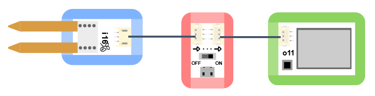
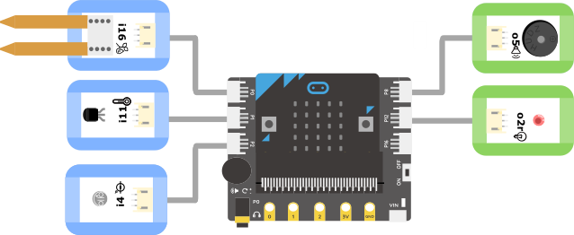
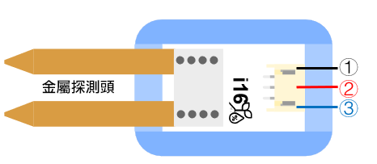

# i16土壤濕度感測器

## 實體照片

## 基本信息

中文名稱：土壤濕度感測器

英文名稱：Soil Moisture Sensor

序號：i16

SKU：BOS0038

## 功能簡介

土壤濕度感測器可以檢測土壤濕度，廣泛應用於節水農業灌溉、溫室、花卉蔬菜、草地牧場、土壤速測、植物培養、科學試驗等領域。

**知識補充：**土壤濕度指的是土壤的含水量，能直接影響到作物的水分供應狀況。土壤濕度過低將形成土壤乾旱，降低光合作用效率，影響作物的產量和品質。嚴重缺水甚至會導致作物凋萎和死亡。土壤濕度過高會惡化土壤通氣性，影響土壤微生物的活動，使作物根系的呼吸、生長等生命活動受到阻礙，從而影響作物地上部分的正常生長，造成徒長、倒伏、病害滋生等。土壤水分的多少還影響田間耕作措施和播種品質，並影響土壤溫度的高低。

## 使用說明

土壤濕度感測器可以搭配Micro:bit、Arduino使用，實現非常有趣的互動作品。土壤濕度感測器在使用時需要將金屬部分充分插入土壤中，並等待數秒直至資料穩定，通過OLED顯示模組或Micro:bit可以讀取土壤濕度數值，也可以通過土壤濕度感測器製作自動裝置，控制其他輸出模組。按照下圖所示連接電路，通電後即可通過OLED顯示模組即時監測土壤濕度。

土壤濕度數值參考：

**注意：**

（1）不同土壤介質的測量值會存在差異。土壤中的水分存在分佈不均勻的情況，資料僅能代表局部濕度。

（2）感測器頂部的塑膠部分不防水，請勿將感測器整個埋入土中。

## 原理介紹

土壤中的水分含量能改變土壤的電阻率，通常來說土壤中的含水量越高，導電能力就越強。土壤濕度感測器的金屬片在插入土壤中時，能充分接觸到土壤，檢測到電阻率的改變，並轉化成電信號。

## 應用範例

### \(1\) 探究土壤濕度對種子發芽率的影響

**範例說明：**將相同數量的同一作物的種子分別種在兩個盆中，通過顯示器讀取兩盆的土壤濕度，從而控制兩盆土壤濕度值始終不同，探究兩種情況下種子的發芽情況。

**元件清單：**土壤濕度感測器；主控板：1組輸入/輸出端；OLED顯示模組。

**連線圖：**

### \(2\) 自動澆花裝置

**範例說明：**利用土壤濕度感測器即時監測花盆中土壤的含水量，當土壤缺水時，馬達帶動軟管口降低，達到自動澆水的目的。

**元件清單：**土壤濕度感測器；閥模組；主控板：1組輸入/輸出端；伺服機模組。

**連線圖：**

### \(3\) 種子發芽箱

**範例說明：**檢測土壤濕度、箱內溫度、箱內光照強度等指標，打造適宜某種植物種子發芽的培育箱。

**元件清單：**土壤濕度感測器；溫度感測器；光感測器；蜂鳴器模組；LED燈模組；Micro:bit；Micro:bit BOSON擴充板。

**連線圖：**

**設計意圖：**使用土壤濕度感測器、溫度感測器、光感測器分別檢測種子發芽箱中的土壤濕度、溫度和光照強度。若其中某一環境因素不在設定區間範圍內，則表示發芽箱內的當前環境不適宜種子生長，此時讓LED燈和蜂鳴器發出警報。

**\*注意：**本程式中所設定的區間需要根據具體環境因素和種子生長習性進行調整。\*

**執行流程：**

① 初始化變數：將變數“環境指標”置為0；

② 檢測土壤濕度：若土壤濕度小於200或大於800，則將“環境指標”置為1；

③ 檢測溫度：調用函數獲取溫度值，若溫度小於10或大於40，則將“環境指標”置為1；

④ 檢測光照：若光的強度小於100或大於900，則將“環境指標”置為1；

⑤ 判斷環境是否適宜種子生長：若“環境指標”為1表明當前環境不適宜種子發芽，點亮LED燈並讓蜂鳴器發生警報聲持續5秒；否則什麼也不做。

**程式示意圖（中文版）：**

**Example program(English)：**

## 商品規格

腳位說明：

| **編號** | **名稱** | **功能說明** |
| :---: | :---: | :---: |
| 1 | GND | 電源接地 |
| 2 | VCC | 電源正極 |
| 3 | A | 類比訊號 |

重量： （g）

尺寸：26mm\*22mm

工作電壓：3.0-5.5V

工作電流：40mA@5V

